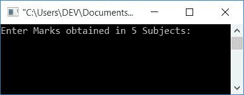
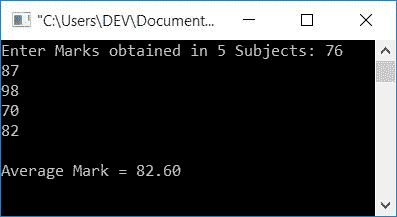
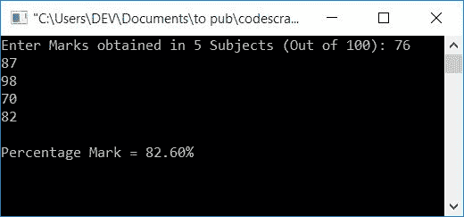
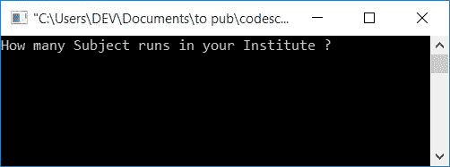
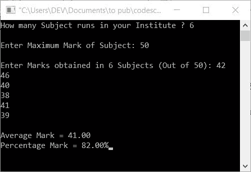

# C 程序：计算平均分数和百分比分数

> 原文：<https://codescracker.com/c/program/c-program-calculate-average-percentage.htm>

在本文中，您将学习并获得有关如何创建一个查找平均分和百分比分数的程序的代码。这里给出的最后一个程序是查找学生平均分和分数的完整版本。在该程序中，科目数和最高分也由用户决定。

## C 语言中求平均分程序

问题是，**用 C 写一个程序，要求用户输入 5 个科目的分数，并打印平均 分数作为输出**。所以这个问题的答案给出如下:

```
#include<stdio.h>
#include<conio.h>
int main()
{
    int i;
    float mark, sum=0, avg;
    printf("Enter Marks obtained in 5 Subjects: ");
    for(i=0; i<5; i++)
    {
        scanf("%f", &mark);
        sum = sum+mark;
    }
    avg = sum/5;
    printf("\nAverage Mark = %0.2f", avg);
    getch();
    return 0;
}
```

该程序在 **Code::Blocks** IDE 中编译并执行。这是样本运行的第一个快照:



现在输入 5 个科目的分数，比如说 **76，87，98，70，82** ，按**回车**键查看学生的 平均分，如下图所示:



#### 前一程序中使用的步骤

以下是上述程序中使用的一些主要步骤:

*   声明一个变量，比如说 **int** 类型的 **i** ，在循环中使用它
*   声明另外三个变量，比如类型为 **float** 的 **mark、sum** 和 **avg**
*   这里这三个变量被声明为 float，因为要保存任何包含 decimal 的值
*   将声明部分的变量 **sum** 初始化为 0
*   现在我们已经为运行 5 次的循环应用了一个
***   在每次运行中，程序扫描标记值，并将其添加到变量**和**中*   因此，在退出循环后，我们有一个 **sum** 变量，它保存用户在运行时输入的所有 5 个标记的总和*   只需将**的总和**除以 5，即可得到给定 5 个数字的平均分数*   打印 **avg** 的值作为输出。就这样**

 **要详细了解**循环**(用于之前的程序)，请参考 C 教程中的[循环。让我们进入下一个节目。](/c/c-for-loop.htm)

## 在 C #中查找百分号程序

问题是，**用 C 语言编写一个程序，要求用户输入 5 个科目(满分 100 分) 的分数，并找出学生**的分数。这个问题的答案如下:

为了计算一个学生在 C 语言程序设计中的分数，你必须让用户输入一些科目的分数(这里有 5 个科目，即物理、化学、数学、计算机科学和英语)。将 5 个标记的总和放在一个变量中，比如说 **sum** ，将 **sum/5** 放在一个变量中，比如说 **avg** 。只需在输出上打印出 **avg** 作为结果。

```
#include<stdio.h>
#include<conio.h>
int main()
{
    int i;
    float mark, sum=0, perc;
    printf("Enter Marks obtained in 5 Subjects (Out of 100): ");
    for(i=0; i<5; i++)
    {
        scanf("%f", &mark);
        sum = sum+mark;
    }
    perc = (sum/500)*100;
    printf("\nPercentage Mark = %0.2f%c", perc, 37);
    getch();
    return 0;
}
```

该程序将产生如下图所示的输出:



该程序中编写的大部分代码几乎与之前的程序相同，除了这里我们使用了值为 37 的 **%c** 格式 说明符。因为， **%c** 格式说明符用于打印字符， **%** 字符的 ASCII 值是 37。因此，为了在百分比值之后在输出屏幕上打印 **%** 符号，我们使用了它的 ASCII 值，如上面的输出所示。

## 在 C 语言中查找平均值和百分比标记

问题是，**用 C 写一个程序，要求用户输入获得的分数，并找到平均值和百分比分数 值。用户必须在此输入主题数量和最高分数。**下面给出这个问题的答案。

这是用 c 语言编写的计算平均分和百分制程序的完整版本，其中科目和最高分的数量由用户决定。让我们来看看:

```
#include<stdio.h>
#include<conio.h>
int main()
{
    int i, n, max;
    float mark, sum=0, avg, perc;
    printf("How many Subject runs in your Institute ? ");
    scanf("%d", &n);
    printf("\nEnter Maximum Mark of Subject: ");
    scanf("%d", &max);
    printf("\nEnter Marks obtained in %d Subjects (Out of %d): ", n, max);
    for(i=0; i<n; i++)
    {
        scanf("%f", &mark);
        sum = sum+mark;
    }
    avg = sum/n;
    perc = (sum/(n*max))*100;
    printf("\nAverage Mark = %0.2f", avg);
    printf("\nPercentage Mark = %0.2f%c", perc, 37);
    getch();
    return 0;
}
```

下面给出的快照显示了该程序的初始输出:



下面给出的快照显示了在提供了学院中的科目运行总数、最高分数和所有科目中获得的分数之后，该程序的最终输出。



让我们通过下面给出的例子来理解上面的程序(及其输出):

*   用户输入 **6** 作为第一个问题，即**你们学院有多少个学科？**。所以 **n** 保持它的值为 6
*   用户输入 **50** 作为第二个问题。因此变量 **max** 的值为 **50**
*   现在用户逐个输入在 6 个科目中获得的分数。并且对每次扫描执行的求和操作如下:
    *   第一次扫描时，用户输入 **42** ，因此 **sum+mark** 或 **0+42** (0 是 **sum** 的初始值)被初始化为 **sum**
    *   现在 **sum** 包含 42 作为它的值
    *   在第二次扫描时，用户输入 **46** ，因此 **42+46** 或 **88** 被初始化为**和**
    *   现在 **sum** 包含 88 作为它的值
    *   在第三次扫描时，用户输入 **40** ，因此 **88+40** 被初始化为**和**
    *   现在**总和**包含 **128** 作为其值
    *   在第四次扫描时，用户输入 **38** ，因此 **128+38** 或 **166** 被初始化为**和**
    *   现在**总和**包含 **166** 作为其值
    *   在第五次扫描时，用户输入 **41** ，因此 **166+41** 或 **207** 被初始化为**和**
    *   现在**总和**包含 **207** 作为其值
    *   在第六次扫描时，用户输入 **39** ，因此 **207+39** 或 **246** 被初始化为**和**
    *   现在**总和**包含 **246** 作为其值
*   截至目前， **sum** 包含 **246** ， **n** 包含 6， **max** 包含 **50**
*   因此， **sum/n** 或 **246/6** 或 **41** 被初始化为 **avg** 变量
*   并且， **(sum/(n*max))*100** 或 **(246/(6*50))*100** 或 **(246/300)*100** 或 **82** 被初始化为 **perc** 变量
*   现在只需打印出**平均值**和**百分比**变量的值，作为**平均分数**和**百分比分数**的输出
*   **%0.2f** 用于打印最多两位小数的数值。而 **%c** 用 37，用来打印 **%** 标志。 因为 **37** 是 **%** 符号的 ASCII 值。好了

#### 其他语言的相同程序

*   [C++计算平均分和百分号](/cpp/program/cpp-program-calculate-average-percentage.htm)
*   [Java 计算平均值和百分比分数](/java/program/java-program-calculate-average-percentage.htm)
*   [Python 计算平均值和百分比分数](/python/program/python-program-calculate-average-percentage-marks.htm)

[C 在线测试](/exam/showtest.php?subid=2)

* * *

* * ***