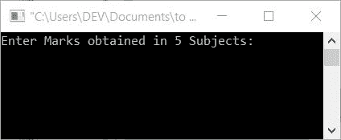
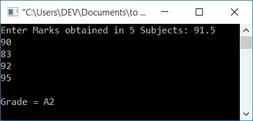
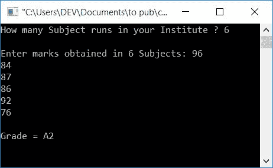

# C 程序：计算学生成绩

> 原文：<https://codescracker.com/c/program/c-program-calculate-student-grade.htm>

在本文中，您将学习并获得根据用户(在运行时)输入的分数(5 个科目)查找学生成绩的代码。分级系统的应用如下表所示:

| 标记范围 | 级别 |
| 91-100 | 一流的 |
| 81-90 | 主动脉第二声 |
| 71-80 | B1 |
| 61-70 | B2 |
| 51-60 | C1 |
| 41-50 | C2 |
| 33-40 | D |
| 21-32 | E1 |
| 0-20 | E2 |

这里，标记范围是平均标记范围。也就是说，如果一个学生在所有五个科目中都得到了 78，74，80，72 和 76，他或她的平均分将是 76，76 介于 71 和 80 之间。所以成绩会是 B1。

**注:**如果一个学生的平均分是 90.4，那么他/她的成绩就是 A2。

## C 语言学生成绩程序

问题是:用 C 语言编写一个程序，要求用户输入五个科目的分数，根据平均分数计算并打印他或她的分数。这个问题的答案如下:

```
#include<stdio.h>
#include<conio.h>
int main()
{
    int i;
    float mark, sum=0, avg;
    printf("Enter Marks obtained in 5 Subjects: ");
    for(i=0; i<5; i++)
    {
        scanf("%f", &mark);
        sum = sum+mark;
    }
    avg = sum/5;
    printf("\nGrade = ");
    if(avg>=91 && avg<=100)
        printf("A1");
    else if(avg>=81 && avg<91)
        printf("A2");
    else if(avg>=71 && avg<81)
        printf("B1");
    else if(avg>=61 && avg<71)
        printf("B2");
    else if(avg>=51 && avg<61)
        printf("C1");
    else if(avg>=41 && avg<51)
        printf("C2");
    else if(avg>=33 && avg<41)
        printf("D");
    else if(avg>=21 && avg<33)
        printf("E1");
    else if(avg>=0 && avg<21)
        printf("E2");
    else
        printf("Invalid!");
    getch();
    return 0;
}
```

这个程序在 Code::Blocks IDE 中编译和执行。以下是示例运行的快照:



现在提供任意 5 个输入作为 5 个科目的分数，比如 91.5、90、83、92 和 95，然后按 ENTER 键查看输出，如下图所示:



上面的程序使用 [if-else](/c/c-if-statement.htm) 语句查找学生的成绩。

下面是上述程序的修改版本。在该程序中，我们允许用户输入科目数，然后输入所有科目的分数，如以下程序所示:

```
#include<stdio.h>
#include<conio.h>
int main()
{
    int i, n;
    float m, sum=0, a;
    printf("How many Subject runs in your Institute ? ");
    scanf("%d", &n);
    printf("\nEnter marks obtained in %d Subjects: ", n);
    for(i=0; i<n; i++)
    {
        scanf("%f", &m);
        sum = sum+m;
    }
    a = sum/n;
    printf("\nGrade = ");
    if(a>=91 && a<=100)
        printf("A1");
    else if(a>=81 && a<91)
        printf("A2");
    else if(a>=71 && a<81)
        printf("B1");
    else if(a>=61 && a<71)
        printf("B2");
    else if(a>=51 && a<61)
        printf("C1");
    else if(a>=41 && a<51)
        printf("C2");
    else if(a>=33 && a<41)
        printf("D");
    else if(a>=21 && a<33)
        printf("E1");
    else if(a>=0 && a<21)
        printf("E2");
    else
        printf("Invalid!");
    getch();
    return 0;
}
```

上面程序的运行示例显示在下面给出的快照中:



#### 其他语言的相同程序

*   [C++计算学生成绩](/cpp/program/cpp-program-calculate-student-grade.htm)
*   [Java 计算学生成绩](/java/program/java-program-calculate-student-grade.htm)
*   [Python 计算学生成绩](/python/program/python-program-calculate-student-grade.htm)

[C 在线测试](/exam/showtest.php?subid=2)

* * *

* * *