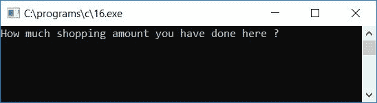
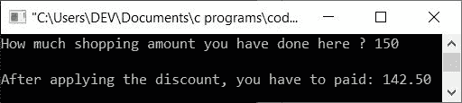
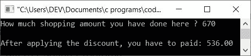
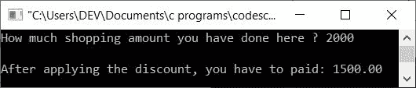

# 计算折扣后要支付的购买金额的程序

> 原文：<https://codescracker.com/c/program/c-program-calculate-discount-purchase-amount.htm>

在本教程中，我们将学习如何用 C 语言创建一个程序，该程序将要求用户输入在商店中购买的总购物金额，然后根据以下折扣标准应用折扣，然后找到并打印减去折扣金额后客户必须支付的最终金额:

*   如果用户购买了价格从 101 英镑到 200 英镑的东西，折扣将是 5%
*   如果用户购买了价格从 201 英镑到 400 英镑的商品，折扣将是 10%
*   如果用户购买了价格从 401 英镑到 800 英镑的商品，折扣将是 20%
*   如果用户购买了价值超过 800 英镑的商品，那么总折扣将是总购买金额的 25%

让我们来看看这个程序:

```
#include<stdio.h>
#include<conio.h>
int main()
{
    float amount, discount, amountToBePaid;
    printf("How much shopping amount you have done here ? ");
    scanf("%f", &amount);
    printf("\n");
    if(amount<=100)
        printf("You have to paid: %0.2f", amount);
    else
    {
        if(amount>100 && amount<=200)
        {
            discount = (amount*5)/100;
            amountToBePaid = amount-discount;
            printf("After applying the discount, you have to paid: %0.2f", amountToBePaid);
        }
        else if(amount>200 && amount<=400)
        {
            discount = (amount*10)/100;
            amountToBePaid = amount-discount;
            printf("After applying the discount, you have to paid: %0.2f", amountToBePaid);
        }
        else if(amount>400 && amount<=800)
        {
            discount = (amount*20)/100;
            amountToBePaid = amount-discount;
            printf("After applying the discount, you have to paid: %0.2f", amountToBePaid);
        }
        else
        {
            discount = (amount*25)/100;
            amountToBePaid = amount-discount;
            printf("After applying the discount, you have to paid: %0.2f", amountToBePaid);
        }
    }
    getch();
    return 0;
}
```

由于程序是在 **Code::Blocks** IDE 下编写的，因此在成功构建和运行之后，这里是你 将在你的输出屏幕上得到的输出。这是示例运行的第一个快照:



现在输入总金额(原始购买金额)，比如说 **150** ，即客户在该商店购买了 150 英镑。 现在按`ENTER`键查看客户在享受折扣后需要支付的总费用(最终费用)。这是第二个 样本运行的快照:



让我们再做一次样品测试。这次客户购买了 **670** 。以下是示例运行的快照:



这里是另一个运行示例，这一次，客户购买了 **2000** :



以下是上述程序中使用的一些主要步骤:

*   接收原始购买金额
*   使用 **if** 语句检查购买金额是否小于等于 100
*   如果是，那么只要求他/她支付原始购买金额作为最终购买金额，而不应用任何折扣。因为折扣只有在购买金额超过 100 英镑时才开始
*   否则，如果购买金额超过 100，则应用折扣，并要求他/她在应用折扣后支付最终金额或净额
*   这里我们首先要计算折扣金额。要计算折扣金额，将金额乘以折扣百分比，再除以 100，然后将其初始化为保存折扣值的变量，比如说 **discount** 。 然后从原始购买金额中减去折扣值，并将其初始化为另一个变量 ，该变量保存客户必须支付的最终金额，例如**amounttobedded**。
*   最后打印出**的值作为输出。无论净金额或最终金额是多少，**amount to payed**变量保存着它**
*   例如，假设用户购买了几件价格为 **768** 的商品。或者用户已经提供了 **768** 作为输入
*   由于给定值**大于 400 且小于等于 800** ，因此 对此采购金额应用的折扣将为 **20%**
*   因此，**(金额*20)/100** 或 **(768*20)/100** 或 **(15360)/100** 或 **153.6** 将被初始化为**折扣**
*   并且**金额折扣**或 **768-153.6** 或 **614.4** 将被初始化为**待支付金额**
*   现在将**的值打印出来，作为输出，这将是客户必须支付的净金额**

[C 在线测试](/exam/showtest.php?subid=2)

* * *

* * *