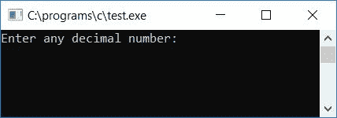
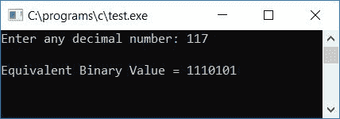
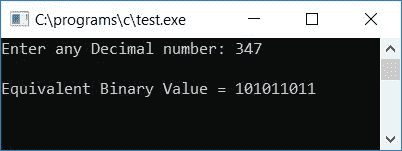
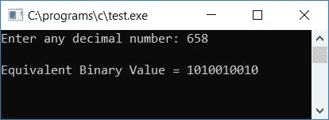

# C 程序：将十进制转换成二进制

> 原文：<https://codescracker.com/c/program/c-program-convert-decimal-to-binary.htm>

在本教程中，我们将学习如何用 C 语言创建一个程序，将用户在运行时给定的任何数字(十进制数)转换成二进制数的等值。最后，我们还创建了一个程序，使用用户定义的[函数](/c/c-functions.htm)来完成同样的工作。

但是在完成这个项目之前，如果你不知道

*   小数
*   二进制数
*   十进制到二进制转换

然后参照[十进制到二进制](/computer-fundamental/decimal-to-binary.htm)的逐步转换 过程。现在让我们继续编程。

## C 语言中的十进制到二进制

在 C 编程中，要将十进制数转换成二进制数，你必须要求用户输入(十进制数系统中的)数，将其转换成二进制数，然后以二进制显示等值作为输出。

```
#include<stdio.h>
#include<conio.h>
int main()
{
    int decnum, binnum[50], i=0;
    printf("Enter any decimal number: ");
    scanf("%d", &decnum);
    while(decnum!=0)
    {
        binnum[i] = decnum%2;
        i++;
        decnum = decnum/2;
    }
    printf("\nEquivalent Binary Value = ");
    for(i=(i-1); i>=0; i--)
        printf("%d", binnum[i]);
    getch();
    return 0;
}
```

由于上面的程序是在 **Code::Blocks** IDE 下编写的，因此在成功构建和运行之后，下面是示例运行。 这是样本运行的第一张快照:



现在提供任意数字(十进制)比如 **117** 并按回车键查看其等价的二进制值，如这里给出的第二个 样本运行快照所示:



#### 程序解释

*   接收任何十进制数
*   创建一个 [`while`循环](/c/c-while-loop.htm)，一直运行到十进制数的值( **decnum** 变为 **0**
*   假设用户已经输入了 **117** 作为输入
*   因此在第一次运行 **while** 循环时， **decnum！=0** 或者 **117！=0** 评估为真，因此程序 流程进入[循环](/c/c-loops.htm)
*   并且 **decnum%2** 或 **117%2** 或 **1** (好像我们将 117 除以 2，然后我们将得到 1 作为余数)被初始化 到 **binnum[i]** (因为 **i** 在程序开始时被初始化为 0，因此在第一次运行循环时，I 保存其值为 0 或 **binnum[0]**
*   现在[变量](/c/c-variables.htm) **i** 的值增加并变为 1，并且 然后 **decnum/2** 或 **117/2** 或 **58** 被初始化为 **decnum**
*   在循环时，程序流程再次回到**的状态**
*   因此在第二次运行**而**循环时， **decnum！=0** 或者 **58！=0** 评估为真，并且程序 流程再次进入循环内部
*   并且 **decnum%2** 或 **58%2** 或 **0** (这次当数字 58 除以 2 时，它没有留下任何余数， 因此余数将是 0)被初始化为 **binnum[1]**
*   **i** 的值增加并变为 2。最后 **decnum/2** 或 **58/2** 或 **29** 得到初始化 到 **decnum**
*   现在在**循环的第三个回合，**结束了！=0** 或 **29！=0** 评估为真，现在第三次程序 流程进入循环，并按照上述步骤进行类似的步骤，直到并且除非 **decnum** 的值变为 0。这里，在第一、第二、第三、第四、第五、第六、第七和第八次运行时， **decnum** 的值将是 117、58、29， 14、7、3、1，然后是 0**
*   存储给定十进制数的等效二进制值后。我们必须以相反的顺序打印二进制数字的值。
*   也就是说，为从 **i-1** 运行的循环创建一个**。这里我们用 1 减去了 **i** 的值，因为在 **while** 循环的最后一次运行 时， **i** 的值增加，并且 **decnum/2** 被初始化为 **decnum** 。 并且当 **decnum** 的值变为 0(循环的最后一次运行)时，因此程序流在检查条件 **decnum 后不会再次进入循环 ！=0** 或 **0！=0** (评估为假)，但是我们已经增加了 **i** 的值 。因此，我们必须用 1 减去它，以删除其额外的索引**
*   因此在这里，在循环的**中，我们从 **i-1** 开始循环，一直运行到**大于或等于** 0**
*   逐一打印 **binnum[i]** 的值
*   这样，我们就在输出屏幕上打印出了给定十进制数的等价二进制值

### C 语言中不使用数组的十进制到二进制转换

问题是，**用 C 写一个程序，不用数组把十进制数转换成二进制数。**这个问题的 答案如下:

```
#include<stdio.h>
#include<conio.h>
int main()
{
    int decnum, binnum=0, mul=1, rem;
    printf("Enter any decimal number: ");
    scanf("%d", &decnum);
    while(decnum>0)
    {
        rem = decnum%2;
        binnum = binnum+(rem*mul);
        mul = mul*10;
        decnum = decnum/2;
    }
    printf("\nEquivalent Binary Value = %d", binnum);
    getch();
    return 0;
}
```

这个程序产生与前一个程序相同的输出。

### C 语言中不带模数运算符的十进制到二进制转换

如果您想要创建相同的程序，但不使用模块化操作符( **%** )，那么

*   将该数除以 2，并将商值初始化为任何变量，比如 **temp**
*   现在将商乘以 2，并再次将其乘法结果初始化为另一个变量，比如 **chk**
*   然后检查 **chk** 是否等于原始值( **decnum** 的当前值，被除数)
*   如果相等，则没有余数，否则，如果不相等，则有余数
*   如果余数没有剩余，那么我们必须将 0 初始化为 **binnum[i]** (i 在第一次运行时保持 0)
*   否则，如果剩余，因此我们必须将 1 初始化为 **binnum** 数组的初始索引(第 0 <sup>个</sup>个索引) ，并再次增加数组的索引，并继续执行下面给出的程序

问题是，**用 C 写一个程序，不使用模运算符**把十进制转换成二进制。这个问题的答案是:

```
#include<stdio.h>
#include<conio.h>
int main()
{
    int decnum, binnum[50], i=0, temp, chk;
    printf("Enter any Decimal number: ");
    scanf("%d", &decnum);
    while(decnum!=0)
    {
        temp = decnum/2;
        chk = temp*2;
        if(chk==decnum)
            binnum[i] = 0;
        else
            binnum[i] = 1;
        i++;
        decnum = temp;
    }
    printf("\nEquivalent Binary Value = ");
    for(i=(i-1); i>=0; i--)
        printf("%d", binnum[i]);
    getch();
    return 0;
}
```

以下是示例运行的最终快照:



### 使用自定义函数将 C 语言中的十进制转换为二进制

现在让我们创建一个名为 **DecToBin()** 的用户定义函数，该函数接收一个参数(十进制数)并将其等效的二进制值一一转换和存储到 **bin[]** 数组，如下面给出的程序所示。问题是，**用 C 写一个程序 使用用户自定义函数**将十进制数转换成二进制数。这个问题的答案是:

```
#include<stdio.h>
#include<conio.h>
void DecToBin(int dec);
int bin[50];
static int i;
int main()
{
    int decnum;
    printf("Enter any decimal number: ");
    scanf("%d", &decnum);
    DecToBin(decnum);
    printf("\nEquivalent Binary Value = ");
    for(i=(i-1); i>=0; i--)
        printf("%d", bin[i]);
    getch();
    return 0;
}
void DecToBin(int dec)
{
    while(dec!=0)
    {
        bin[i] = dec%2;
        i++;
        dec = dec/2;
    }
}
```

以下是示例运行的最终快照:



在这里，我们在函数 **main()** 外部声明了数组 **bin[]** 和变量 **i** ，因为在 外部声明了 **main()** 函数(在程序开始时)之后，数组(bin[])和变量(I)都保持已知，并且可以在整个 程序中使用。 **i** 的值被声明为静态变量。因为静态变量保持它以前的值。关于静态变量还有一点 ,如果你一开始没有初始化静态变量的任何值，那么它会把 0 作为初始值。

#### 其他语言的相同程序

*   [C++ 十进制到二进制](/cpp/program/cpp-program-convert-decimal-to-binary.htm)
*   [Java 十进制到二进制](/java/program/java-program-convert-decimal-to-binary.htm)
*   [Python 十进制转二进制](/python/program/python-program-convert-decimal-to-binary.htm)

[C 在线测试](/exam/showtest.php?subid=2)

* * *

* * *