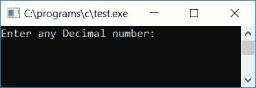
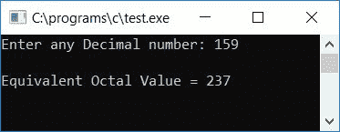
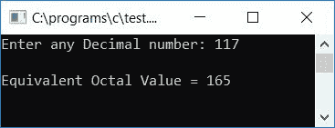
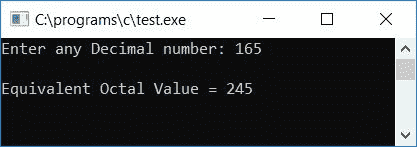

# C 程序：将十进制转换为八进制

> 原文：<https://codescracker.com/c/program/c-program-convert-decimal-to-octal.htm>

在本教程中，我们将学习如何用 C 语言创建一个程序，将任何给定的十进制数(在运行时由用户指定)转换成等价的八进制数。最后，我们还创建了一个用户定义的[函数](/c/c-functions.htm)程序来完成同样的工作。

在浏览该计划之前，如果您不了解

*   小数
*   八进制数
*   十进制到八进制的转换

然后参照[十进制到八进制](/computer-fundamental/decimal-to-octal.htm)的逐步转换 过程。现在让我们继续这个项目。

## C 语言中的十进制到八进制

在 C 编程中，要将十进制数转换为十进制数，您必须要求用户输入十进制数，将其转换为八进制数，然后以八进制显示等值，如下面给出的程序所示:

```
#include<stdio.h>
#include<conio.h>
int main()
{
    int decnum, octnum[50], i=0;
    printf("Enter any Decimal number: ");
    scanf("%d", &decnum);
    while(decnum != 0)
    {
        octnum[i] = decnum%8;
        i++;
        decnum = decnum/8;
    }
    printf("\nEquivalent Octal Value = ");
    for(i=(i-1); i>=0; i--)
        printf("%d", octnum[i]);
    getch();
    return 0;
}
```

由于上面的程序是在 **Code::Blocks** IDE 下编写的，因此这里是成功构建和运行后的运行示例。 这是样本运行的第一张快照:



现在提供任意十进制数，比如 159，并按回车键查看它的等价八进制值，如下面给出的示例运行的第二个快照所示:



#### 程序解释

*   在运行时接收来自用户的任何十进制数作为输入
*   创建一个 [`while`循环](/c/c-while-loop.htm)，该循环一直运行到输入的十进制数 的值不等于零(0)。换句话说， **while** 循环运行，直到 **decnum** (用户给定的十进制数)的值变为 0
*   假设用户已经输入了 **159** 作为输入。因此在第一次运行**的同时**循环，条件 **decnum！=0** 或者 **159！=0** 评估为真，因此程序流程进入 [循环](/c/c-loops.htm)
*   和 **decnum%8** 或 **159%8** (当数字 159 除以 8 时，我们将得到余数为 7)或 **7** 得到 初始化为 **octnum[i]** 或 **octnum[0]** (因为 **i** 保存 0 作为其初始值)
*   现在， **i** 的值增加并变为 1。然后 **decnum/8** 或 **159/8** 或 **19** 得到初始化 到 **decnum**
*   现在程序流程返回到**而**循环并检查条件，即 **decnum！=0** 或 **19！=0** 评估为真，因此程序流再次进入循环，并且 **decnum%8** 或 **19%8** 或 **3** 将 初始化为 **octnum[i]** 或 **octnum[1]** 。
*   **i** 的值增加并变为 2。然后 **decnum/8** 或 **19/8** 或 **2** 被初始化 到 **decnum** 。当循环并检查条件时，程序流程再次返回到
***   那是 **decnum！=0** 或 **2！=0** 评估为真，因此程序流再次进入循环*   并且 **decnum%8** 或 **2%8** (只谈整数，2 不能被 8 整除，因此在这种情况下 2 将是 的余数)或 **2** 被初始化为 **octnum[i]** 或 **octnum[2]***   **i** 的值增加并变为 3。并且 **decnum/8** 或 **2/8** 或 **0** 被初始化为 **decnum** 。*   程序流程再次返回到 **while** 循环，并检查条件，即 **decnum！=0** 或 **0！=0** 评估为假，因此程序流不进入循环(即，现在程序流从循环中退出)*   现在我们已经将所有给定十进制数的等价八进制数逐个存储在一个名为 **octnum[]** 的数组中*   我们必须为循环创建一个**，它将被初始化为比 **i** 的当前值小 1。随着 **while** 循环的最后一次 运行，我们增加了 **i** 的值。但是随着 **decnum** 变为 0，因此程序流 从循环中退出，但是 **i** 保持其值比所需值多 1，因此我们必须删除或跳过 最后一个索引或编号。***   我们必须以相反的顺序一个接一个地打印八进制数字。即循环从 **i-1** 到**大于或等于 到**到 0*   在循环内部，一个接一个地打印八进制数字*   这样，我们在运行时打印出了用户给定十进制数的等价八进制值**

 **### C 语言中不带模运算符的十进制到八进制转换

现在，让我们创建一个相同目的的程序，将任何给定的十进制数转换成等价的八进制值，但不使用任何模运算符[如下面给出的程序所示。](/c/c-operators.htm)

```
#include<stdio.h>
#include<conio.h>
int main()
{
    int decnum, octnum[100], i=0, temp, chck, rem;
    printf("Enter any Decimal number: ");
    scanf("%d", &decnum);
    while(decnum!=0)
    {
        temp = decnum/8;
        chck = temp*8;
        rem = decnum - chck;
        octnum[i] = rem;
        i++;
        decnum = temp;
    }
    printf("\nEquivalent Octal Value = ");
    for(i=i-1; i>=0; i--)
        printf("%d", octnum[i]);
    getch();
    return 0;
}
```

以下是示例运行的最终快照:



#### 程序解释

*   众所周知，模运算符(%)只能在任何数除以任何其他数时找到余数
*   所以在这里，我们必须找出除以 8 的余数
*   因此，我们简单地将数字除以 8，并将其值初始化为一个变量，比如说 **temp**
*   然后我们再次将相同的数字 **temp** 乘以 8，并初始化为另一个 [变量](/c/c-variables.htm)比如说 **chck**
*   现在减去并初始化 **decnum - chck** 的值(这里 **decnum** 是原来的数字)到变量 say **rem**
*   例如，让我们假设用户已经提供了 **159** 作为输入
*   因此在第一次运行 **while** 循环时， **decnum/8** 或 **159/8** 或 **19** 被初始化为 **temp**
*   并且 **temp*8** 或 **19*8** 或 **152** 被初始化为 **chck**
*   然后 **decnum-chck** 或 **159-152** 或 **7** 被初始化为 **rem**
*   现在，如果你将这三行代码替换为 **rem = decnum%8** ，你将得到相同的值，即 7 将被初始化为 **rem**

因此，我们成功地替换了模运算符，并创建了用于相同目的的程序，但没有使用任何模运算符，如上面的程序所示。

### 使用用户自定义函数将 C 语言中的十进制转换为八进制

现在让我们为同样的目的创建一个函数驱动的程序。问题是，**用 C 写一个程序，用自定义函数**把 十进制数转换成八进制数。这个问题的答案是:

```
#include<stdio.h>
#include<conio.h>
void DecToOct(int dec);
int octnum[50];
static int i;
int main()
{
    int decnum;
    printf("Enter any Decimal number: ");
    scanf("%d", &decnum);
    DecToOct(decnum);
    printf("\nEquivalent Octal Value = ");
    for(i=(i-1); i>=0; i--)
        printf("%d", octnum[i]);
    getch();
}
void DecToOct(int dec)
{
    while(dec != 0)
    {
        octnum[i] = dec%8;
        i++;
        dec = dec/8;
    }
}
```

以下是上述程序运行示例的最终快照:



在这里，我们将变量 **i** 声明为静态变量。因为静态变量记得它以前的值。 我们还没有用 0 初始化 **i** 的值，因为静态变量保存 0 作为它的初始值。 也就是说，如果你不将任何值初始化为任何静态变量，那么 0 会自动初始化为静态变量。 我们在 **main()** 函数外创建了数组 **octnum[]** 和变量 **i** ，这样 数组和变量在整个程序中都是已知的，也就是说，在函数 **main()** 和 **DecToOct()** 内。

#### 其他语言的相同程序

*   [C++ 十进制到八进制](/cpp/program/cpp-program-convert-decimal-to-octal.htm)
*   [Java 十进制到八进制](/java/program/java-program-convert-decimal-to-octal.htm)
*   [Python 十进制到八进制](/python/program/python-program-convert-decimal-to-octal.htm)

[C 在线测试](/exam/showtest.php?subid=2)

* * *

* * ***