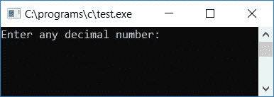
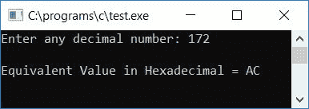
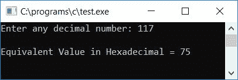
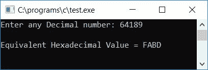
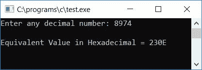

# C 程序：将十进制转换为十六进制

> 原文：<https://codescracker.com/c/program/c-program-convert-decimal-to-hexadecimal.htm>

在本教程中，我们将学习如何用 C 语言创建一个程序，将任何给定的十进制数(由用户在运行时输入)转换成相应的十六进制值。我们还创建了一个用户定义的[函数](/c/c-functions.htm)，它完成了将十进制数转换为十六进制数的相同工作。

在浏览该计划之前，如果您不了解

*   小数
*   十六进制数
*   十进制到十六进制的转换过程

然后参考，[十进制到](/computer-fundamental/decimal-to-hexadecimal.htm)十六进制转换 的逐步过程。让我们继续节目。

## C 语言中的十进制到十六进制

在 C 编程中，要把十进制数转换成十六进制数，你必须让用户输入十进制数，然后把它转换成等价的十六进制数，如下面给出的程序所示。问题是，**用 C 写一个程序，把十进制转换成十六进制。**下面是它的回答。

```
#include<stdio.h>
#include<conio.h>
int main()
{
    int decnum, rem, i=0;
    char hexnum[50];
    printf("Enter any decimal number: ");
    scanf("%d", &decnum);
    while(decnum!=0)
    {
        rem = decnum%16;
        if(rem<10)
            rem = rem+48;
        else
            rem = rem+55;
        hexnum[i] = rem;
        i++;
        decnum = decnum/16;
    }
    printf("\nEquivalent Value in Hexadecimal = ");
    for(i=i-1; i>=0; i--)
        printf("%c", hexnum[i]);
    getch();
    return 0;
}
```

由于上面的程序是在 **Code::Blocks** IDE 下构建和运行的，因此在成功构建和运行之后，您将得到下面的 输出。这是示例运行的第一个快照:



现在提供任意十进制数作为输入，比如说 **172** 并按回车键查看输出的等价十六进制值。 下面是示例运行的第二个快照:



这是另一个运行示例。这是示例运行的最终快照:



#### 程序解释

*   由用户接收任何十进制数
*   用条件 **decnum 创建一个 [while 循环](/c/c-while-loop.htm)！=0** 。这里**decnum** [变量](/c/c-variables.htm)保存用户在运行时输入的十进制数值
*   假设用户已经输入了 **172** 作为输入
*   因此在第一次运行 **while** 循环时，条件 **decnum！=0** 或者 **172！=0** 评估为真。 因此程序流程进入[循环](/c/c-loops.htm)
*   和 **decnum%16** 或 **172%16** (我们将得到余数 12，因为当用 16(除数)除 172(被除数)时，我们将得到 10 作为商，12 作为余数)或 **12** 被初始化为 **rem** 变量
*   现在使用 [if 语句](/c/c-if-statement.htm)检查 **rem** 内的值是否小于 10，因为如果值小于 10，那么该值可能来自 **0，1，2，...，8，9** 。我们都知道, **0，1，2，...8，9** 分别是 48，49，50，...，56，57 。因此，我们必须将 48 加到变量 **rem** 中的值上
*   因为如果 **rem** 为 0，那么 **rem+48** 或 **0+48** 或 **48** 被初始化为 **rem** (这是 0 的 ASCII 码 )。或者如果 **rem** 保存值 **4** ，那么 **rem+48** 或 **4+48** 或 **52** 被初始化为**rem**T25，等于 **4** 的 ASCII 码
*   最后 **rem** (ASCII 码值)被初始化为 **hexnum[i]** ( **i** 保存 0 作为初始值)或 **hexnum[0]**
*   第二种情况是，如果 **rem** 的值不小于 10，那么 **rem** 变量里面的值可能来自 **10，11，12，...，14，15**
*   在十六进制数字系统中，10 用 A 表示，11 用 B 表示，...，15 是用 f .和 ASCII 码来表示的 **A，B，C、...、E、F** 为 **65、66、67、...，69，70**
*   因此， **rem+55** 被初始化为 **rem** 。我们将 **rem** 的值与 **55** 相加，就好像 rem**rem**的值是 10，那么我们必须初始化 A 的 ASCII 码，因为 10 由 A 表示，A 的 ASCII 码是 65。这样 的 ASCII 码的 **0，1，2、...，E 或 F** 被初始化为 **hexnum[i]** 或 **hexnum[0]** 。因此，首先运行**的 同时**循环。我们得到了一个余数值 **12** ，因此 **rem+55** 或 **12+55** 或**67**T37】被初始化为 **rem** ，然后 **rem** 被初始化为**hex num[I】**或 **hexnum[0]**
*   然后 **i** 的值增加并变为 1。并且 **decnum/16** 或 **172/16** 或 **10** 被初始化为 **decnum**
*   现在在第二次运行 **while** 循环时，条件 **decnum！=0** 或 **10！=0** 评估为真，因此 程序流程再次进入循环，并按照上述步骤进行类似操作
*   从 **while** 循环中退出后，我们已经成功地逐个存储了给定十进制数的等价十六进制值
*   因此，要以十六进制形式打印数字，我们必须为循环、 创建一个[，它从比当前值 i 小 1 的**运行到 **0****](/c/c-for-loop.htm)
*   因为上次运行时，我们已经增加了 **i** 的值。这里最后一次运行意味着 **decnum** 包含 0，因此 条件(decnum！=0 或者 0！=0)评估为假。因此，我们必须用 1 减去 **i** 的当前值
*   从最后一个数字到第一个数字，逐个打印出 **hexnum[]** 数组的所有数字
*   这样，我们就成功地打印出了用户在运行时给定的十进制值的等价十六进制值

### C 语言中不带模运算符的十进制到十六进制转换

现在让我们创建相同的程序，但是不使用任何模块操作符。也就是说，我们必须在不使用模运算符的情况下找出余数。因此，为了找出余数，我们将出现在 **decnum** 中的数除以 16，并将它的 商值存储在变量比如 **temp** 中，然后再次将商值乘以 16，并将乘法 结果存储到变量比如 **chck** 中。现在从 **decnum** (decnum - chck)中减去 **chck** ，并将其初始化为 **rem** 变量，该变量将保存当前余数。

例如，如果用户提供了 172 作为输入，那么在第一次运行时 **decnum/16** 或 **10** 被初始化为 **temp** ，然后 **temp*16** 或 **10*16** 或 **160** 被初始化为 **chck** 。现在 **decnum-chck** 或 **172-160** 或 T18】12 被初始化为 **rem** 这是这次的余数。这样，我们用下面给出的程序中的三行代码代替了模运算符:

```
#include<stdio.h>
#include<conio.h>
int main()
{
    int decnum, hexnum[50], temp, chck, i=0, rem;
    printf("Enter any Decimal number: ");
    scanf("%d", &decnum);
    while(decnum!=0)
    {
        temp = decnum/16;
        chck = temp*16;
        rem = decnum - chck;
        if(rem<10)
            rem = rem+48;
        else
            rem = rem+55;
        hexnum[i] = rem;
        i++;
        decnum = temp;
    }
    printf("\nEquivalent Hexadecimal Value = ");
    for(i=i-1; i>=0; i--)
        printf("%c", hexnum[i]);
    getch();
    return 0;
}
```

以下是示例运行的最终快照:



### 使用用户自定义函数将 C 语言中的十进制转换为十六进制

现在让我们创建一个名为 **DecToHex()** 的用户定义函数，它接受一个参数(用户输入的十进制数)。 这里我们在函数 say **main()** 和 **DecToHex()** 之外声明了变量 **i** 和数组 **hex[]** ，使其为两个函数所知。这里变量 **i** 被声明为静态变量，因为静态变量记得 它以前的值。最后一件事是，我们没有用 0 初始化静态变量 **i** (这是必需的)，因为默认情况下 静态变量在声明静态变量后将 0 作为初始值。其余的事情都是类似的，你很容易理解。

```
#include<stdio.h>
#include<conio.h>
void DecToHex(int dec);
static int i;
char hex[50];
int main()
{
    int decnum;
    printf("Enter any decimal number: ");
    scanf("%d", &decnum);
    DecToHex(decnum);
    printf("\nEquivalent Value in Hexadecimal = ");
    for(i=i-1; i>=0; i--)
        printf("%c", hex[i]);
    getch();
    return 0;
}
void DecToHex(int dec)
{
    int rem;
    while(dec!=0)
    {
        rem = dec%16;
        if(rem<10)
            rem = rem+48;
        else
            rem = rem+55;
        hex[i] = rem;
        i++;
        dec = dec/16;
    }
}
```

下面是上述程序运行示例的最终快照:



#### 其他语言的相同程序

*   [C++ 十进制到十六进制](/cpp/program/cpp-program-convert-decimal-to-hexadecimal.htm)
*   [Java 十进制到十六进制](/java/program/java-program-convert-decimal-to-hexadecimal.htm)
*   [Python 十进制到十六进制](/python/program/python-program-convert-decimal-to-hexadecimal.htm)

[C 在线测试](/exam/showtest.php?subid=2)

* * *

* * *