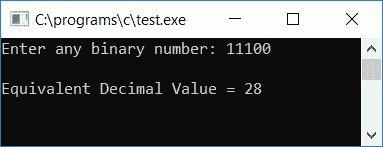

# C 程序：将二进制转换成十进制

> 原文：<https://codescracker.com/c/program/c-program-convert-binary-to-decimal.htm>

在本教程中，我们将学习如何用 C 语言创建一个程序，将任何给定的二进制数(在运行时由用户输入)转换成等价的十进制数。最后，我们还使用名为 **BinToDec()** 的自定义[函数](/c/c-functions.htm)创建了相同用途的程序。

但是在完成这个项目之前，如果你不知道

*   二进制数
*   小数
*   二进制到十进制转换

然后参照[二进制到十进制](/computer-fundamental/binary-to-decimal.htm)的逐步转换 过程。现在让我们继续这个项目。

## C 语言中的二进制到十进制

在 C 编程中，要将二进制数转换为十进制数，必须要求用户输入二进制数，然后将其转换为十进制数，如以下程序所示:

```
#include<stdio.h>
#include<conio.h>
#include<math.h>
int main()
{
    int binnum, decnum=0, i=0, rem;
    printf("Enter any binary number: ");
    scanf("%d", &binnum);
    while(binnum!=0)
    {
        rem = binnum%10;
        decnum = decnum + rem*pow(2,i);
        i++;
        binnum = binnum/10;
    }
    printf("\nEquivalent Decimal Value = %d", decnum);
    getch();
    return 0;
}
```

由于上面的程序是在 **Code::Blocks** IDE 下编写的，因此在成功构建并运行之后，您将得到下面的 输出。这是示例运行的第一个快照:


现在提供任意二进制数，比如说 **101110** ，并按回车键查看其在十进制中的等效值，如下面给出的示例运行的第二个快照中的 所示:


#### 程序解释

*   在运行时接收来自用户的任何二进制数，比如 **101110**
*   创建一个 [while 循环](/c/c-while-loop.htm)，一直运行到 **binnum** (用户输入的二进制数，比如 **101110** ) 的值变为 0
*   换句话说，[循环](/c/c-loops.htm)继续运行，直到 **binnum** 的值不等于 0。当 **binnum**的值等于 0 时，则程序流程从循环中退出或者从**退出，同时**循环
*   在第一次运行 **while** 循环时，条件 **binnum！=0** 或者 **101110！=0** 评估为真，因此 程序流程进入循环，并且 **binnum%10** 或 **101110%10** 或 **0** 被初始化为 **rem**
*   和 **decnum + rem*pow(2，i)** (我们已经在程序开始时将 **decnum** 和 **i** 都初始化为 0。 And**math . h**库的函数 **pow()** 取两个参数，第一个参数对应基数，第二个参数 对应指数。即在**2<sup>3</sup>T13】中，2 为基数，3 为指数)或 **0 + 0*pow(2，0)** 或 T16】0+0 * 2<sup>0</sup>或 **0 + 0*1** 或 **0+0** 或 **0** 被初始化为 **decnum****
*   **i** 的值增加并变为 1
*   然后 **binnum/10** 或 **101110/10** 或 **10111** 被初始化为 **binnum**
*   现在程序流回到 **while** 循环的状态。那就是**宾努姆！=0** 或者 **10111！=0** 评估 为真，因此程序流再次进入循环内部
*   在循环内部， **binnum%10** 或 **10111%10** 或 **1** 被初始化为 **rem**
*   然后 **decnum + rem*pow(2，i)** 或 **0 + 1*pow(2，1)** 或 **0 + 1*2 <sup>1</sup>** 或 **2** 被初始化为 **decnum**
*   **i** 的值增加并变为 2
*   并且 **binnum/10** 或 **10111/10** 或 **1011** 被初始化为 **binnum**
*   现在程序流回到**的状态，同时**再次循环。还有**宾纳姆！=0** 或者 **1011！=0** 评估为真，因此程序流再次进入循环
*   因此，再次 **binnum%10** 或 **1011%10** 或 **1** 被初始化为 **rem**
*   然后 **decnum + rem*pow(2，i)** 或 **2 + 1*pow(2，2)** 或 **2 + 1*2 <sup>2</sup>** 或 **2 + 1*4** 或 **6** 被初始化为 **decnum**
*   **i** 的值增加并变为 3。然后 **binnum/10** 或 **1011/10** 或 **101** 将 初始化为 **binnum**
*   以这种方式，程序流程再次返回到 **while** 循环的条件，并且如果条件评估为真，则 遵循如上所述的类似步骤来计算 **rem、decnum、i** 和 **binnum** 的新值。
*   即在第四次运行**而**循环时， **rem，decnum，I，binnum** 分别保持其值为 **1，14，4，10**
*   然后在第五次运行时， **rem，decnum，I，binnum** 分别持有 **0，14，5，1**
*   并且在第六次运行时， **rem，decnum，I，binnum** 分别持有 **1，46，6，0**
*   由于 **binnum** 的值变得等于 0，因此程序流不会进入循环。我们有 **46** 作为 **decnum** 的值，它是给定二进制数的等价十进制值，比如说 **101110**
*   现在打印程序最后的 **decnum** 的值

### C 语言中二进制到十进制转换不使用 power()函数

现在让我们创建同样的程序，但是这次不使用 **math.h** 库的任何 **pow()** 函数。问题是，**用 C 写一个程序，把任何给定的二进制数转换成十进制数，而不需要 使用任何 pow()函数**。这个问题的答案是:

```
#include<stdio.h>
#include<conio.h>
int main()
{
    int binnum, decnum=0, i=1, rem;
    printf("Enter any binary number: ");
    scanf("%d", &binnum);
    while(binnum!=0)
    {
        rem = binnum%10;
        decnum = decnum + (rem*i);
        i = i*2;
        binnum = binnum/10;
    }
    printf("\nEquivalent Decimal Value = %d", decnum);
    getch();
    return 0;
}
```

以下是上述程序运行示例的最终快照:


这里我们把 **pow(2，i)** (0 为 I 的初始值)换成了 **i** (1 为 I 的初始值) **i++** 换成了 **i=i*2** 。因此，在这里的这种情况下，我们会得到:

*   第一次运行时，I 等于 1
*   第二次运行时，I 等于 i*2 或 1*2 或 2
*   第三次运行时，I 等于 i*2 或 2*2 或 4
*   在第四次运行时，I 等于 i*2 或 4*2 或 8
*   在第五次运行时，I 等于 i*2 或 8*2 或 16
*   在第七次运行时，I 等于 i*2 或 16*2 或 32

这里我们在 **pow(2，i)** 的情况下得到相同的值，即:

*   第一次运行时， **pow(2，0)** 或**2<sup>0</sup>T5】或 **1****
*   第一次运行时， **pow(2，1)** 或**2<sup>1</sup>T5 或 **2****
*   第一次运行时， **pow(2，2)** 或**2<sup>2</sup>T5 或 **4****
*   第一次运行时， **pow(2，3)** 或**2<sup>3</sup>T5 或 **8****
*   等等

### 使用自定义函数在 C 语言中实现二进制到十进制的转换

现在让我们用 C 语言创建另一个程序，该程序使用名为 **BinToDec()** 的用户定义函数将任何给定的二进制数 转换为等效的十进制值，如下面给出的程序所示:

```
#include<stdio.h>
#include<conio.h>
int BinToDec(int bin);
int main()
{
    int binnum, decnum;
    printf("Enter any binary number: ");
    scanf("%d", &binnum);
    decnum = BinToDec(binnum);
    printf("\nEquivalent Decimal Value = %d", decnum);
    getch();
    return 0;
}
int BinToDec(int bin)
{
    int dec=0, i=1, rem;
    while(bin!=0)
    {
        rem = bin%10;
        dec = dec + (rem*i);
        i = i*2;
        bin = bin/10;
    }
    return dec;
}
```

以下是示例运行的最终快照:



这里我们使用了一个名为 **BinToDec()** 的函数，它将一个参数作为二进制数。在函数内部，我们已经将给定的二进制数转换为十进制数。十进制数保存在变量 **dec** 中。并且我们已经将 **dec** 的 值返回给函数。因此，在 **main()** 函数中，我们已经将函数 **BinToDec()** 的返回值初始化为变量 **decnum** ，该变量保存 **BinToDec()** 函数的 **dec** 的值。最后打印 **decnum** 的 值作为输出，它将是给定二进制数的等价十进制值。

#### 其他语言的相同程序

*   [C++二进制到十进制](/cpp/program/cpp-program-convert-binary-to-decimal.htm)
*   [Java 二进制到十进制](/java/program/java-program-convert-binary-to-decimal.htm)
*   [Python 二进制到十进制](/python/program/python-program-convert-binary-to-decimal.htm)

[C 在线测试](/exam/showtest.php?subid=2)

* * *

* * *