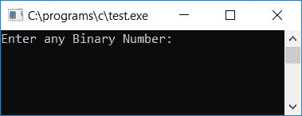
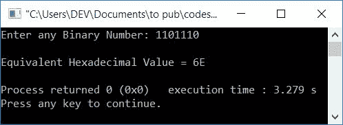
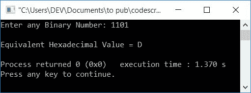
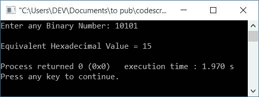

# C 程序：将二进制转换为十六进制

> 原文：<https://codescracker.com/c/program/c-program-convert-binary-to-hexadecimal.htm>

在本教程中，我们将学习如何用 C 语言创建一个程序，该程序可以将用户(在运行时)给定的任何二进制数转换为等效的十六进制值。最后，我们还创建了同样用途的函数驱动程序，也可以将二进制数转换为十六进制数。

但是在完成这个项目之前，如果你不知道

*   二进制数
*   十六进制数
*   二进制到十六进制的转换过程

然后参照[二进制到十六进制的](/computer-fundamental/binary-to-hexadecimal.htm)转换步骤 逐步处理。现在让我们继续这个项目。

## C 语言中的二进制到十六进制

问题是，**用 C 写一个程序，把二进制数转换成十六进制**。这个问题的答案是:

```
#include<stdio.h>
#include<conio.h>
int main()
{
    int binnum, hex=0, mul=1, count=1, rem, i=0;
    char hexnum[20];
    printf("Enter any Binary Number: ");
    scanf("%d", &binnum);
    while(binnum!=0)
    {
        rem = binnum%10;
        hex = hex + (rem*mul);
        if(count%4==0)
        {
            if(hex<10)
                hexnum[i] = hex+48;
            else
                hexnum[i] = hex+55;
            mul = 1;
            hex = 0;
            count = 1;
            i++;
        }
        else
        {
            mul = mul*2;
            count++;
        }
        binnum = binnum/10;
    }
    if(count!=1)
        hexnum[i] = hex+48;
    if(count==1)
        i--;
    printf("\nEquivalent Hexadecimal Value = ");
    for(i=i; i>=0; i--)
        printf("%c", hexnum[i]);
    getch();
    return 0;
}
```

由于上述程序是在 **Code::Blocks** IDE 下编写的，因此在成功构建和运行之后，您将在输出屏幕上获得以下 输出。这是示例运行的第一个快照:



现在提供任意二进制数，比如说 **1101110** ，并按回车键查看其等价的十六进制值，如下面给出的示例运行的 第二个快照所示:



下面是上述程序的另一个示例运行的最终快照:



#### 程序解释

*   在运行时接收来自用户的任何二进制数，比如 **1101**
*   创建一个 [while 循环](/c/c-while-loop.htm),一直运行到给定二进制数的值变为 0
*   也就是说，在第一次运行 **while** 循环时，条件 **binnum！=0** 或者 **1101！=0** 评估为真，因此 程序流程进入[循环](/c/c-loops.htm)
*   并且 **binnum%10** 或 **1101%10** 或 **1** 被初始化为 **rem** ，然后 **hex + (rem*mul)** (我们在程序开始时用 **0** 和 **1** 初始化了 hex**和 **mul** 或 **0 + (1*****
*   现在我们已经这样创建了一个 [if](/c/c-if-statement.htm) 块，使得 **hex** 的值被初始化为 **hexnum[]** 字符 数组中的十六进制数字，一一对应于每 4 对二进制数字。
*   因此，在第一次运行 **while** 循环时， **if** 语句的条件，即 **count%4==0** (我们已经在程序开始时将[变量](/c/c-variables.htm) **count** 初始化为 1)或 **1%4==** 评估为假，因此如果语句，程序流 进入**的 **else** 块**
*   最后， **binnum/10** 或 **1101/10** 或 **110** 被初始化为 **binnum** ，然后程序流程返回 到**的状态，同时**循环
*   又来了**宾纳姆！=0** 或 **110！=0** 评估为真，程序流程再次进入 **while** 循环
*   并且 **binnum%10** 或 **110%10** 或 **0** 被初始化为 **rem** ，然后 **hex + (rem*mul)** 或 **1 + (0*2)** 或 **1** 被初始化为 **hex**
*   现在 **if** 块的条件，即 **count%4==0** 或 **2%4==** 评估为假，程序流程进入 **else** 块内 ，并且 **mul*2** 或 **2*2** 或 **4** 被初始化为 **mul** ，并且**的值计数**
*   最后， **binnum/10** 或 **110/10** 或 **11** 被初始化为 **binnum** ，然后程序流程返回 到**的状态，同时**循环
*   又来了**宾纳姆！=0** 或 **11！=0** 评估为真，程序流程再次进入 **while** 循环
*   并且 **binnum%10** 或 **11%10** 或 **1** 被初始化为 **rem** ，然后 **hex + (rem*mul)** 或 **1 + (1*4)** 或 **5** 被初始化为 **hex**
*   现在 **if** 块的条件，即 **count%4==0** 或 **3%4==** 评估为假，程序流程进入 **else** 块内 ，并且 **mul*2** 或 **4*2** 或 **8** 被初始化为 **mul** ，并且**的值计数**
*   最后， **binnum/10** 或 **11/10** 或 **1** 被初始化为 **binnum** ，然后程序流程在循环的同时回到 的状态
*   又来了**宾纳姆！=0** 或 **1！=0** 评估为真，程序流程再次进入 **while** 循环
*   并且 **binnum%10** 或 **1%10** 或 **1** 被初始化为 **rem** ，然后 **hex + (rem*mul)** 或 **5 + (1*8)** 或 **13** 被初始化为 **hex**
*   现在 **if** 块的条件即 **count%4==0** 或 **4%4==** 评估为真，因此程序 流程这次进入 **if** 块，并且由于 **hex** (13)的值不小于 10， 因此 **hex+55** 或 **13+55** 或 **68** (68 是 C 的 ASCII 码)被初始化为 **hexnum[i]** (我们已经在程序开始时将变量 **I**初始化为 0)或 **hexnum[0]** ，然后 1、0 和 1 被初始化为**mul【1】 并且 **i** 的值增加并变为 1**
*   最后， **binnum/10** 或 **1/10** 或 **0** 初始化为 **binnum** ，程序流程返回到**的 状态，同时**循环
*   那里，**宾纳姆！=0** 或 **0！=0** 求值为假，程序流这次不进入循环， 即程序流从循环中出来或退出循环，然后条件**计数！=1** 或 **1！=1** 评估为假，因此程序流程不会进入 **if** 块。
*   现在第二个 **if** block 的条件，即 **count==1** 或 **1==1** 评估为真，因此 **i** 的 值减 1，变成 0。
*   现在我们已经为循环创建了**，它从 **i** 的当前值运行到 0**
*   并从最后一个索引到第一个索引，逐一打印每个十六进制数字的值
*   这里我们用 ASCII 码表示数字和字符，即 **0，1，2，3，...、7、8、9、A、B、C、D、E、F**
*   也就是说，0，1，2，...8，9 是 **48，49，50，...，56，57** 。而**的 ASCII 码为 A、B、C、..、E、F** 、T6 分别为 **65、66、67、...69，70**
*   因此，如果**十六进制**的值为 0，则 0+48(0 的 ASCII 码)被初始化为 **hexnum[]** ，同样地 如果**十六进制**的值为 13，则 as 13 大于 10，因此 **13+55** 或**68**(C 的 ASCII 码)被初始化为 **hexnum[]**

### 使用用户自定义函数将二进制转换为十六进制

这是另一个使用用户自定义函数的程序，名为 **BinToHex()** ，它也做同样的工作，即将任何二进制数转换为十六进制数。

在这里，我们将变量 **i** 和字符数组 **hexnum[]** 声明为全局变量，使其在两个函数中都被称为 ，即 **main()** 和 **BinToHex()** 。

```
#include<stdio.h>
#include<conio.h>
void BinToHex(int bin);
int i=0;
char hexnum[20];
int main()
{
    int binnum;
    printf("Enter any Binary Number: ");
    scanf("%d", &binnum);
    BinToHex(binnum);
    printf("\nEquivalent Hexadecimal Value = ");
    for(i=i; i>=0; i--)
        printf("%c", hexnum[i]);
    getch();
    return 0;
}
void BinToHex(int bin)
{
    int hex=0, mul=1, count=1, rem;
    while(bin!=0)
    {
        rem = bin%10;
        hex = hex + (rem*mul);
        if(count%4==0)
        {
            if(hex<10)
                hexnum[i] = hex+48;
            else
                hexnum[i] = hex+55;
            mul = 1;
            hex = 0;
            count = 1;
            i++;
        }
        else
        {
            mul = mul*2;
            count++;
        }
        bin = bin/10;
    }
    if(count!=1)
        hexnum[i] = hex+48;
    if(count==1)
        i--;
}
```

以下是上述程序示例运行的最终快照:



#### 其他语言的相同程序

*   [C++二进制到十六进制](/cpp/program/cpp-program-convert-binary-to-hexadecimal.htm)
*   [Java 二进制到十六进制](/java/program/java-program-convert-binary-to-hexadecimal.htm)
*   [Python 二进制到十六进制](/python/program/python-program-convert-binary-to-hexadecimal.htm)

[C 在线测试](/exam/showtest.php?subid=2)

* * *

* * *