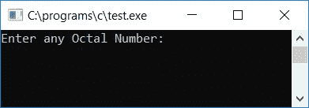
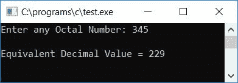
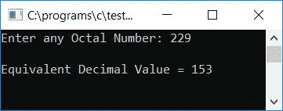
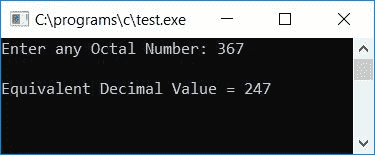

# C 程序：将八进制转换成十进制

> 原文：<https://codescracker.com/c/program/c-program-convert-octal-to-decimal.htm>

在本教程中，我们将学习如何用 C 语言创建一个程序，可以将任何给定的八进制数转换成等价的十进制数。最后我们还将看看函数驱动的程序，它做同样的工作，但是使用用户定义的函数 名为 **OctToDec()** 。

但是在开始之前。如果你不知道

*   八进制数
*   小数
*   八进制到十进制的转换过程

然后参照[八进制到十进制](/computer-fundamental/octal-to-decimal.htm)的逐步转换 过程。现在让我们继续这个项目。

## C 语言中的八进制到十进制

在 C 编程中，要把八进制数转换成十进制数，你必须要求用户先输入八进制数。然后转换成十进制数，再以十进制形式显示等效值作为输出。

```
#include<stdio.h>
#include<conio.h>
#include<math.h>
int main()
{
    int octnum, decnum=0, i=0, rem;
    printf("Enter any Octal Number: ");
    scanf("%d", &octnum);
    while(octnum!=0)
    {
        rem = octnum%10;
        decnum = decnum + (rem*pow(8,i));
        i++;
        octnum = octnum/10;
    }
    printf("\nEquivalent Decimal Value = %d", decnum);
    getch();
    return 0;
}
```

由于上面的程序是在 **Code::Blocks** IDE 下编写的，因此在成功构建并运行之后，您将得到下面的 输出。这是示例运行的第一个快照:



现在输入任意一个八进制数，比如说 **345** ，然后按回车键查看输出，显示其等价的十进制 值，如下图所示:



#### 程序解释

*   接收任意八进制数说 **345** 在**octnum**T4】变量
*   创建一个 **while** 循环，一直运行到 **octnum** 的值变为零
*   与第一次运行时一样，条件 **octnum！=0** 或 **345！=0** 评估为真，因此程序流程进入循环内部
*   并且 **octnum%10** 或 **345%10** 或 **5** 被初始化为 **rem** ，然后 **decnum + (rem*pow(8，i))** (此处 **decnum** 和 **i** 在程序开始时被初始化为 0)或 **0 + (5*pow(8，0))** 或
*   **i** 的值增加并变为 1，并且 **octnum/10** 或 **345/10** 或 **34** 被初始化为 **octnum**
*   现在程序流程回到 [while 循环](/c/c-while-loop.htm)的状态，这次又是 **octnum！=0** 或 **34！=0** 评估为真，并且程序流再次回到[循环](/c/c-loops.htm)内
*   并且 **octnum%10** 或 **34%10** 或 **4** 得到初始化为 **rem** ，然后 **decnum + (rem*pow(8，i))** 或 **5+(4 * pow(8，1))** 或 **5 + 4*8 <sup>1</sup>** 或 **5 + 32** 或
*   **i** 的值增加并变为 2，并且 **octnum/10** 或 **34/10** 或 **3** 被初始化为 **octnum**
*   现在程序流程回到 **while** 循环的状态和 **octnum 的状态！=0** 或 **3！=0** 评估为真，并且程序流程再次回到循环内部
*   并且 **octnum%10** 或 **3%10** 或 **3** 被初始化为 **rem** ，然后 **decnum + (rem*pow(8，i))** 或 **37+(3 * pow(8，2))** 或**37+3 * 8<sup>2</sup>T15】或 **37 + 192****
*   **i** 的值增加并变为 3，并且 **octnum/10** 或 **3/10** 或 **0** 被初始化为 **octnum**
*   现在程序流再次回到循环的条件，这次是 **octnum！=0** 或 **0！=0** 评估为 为假，因此程序流从**退出，同时**循环，并且 **decnum** 的值即 **229** 作为给定八进制数 **345** 的等效十进制值被打印 作为输出
*   这里我们使用了 **math.h** 库的函数 **pow()** ，它有两个参数，第一个是 负责基数，第二个负责指数。例如，在**8<sup>1</sup>T7】中，8 是基数，1 是指数**

### 没有 power()函数的 C 语言中的八进制到十进制

也可以不使用 **math.h** 库的任何 **pow()** 函数来创建程序。下面是没有使用任何预定义函数的 程序:

```
#include<stdio.h>
#include<conio.h>
int main()
{
    int octnum, decnum=0, rem, mul=1;
    printf("Enter any Octal Number: ");
    scanf("%d", &octnum);
    while(octnum!=0)
    {
        rem = octnum%10;
        decnum = decnum + (rem*mul);
        mul = mul*8;
        octnum = octnum/10;
    }
    printf("\nEquivalent Decimal Value = %d", decnum);
    getch();
    return 0;
}
```

以下是上述程序示例运行的最终快照:



### 使用用户自定义函数在 C 语言中实现八进制到十进制的转换

让我们创建一个函数驱动的程序，其中函数 **OctToDec()** 以这种方式创建，它将一个参数作为八进制 数，并将其转换为等效的十进制值，然后将其返回给 main()函数，如下面给出的程序所示:

```
#include<stdio.h>
#include<conio.h>
int OctToDec(int oct);
int main()
{
    int octnum, decnum=0, rem, mul=1;
    printf("Enter any Octal Number: ");
    scanf("%d", &octnum);
    decnum = OctToDec(octnum);
    printf("\nEquivalent Decimal Value = %d", decnum);
    getch();
    return 0;
}
int OctToDec(int oct)
{
    int rem, dec=0, mul=1;
    while(oct!=0)
    {
        rem = oct%10;
        dec = dec + (rem*mul);
        mul = mul*8;
        oct = oct/10;
    }
    return dec;
}
```

上述程序示例运行的最终快照如下所示:



#### 其他语言的相同程序

*   [C++八进制到十进制](/cpp/program/cpp-program-convert-octal-to-decimal.htm)
*   [Java 八进制到十进制](/java/program/java-program-convert-octal-to-decimal.htm)
*   [Python 八进制到十进制](/python/program/python-program-convert-octal-to-decimal.htm)

[C 在线测试](/exam/showtest.php?subid=2)

* * *

* * *