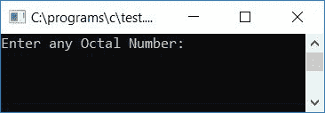
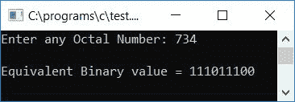
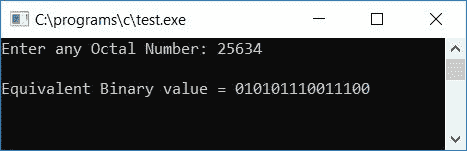
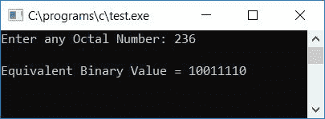
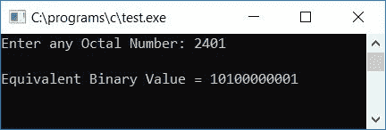

# C 程序：将八进制转换成二进制

> 原文：<https://codescracker.com/c/program/c-program-convert-octal-to-binary.htm>

在本教程中，我们将学习如何用 C 语言创建一个程序，在运行时将用户给定的任何八进制数转换成其等价的二进制值。最后，我们还创建了一个功能驱动的程序来做同样的工作。在函数驱动程序中，我们定义了一个名为 **OctToBin()** 的[函数](/c/c-functions.htm)，该函数以八进制数为自变量，将其转换为与其等价的二进制值。

但是在完成这个项目之前，如果你不知道

*   八进制数
*   二进制数
*   八进制到二进制转换过程

然后参照[八进制到二进制](/computer-fundamental/octal-to-binary.htm)的逐步转换过程。 现在让我们进入下一个项目。

## C 语言中的八进制到二进制

在 C 编程中，要将八进制数转换成二进制数，你必须要求用户输入八进制值并将其转换成二进制值，然后以二进制显示等值作为输出。问题是，**用 C 写一个程序，把任意给定的数 (八进制)转换成它在二进制**中的等值。这个问题的答案是:

```
#include<stdio.h>
#include<conio.h>
int main()
{
    int octnum, rev=0, rem;
    printf("Enter any Octal Number: ");
    scanf("%d", &octnum);
    while(octnum!=0)
    {
        rem = octnum%10;
        rev = (rev*10) + rem;
        octnum = octnum/10;
    }
    octnum = rev;
    printf("\nEquivalent Binary value = ");
    while(octnum!=0)
    {
        rem = octnum%10;
        switch(rem)
        {
            case 0: printf("000");
                break;
            case 1: printf("001");
                break;
            case 2: printf("010");
                break;
            case 3: printf("011");
                break;
            case 4: printf("100");
                break;
            case 5: printf("101");
                break;
            case 6: printf("110");
                break;
            case 7: printf("111");
                break;
            default: printf(" InvalidOctalDigit(%d) ", rem);
                break;
        }
        octnum = octnum/10;
    }
    getch();
    return 0;
}
```

由于上面的程序是在 **Code::Blocks** IDE 下编写的，因此在成功构建和运行之后，下面是示例运行。 这是第一张快照:



现在提供任意一个数字，比如说 **734** 作为输入，并按回车键查看其二进制形式的值，如示例运行的第二个快照 所示。



由于数字 **734** 有 3 位数，即 **7** 、 **3** 和 **4** 。这里二进制的 7 是 111，二进制的 3 是 011，二进制的 4 是 100。因此，在将所有八进制和二进制数字组合后，我们得到 **734** (八进制)等于 **111011100** (二进制)，如上图所示。也可以写成**(734)<sub>8</sub>**=**(111011100)<sub>2</sub>**

#### 程序解释

*   接收任何数字(八进制)作为输入，比如 **734**
*   现在使用[反转数字，同时循环](/c/c-while-loop.htm)
*   这里我们颠倒了八进制数，因为在逐个计算给定八进制数的余数时，我们将得到最后一位作为第一个余数，第一位作为最后一个余数。例如，使用模(%)[运算符](/c/c-operators.htm)来查找 的数字或任意数的余数，如 **734** 。即使用 **734%10** ，我们将得到 **4** 作为第一位数字或余数。而这里的 4 是数字 **734** 的最后一个 位。因此我们先颠倒了数字
*   现在将存储在 **rev** [变量](/c/c-variables.htm)中的数字反向初始化为 **octnum** 变量
*   创建一个 **while** 循环，直到 **octnum** 的值变为 0
*   第一次运行时， **while** loop， **octnum！=0** 或者 **437！=0** (因为我们已经反转了数字 734) 评估为真，因此程序流进入[循环](/c/c-loops.htm)
*   并且 **octnum%10** 或 **437%10** 或**7**(**734**的第一位)被初始化为 **rem**
*   创建 **switch()** case，检查 **rem** 变量内的值
*   无论 **rem** 变量中的值是什么，打印出它的等价二进制值。例如，如果 **rem** 保存 7， 则输出等于 7 的二进制数，在打印等于 **rem** 的二进制数后， **octnum/10** 或 T8】437/10 或 **43** 被初始化为 **octnum** ，程序流程返回到**的状态，同时**循环
*   那里，条件 **octnum！=0** 或 **43！=0** 再次评估为真，因此程序流程进入循环内部
*   并且 **octnum%10** 或 **43%10** 或 **3** 被初始化为 **rem** ，然后使用 **switch()** case，输出与 **3** 等价的二进制 ，继续进行上述类似操作，直到 **octnum** 的值变为 0
*   这样，给定八进制数的二进制等效值就打印在输出屏幕上

### 使用 strcat()函数将八进制转换为二进制

让我们用另一种方式创建相同目的的程序。这里我们使用了 **string.h** 库中名为 **strcat()** 的字符串函数，将字符串一个一个串联起来。我们以字符串格式存储了二进制值，如下面给出的程序所示。 问题是，**用 C 写一个程序，用库函数 strcat()把八进制数转换成它等价的二进制数。** 这个问题的答案是:

```
#include<stdio.h>
#include<conio.h>
#include<string.h>
int main()
{
    int octnum, rev=0, rem, count=0;
    char binnum[40] = "";
    printf("Enter any Octal Number: ");
    scanf("%d", &octnum);
    while(octnum!=0)
    {
        rem = octnum%10;
        if(rem>7)
        {
            count++;
            break;
        }
        rev = (rev*10) + rem;
        octnum = octnum/10;
    }
    if(count==0)
    {
        octnum = rev;
        printf("\nEquivalent Binary value = ");
        while(octnum!=0)
        {
            rem = octnum%10;
            switch(rem)
            {
                case 0: strcat(binnum, "000");
                    break;
                case 1: strcat(binnum, "001");
                    break;
                case 2: strcat(binnum, "010");
                    break;
                case 3: strcat(binnum, "011");
                    break;
                case 4: strcat(binnum, "100");
                    break;
                case 5: strcat(binnum, "101");
                    break;
                case 6: strcat(binnum, "110");
                    break;
                case 7: strcat(binnum, "111");
                    break;
            }
            octnum = octnum/10;
        }
        printf("%s", binnum);
    }
    else
        printf("\nInvalid Octal Digit %d", rem);
    getch();
    return 0;
}
```

以下是上述程序示例运行的最终快照:



由于八进制数不能超过大于 7 的值，因此我们使用了 **count** 变量来检查 给定的八进制数的任何一位是否超过值 7。如果超过，则其值递增 ，然后退出当前循环。在将八进制转换为二进制之前，我们已经检查了**计数**是否保持其原始值。如果它成立，那么 所有的八进制数字都是正确的，否则打印任何消息，如**你输入了无效的八进制数字**。

### 使用间接转换将八进制转换为二进制

问题是，**用 C 写一个程序，把八进制数转换成等价的二进制数，这样给定的八进制数 先转换成十进制数，然后十进制数再转换成二进制数**。这个问题的答案是:

```
#include<stdio.h>
#include<conio.h>
int main()
{
    int octnum, decnum=0, binnum[40], rem, mul=1, i=0, count=0;
    printf("Enter any Octal Number: ");
    scanf("%d", &octnum);
    while(octnum!=0)
    {
        rem = octnum%10;
        if(rem>7)
        {
            count++;
            break;
        }
        decnum = decnum + (rem*mul);
        mul = mul*8;
        octnum = octnum/10;
    }
    if(count==0)
    {
        while(decnum!=0)
        {
            binnum[i] = decnum%2;
            i++;
            decnum = decnum/2;
        }
        printf("\nEquivalent Binary Value = ");
        for(i=(i-1); i>=0; i--)
            printf("%d", binnum[i]);
    }
    else
        printf("\nInvalid Octal Digit %d", rem);
    getch();
    return 0;
}
```

以下是上述程序示例运行的最终快照:



### 使用用户自定义函数将八进制转换为二进制

使用名为 **OctToBin()** 的用户定义函数将八进制转换为二进制。创建这个函数的方式是 它接受一个参数，用户将给出一个八进制数。

在这里，我们将所有公共变量(同时存在于函数 main()和 OctToBin()中)声明为全局变量，以便通过这两个函数来识别它。变量 **i** 和 **count** 被声明为**静态**变量， 以便它们可以记住它们之前的值。众所周知，静态变量自动保存 0 作为初始值。 因此，这里我们没有将静态变量 **i** 和**计数**初始化为零。

```
#include<stdio.h>
#include<conio.h>
void OctToBin(int oct);
static int i, count;
int bin[40];
int main()
{
    int octnum;
    printf("Enter any Octal Number: ");
    scanf("%d", &octnum);
    OctToBin(octnum);
    if(count==0)
    {
        printf("\nEquivalent Binary Value = ");
        for(i=(i-1); i>=0; i--)
            printf("%d", bin[i]);
    }
    else
        printf("\nYou've entered invalid Octal Digit");

    getch();
    return 0;
}
void OctToBin(int oct)
{
    int dec=0, rem, mul=1;
    while(oct!=0)
    {
        rem = oct%10;
        if(rem>7)
        {
            count++;
            break;
        }
        dec = dec + (rem*mul);
        mul = mul*8;
        oct = oct/10;
    }
    if(count==0)
        while(dec!=0)
        {
            bin[i] = dec%2;
            i++;
            dec = dec/2;
        }
}
```

以下是示例运行的最终快照:



#### 其他语言的相同程序

*   [C++八进制转二进制](/cpp/program/cpp-program-convert-octal-to-binary.htm)
*   [Java 八进制到二进制](/java/program/java-program-convert-octal-to-binary.htm)
*   [Python 八进制转二进制](/python/program/python-program-convert-octal-to-binary.htm)

[C 在线测试](/exam/showtest.php?subid=2)

* * *

* * *