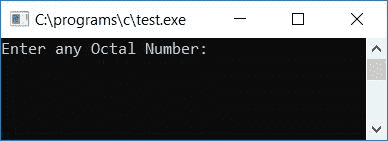
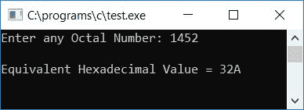
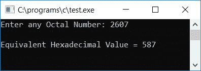
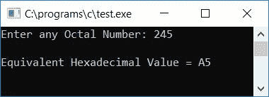

# C 程序：将八进制转换成十六进制

> 原文：<https://codescracker.com/c/program/c-program-convert-octal-to-hexadecimal.htm>

在本教程中，我们将学习如何用 C 语言创建一个程序，将任何给定的八进制数转换成其等价的十六进制值。最后，我们还创建了一个使用用户定义的[函数](/c/c-functions.htm) **OctToHex()** 的程序，它也 做同样的工作。

但是在完成这个项目之前，如果你不知道

*   八进制数
*   十六进制数
*   八进制到十六进制的转换过程

然后参照[八进制到十六进制的](/computer-fundamental/octal-to-hexadecimal.htm)转换步骤通过 步骤进行处理。现在让我们继续这个项目。

## C 语言中的八进制到十六进制

在 C 编程中，要将八进制数转换成十六进制数，你必须要求用户输入任意一个八进制数。然后转换成十六进制，显示**十六进制**值作为输出。问题是，**用 C 写一个程序，将 用户(在运行时)给定的任何八进制数转换成它的等价十六进制值。**这个问题的答案如下:

```
#include<stdio.h>
#include<conio.h>
#include<string.h>
int main()
{
    int octnum, rev=0, rem, count=0, hex=0, mul=1, i=0, k=0;
    char binnum[40] = "", hexnum[40];
    printf("Enter any Octal Number: ");
    scanf("%d", &octnum);
    while(octnum!=0)
    {
        rem = octnum%10;
        if(rem>7)
        {
            count++;
            break;
        }
        rev = (rev*10) + rem;
        octnum = octnum/10;
    }
    if(count==0)
    {
        octnum = rev;
        while(octnum!=0)
        {
            rem = octnum%10;
            switch(rem)
            {
                case 0: strcat(binnum, "000");
                    break;
                case 1: strcat(binnum, "001");
                    break;
                case 2: strcat(binnum, "010");
                    break;
                case 3: strcat(binnum, "011");
                    break;
                case 4: strcat(binnum, "100");
                    break;
                case 5: strcat(binnum, "101");
                    break;
                case 6: strcat(binnum, "110");
                    break;
                case 7: strcat(binnum, "111");
                    break;
            }
            octnum = octnum/10;
        }
        while(binnum[k]!='\0')
            k++;
        count=1;
        k--;
        while(k>=0)
        {
            if(binnum[k]=='0')
                rem = 0;
            else
                rem = 1;
            hex = hex + (rem*mul);
            if(count%4==0)
            {
                if(hex<10)
                    hexnum[i] = hex+48;
                else
                    hexnum[i] = hex+55;
                mul = 1;
                hex = 0;
                count = 1;
                i++;
            }
            else
            {
                mul = mul*2;
                count++;
            }
            k--;
        }
        if(count!=1)
            hexnum[i] = hex+48;
        if(count==1)
            i--;
        printf("\nEquivalent Hexadecimal Value = ");
        count = 0;
        for(i=i; i>=0; i--)
        {
            if(hexnum[i]=='0' && count==0)
            {
                count++;
                continue;
            }
            else
                printf("%c", hexnum[i]);
        }
    }
    else
        printf("\nInvalid Octal Digit %d", rem);
    getch();
    return 0;
}
```

由于上述程序是在 **Code::Blocks** IDE 下编写的，因此在成功构建和运行之后，这里是示例运行的第一个 快照:



现在提供任意一个八进制数，比如说 **1452** 作为输入，并按`ENTER`键查看它的十六进制等效值，如示例运行的第二个 快照所示:



这是另一次样本运行的最终快照:



#### 程序解释

*   在运行时接收来自用户的任何八进制数，比如说 **1452** 作为输入
*   现在反转给定的八进制数，并将其反转初始化为原始数，比如说 **octnum** 本身
*   这里我们颠倒了数字，因为使用模(%)或余数[运算符](/c/c-operators.htm) 我们将得到最后一位数字。例如， 用类似 **1452%10** 的方式应用模运算符，那么我们得到的结果是 2，2 是最后一位数字，但是把 的数字反过来，就变成了 2541。然后用和 **2541%10** 一样的方法应用模运算符后，我们得到的结果是 1，1 是原始数字的第一位，比如说 **1452**
*   在反转数字时，我们检查了是否有任何数字大于 7。在八进制中，所有的数字必须小于或等于 7。但是如果任何数字大于 7，那么我们已经增加了一个[变量](/c/c-variables.htm)比如说**计数**(它是在程序开始时用 0 初始化的 )，这样我们可以在退出 [while 循环](/c/c-while-loop.htm)之后检查它是否保持其原始的 值(0)，如果保持，那么我们必须继续将数字从八进制转换为十六进制，否则我们必须打印 一条类似于**您输入了一个无效的八进制数字**的消息
*   现在，如果**计数**保持其原始值，则程序流程进入 if 块内的
*   并且 **rev** (八进制数的反数)或 **2541** 被初始化为 **octnum**
*   然后我们创建了一个 **while** 循环来将八进制数转换成二进制数
*   **而**循环的条件 **octnum！=0** 或者 **2541！=0** 评估为真，程序流程进入 [循环](/c/c-loops.htm)
*   在那里， **octnum%10** 或 **2541%10** 或 **1** 被初始化为 **rem**
*   使用[开关盒](/c/c-switch-statement.htm)，我们检查了变量 **rem** 中的值
*   无论 **rem** 中的值是什么，都将其连接到 **binnum** 字符数组中
*   这里我们使用了 **string.h** 库的 **strcat()** 函数，这样每个 八进制数字的二进制等价物(以字符串形式)就被一个接一个地连接到 **binnum** 字符数组中
*   串接后， **octnum/10** 或 **2541/10** 或 **254** 被初始化为 **octnum**
*   并且程序流回到循环的条件，有 **octnum！=0** 或者 **254！=0** 评估为真，并且 程序流再次进入循环内部，并且进行与上述相同的操作，直到 **octnum** 的值变为 0
*   从 **while** 循环中退出后，我们有了保存 **001100101010** 的 **binnum** 字符数组
*   这里 **001** 、 **100** 、 **101** 和 **010** 是 **1** 、 **4** 、 **5** 和 **2** 的二进制等价物
*   现在我们已经使用了 **while** 循环，来计算 **binnum** 字符数组的长度，即 **binnum**数组中有多少字符
*   数组长度 **binnum** 初始化为变量比如 **k**
*   当数组中的索引从 0 开始时， **k** 的值递减
*   现在我们有了每个八进制数字的二进制等价物
*   是时候从右侧开始制作 4-4 二进制对，并将其转换为十六进制对等物
*   为此，我们从 **binnum** 数组的最后一个索引开始
*   在第一次运行 **while** 循环时，条件 **k > =0** 或 **8 > =0** 评估为真，因此程序流程进入循环内部
*   在循环内部，我们已经检查了在数组 **binnum** 的当前索引处出现了什么字符，如果是 0，那么 将 0 初始化为 **rem** ，否则将 1 初始化为 **rem**
*   按照 C 语言教程中的[二进制到十六进制的步骤进行操作](/c/program/c-program-convert-binary-to-hexadecimal.htm)
*   完成上述所有步骤后，我们只需一个接一个地打印所有的十六进制数字
*   在这里，我们在循环的**中使用了 **if** 语句来打印十六进制数字，因此十六进制数字开头的任何零(0) 都会被跳过**

**注-** 还可以采用第二种方案，即[八进制转十进制](/c/program/c-program-convert-octal-to-decimal.htm)T10】然后[十进制转十六进制](/c/program/c-program-convert-decimal-to-hexadecimal.htm)。因为第二个选项 比第一个选项更容易创建和理解。因此，这里使用的第一个选项是 将[八进制转换为二进制](/c/program/c-program-convert-octal-to-binary.htm)，然后 [二进制转换为十六进制](/c/program/c-program-convert-binary-to-hexadecimal.htm)。

你可以按照这两篇文章(用于第二个选项)自己创建程序。我相信，在理解了上面创建的第一个选项后，这对你来说会非常容易。

### 使用用户自定义函数将八进制转换为十六进制

让我们创建同样用途的程序，但这次使用用户定义的函数。问题是，**用 C 写一个程序， 使用名为 OctToHex()** 的用户自定义函数将八进制转换为十六进制。这个问题的答案是:

```
#include<stdio.h>
#include<conio.h>
#include<string.h>
void OctToHex(int oct);
static int count, i;
char hexnum[40];
int main()
{
    int octnum;
    printf("Enter any Octal Number: ");
    scanf("%d", &octnum);
    OctToHex(octnum);
    if(count==0)
        printf("\nYou've entered an invalid octal digit");
    else
    {
        printf("\nEquivalent Hexadecimal Value = ");
        count = 0;
        for(i=i; i>=0; i--)
        {
            if(hexnum[i]=='0' && count==0)
            {
                count++;
                continue;
            }
            else
                printf("%c", hexnum[i]);
        }
    }
    getch();
    return 0;
}
void OctToHex(int oct)
{
    int rev=0, rem, hex=0, mul=1, k=0;
    char binnum[40] = "";
    while(oct!=0)
    {
        rem = oct%10;
        if(rem>7)
        {
            count++;
            break;
        }
        rev = (rev*10) + rem;
        oct = oct/10;
    }
    if(count==0)
    {
        oct = rev;
        while(oct!=0)
        {
            rem = oct%10;
            switch(rem)
            {
                case 0: strcat(binnum, "000");
                    break;
                case 1: strcat(binnum, "001");
                    break;
                case 2: strcat(binnum, "010");
                    break;
                case 3: strcat(binnum, "011");
                    break;
                case 4: strcat(binnum, "100");
                    break;
                case 5: strcat(binnum, "101");
                    break;
                case 6: strcat(binnum, "110");
                    break;
                case 7: strcat(binnum, "111");
                    break;
            }
            oct = oct/10;
        }
        while(binnum[k]!='\0')
            k++;
        count=1;
        k--;
        while(k>=0)
        {
            if(binnum[k]=='0')
                rem = 0;
            else
                rem = 1;
            hex = hex + (rem*mul);
            if(count%4==0)
            {
                if(hex<10)
                    hexnum[i] = hex+48;
                else
                    hexnum[i] = hex+55;
                mul = 1;
                hex = 0;
                count = 1;
                i++;
            }
            else
            {
                mul = mul*2;
                count++;
            }
            k--;
        }
        if(count!=1)
            hexnum[i] = hex+48;
        if(count==1)
            i--;
    }
    else
        count=0;
}
```

以下是示例运行的最终快照:



在这里，我们将变量 **i** 和 **count** 声明为静态变量，这样它就可以保存或记住它之前的 值。我们没有用 0 初始化静态变量，因为默认情况下静态变量会自动将 0 初始化为它的 初始值。我们将静态变量和一个字符数组 **hexnum[]** 声明为全局变量，以使 所有三个变量都为函数 say **main()** 和 **OctToHex()** 所知。

#### 其他语言的相同程序

*   [C++八进制到十六进制](/cpp/program/cpp-program-convert-octal-to-hexadecimal.htm)
*   [Java 八进制转十六进制](/java/program/java-program-convert-octal-to-hexadecimal.htm)
*   [Python 八进制转十六进制](/python/program/python-program-convert-octal-to-hexadecimal.htm)

[C 在线测试](/exam/showtest.php?subid=2)

* * *

* * *