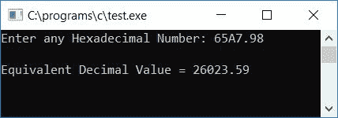

# 将十六进制转换成十进制的 c 程序

> 原文：<https://codescracker.com/c/program/c-program-convert-hexadecimal-to-decimal.htm>

在本教程中，我们将学习如何用 C 语言创建一个程序，将用户在运行时给定的任何十六进制数转换成等价的十进制数。我们还创建了一个用户定义的[函数](/c/c-functions.htm)，它也做同样的工作。

但是在完成这个项目之前，如果你不知道

*   十六进制数
*   小数
*   十六进制到十进制的转换过程

然后参照[十六进制到十进制](/computer-fundamental/hexadecimal-to-decimal.htm)转换 的分步过程。现在让我们继续这个项目。

## C 语言中的十六进制到十进制

在 C 语言编程中，要将十六进制数转换成十进制数，必须要求用户输入十六进制数，将其转换成十进制数，然后以十进制显示其等效值作为输出。问题是，**用 C 写一个程序，把十六进制数转换成十进制数**。这个问题的答案是:

```
#include<stdio.h>
#include<conio.h>
#include<math.h>
int main()
{
    int decnum=0, rem, i=0, len=0;
    char hexnum[20];
    printf("Enter any Hexadecimal Number: ");
    scanf("%s", hexnum);
    while(hexnum[i]!='\0')
    {
        len++;
        i++;
    }
    len--;
    i=0;
    while(len>=0)
    {
        rem = hexnum[len];
        if(rem>=48 && rem<=57)
            rem = rem-48;
        else if(rem>=65 && rem<=70)
            rem = rem-55;
        else if(rem>=97 && rem<=102)
            rem = rem-87;
        else
        {
            printf("\nYou've entered an invalid Hexadecimal digit");
            getch();
            return 0;
        }
        decnum = decnum + (rem*pow(16, i));
        len--;
        i++;
    }
    printf("\nEquivalent Decimal Value = %d", decnum);
    getch();
    return 0;
}
```

由于上述程序是在 **Code::Blocks** IDE 下编写的，因此在成功构建并运行之后，这里是示例运行的第一张快照 :


现在提供任意十六进制数作为输入，比如说 **A67** 并按回车键查看其十进制等效值，如下面给出的同一个示例运行的 第二个快照所示:


#### 程序解释

*   接收任何十六进制数作为输入，比如 **5A9**
*   输入的十六进制数存储在字符数组[中](/c/c-arrays.htm) **hexnum[]**
*   现在使用 [while 循环](/c/c-while-loop.htm)计算字符数组 **hexnum[]** (给定的十六进制数)的长度
*   得到给定十六进制数的长度后，将长度值(变量 **len**保存长度值)减 1，即使用 **len -** 或 **len=len-1** 。因为数组中的索引从 0 开始
*   用 0 初始化 **i** ，因为我们要用 **i** 作为 **16** 的指数
*   现在创建 **while** 循环，从给定字符数组的最后一个索引运行到第一个(第 0 个<sup>第</sup>个索引)或 **hexnum[]**
*   因此，在第一次运行时，while 循环 **len > =0** 或 **2 > =0** 的条件(由于给定十六进制数 5a 9 的长度为 3，并且在将其值减 1 后，我们让 **len** 变量保存 2 作为其值)评估为 为真，因此程序流进入[循环](/c/c-loops.htm)和**hex num【len】**内部
*   由于 **hexnum[2]** 是一个字符， **rem** 是一个整数类型变量，因此使用 **rem = hexnum[2]** ，将 **hexnum[2]** 或 **9** 的 ASCII 代码初始化为 **rem**
*   而且众所周知 **0-9** 的 ASCII 码是 **48-57** 而 **A-F** (对应 十六进制数字 10 到 15)的 ASCII 码是 **65-70**
*   因此，我们已经使用其 ASCII 码检查并初始化了给定十六进制数字的相应十进制值。也就是说，如果 **hexnum[2]** 持有 **9** ，并且 9 的 ASCII 码是 **56** ，那么 **rem-48** 或 **57-48** 或 **9** 会将 初始化为 **rem**
*   然后 **decnum + (rem*pow(16，i))** (程序开始时 decnum 被初始化为 0)或 **0 + (9*pow(16，0))** 或 **0+9 * 1**或 **9** 被初始化为 **decnum**
*   **len** 的值递减并变为 1。并且 **i** 的值增加并变为 1
*   当循环和 **len > =0** 或 **1 > =0** 评估为 真时，程序流程再次回到循环内部
*   那里做着类似的操作。即 **hexnum[len]** 或 **hexnum[1]** 或 **A** 被初始化为 **rem** 。 由于 A 的 ASCII 码是 65，因此 **rem-55** 或 **65-55** 或 **10** (10 代表十六进制的 A)被初始化 到 **rem**
*   然后 **decnum + (rem*pow(16，i))** 或 **9 + (10*16 <sup>1</sup> )** 或 **9+160** 或 **169** 被初始化为 **decnum**
*   **len** 的值递减，而 **i** 的值递增
*   并且程序流再次返回到循环的条件，并进行与上述步骤中所述类似的操作
*   从 **while** 循环中退出后，我们有了 **decnum** 变量，它保存了给定十六进制 数的等价十进制值
*   因此打印 **decnum** 变量的值作为输出

### 十六进制输入包含十进制怎么办？

上面给出的程序只有当用户输入任何十六进制数(没有任何小数点)时才是正确的。但是如果他/她输入任何包含点(小数点)的十六进制数，那么你就要用下面给出的程序修改上面的程序。问题是，**用 C 写一个程序，把十六进制(包括 小数点)转换成十进制**。这个问题的答案是:

```
#include<stdio.h>
#include<conio.h>
#include<math.h>
int main()
{
    int decnum=0, decnum1=0, rem, i=0, len=0, lenTemp, dotPos=0;
    float decnum2=0;
    char hexnum[20];
    printf("Enter any Hexadecimal Number: ");
    scanf("%s", hexnum);
    while(hexnum[i]!='\0')
    {
        if(hexnum[i]=='.')
            dotPos = i;
        len++;
        i++;
    }
    len--;
    i=0;
    if(dotPos==0)
    {
        while(len>=0)
        {
            rem = hexnum[len];
            if(rem>=48 && rem<=57)
                rem = rem-48;
            else if(rem>=65 && rem<=70)
                rem = rem-55;
            else if(rem>=97 && rem<=102)
                rem = rem-87;
            else
            {
                printf("\nYou've entered an invalid Hexadecimal digit");
                getch();
                return 0;
            }
            decnum = decnum + (rem*pow(16, i));
            len--;
            i++;
        }
        printf("\nEquivalent Decimal Value = %d", decnum);
    }
    else
    {
        lenTemp = dotPos-1;
        while(lenTemp>=0)
        {
            rem = hexnum[lenTemp];
            if(rem>=48 && rem<=57)
                rem = rem-48;
            else if(rem>=65 && rem<=70)
                rem = rem-55;
            else if(rem>=97 && rem<=102)
                rem = rem-87;
            else
            {
                printf("\nYou've entered an invalid Hexadecimal digit");
                getch();
                return 0;
            }
            decnum1 = decnum1 + (rem*pow(16, i));
            lenTemp--;
            i++;
        }
        lenTemp = dotPos+1;
        i=-1;
        while(lenTemp<=len)
        {
            rem = hexnum[lenTemp];
            if(rem>=48 && rem<=57)
                rem = rem-48;
            else if(rem>=65 && rem<=70)
                rem = rem-55;
            else if(rem>=97 && rem<=102)
                rem = rem-87;
            else
            {
                printf("\nYou've entered an invalid Hexadecimal digit");
                getch();
                return 0;
            }
            decnum2 = decnum2 + (rem*pow(16, i));
            lenTemp++;
            i--;
        }
        decnum2 = decnum1+decnum2;
        printf("\nEquivalent Decimal Value = %0.2f", decnum2);
    }
    getch();
    return 0;
}
```

下面是上述程序的运行示例。这是最终的快照:


#### 程序解释

*   这里我们使用了变量 **dotPos** 来检查给定的十六进制数中是否存在小数点
*   如果存在，那么我们已经将 1 初始化为**点位置**变量，并且稍后检查**点位置** 变量是否保持其先前的值(0)
*   如果它成立，那么我们必须像上面给出的第一个程序那样应用正常的转换规则，否则我们必须处理不同的规则
*   在包含小数点的十六进制数输入中，我们使用了两个部分
*   小数点前一个，小数点后一个
*   前十进制部分被转换成其等价的十进制值并初始化为 **decnum1** ，而后十进制部分 被转换成其等价的十进制值并初始化为 **decnum2** (浮点变量)
*   最后将两个变量相加，并将其初始化为浮点变量 **decnum2**
*   并将其值作为输出打印出来

### 使用自定义函数将 C 语言中的十六进制转换成十进制

现在让我们使用名为 **HexToDec()** 的用户定义函数创建一个相同用途的程序，如下面给出的程序所示。 的问题是，**用 C 写一个程序，用用户自定义函数**把十六进制转换成十进制。这个问题的答案是:

```
#include<stdio.h>
#include<conio.h>
#include<math.h>
int HexToDecY(char hex[]);
float HexToDecN(char hex[]);
static int i, len, dotPos;
int main()
{
    int decnumInt;
    float decnumFlt;
    char hexnum[20];
    printf("Enter any Hexadecimal Number: ");
    scanf("%s", hexnum);
    while(hexnum[i]!='\0')
    {
        if(hexnum[i]=='.')
            dotPos = i;
        len++;
        i++;
    }
    len--;
    i=0;
    if(dotPos==0)
    {
        decnumInt = HexToDecY(hexnum);
        if(decnumInt!=0)
            printf("\nEquivalent Decimal Value = %d", decnumInt);
    }
    else
    {
        decnumFlt = HexToDecN(hexnum);
        if(decnumFlt!=0)
            printf("\nEquivalent Decimal Value = %0.2f", decnumFlt);
    }
    getch();
    return 0;
}
int HexToDecY(char hex[20])
{
    int dec=0, rem;
    while(len>=0)
    {
        rem = hex[len];
        if(rem>=48 && rem<=57)
            rem = rem-48;
        else if(rem>=65 && rem<=70)
            rem = rem-55;
        else if(rem>=97 && rem<=102)
            rem = rem-87;
        else
        {
            printf("\nYou've entered an invalid Hexadecimal digit");
            return 0;
        }
        dec = dec + (rem*pow(16, i));
        len--;
        i++;
    }
    return dec;
}
float HexToDecN(char hex[20])
{
    int dec1=0, rem, lenTemp;
    float dec2=0;
    lenTemp = dotPos-1;
    while(lenTemp>=0)
    {
        rem = hex[lenTemp];
        if(rem>=48 && rem<=57)
            rem = rem-48;
        else if(rem>=65 && rem<=70)
            rem = rem-55;
        else if(rem>=97 && rem<=102)
            rem = rem-87;
        else
        {
            printf("\nYou've entered an invalid Hexadecimal digit");
            return 0;
        }
        dec1 = dec1 + (rem*pow(16, i));
        lenTemp--;
        i++;
    }
    lenTemp = dotPos+1;
    i=-1;
    while(lenTemp<=len)
    {
        rem = hex[lenTemp];
        if(rem>=48 && rem<=57)
            rem = rem-48;
        else if(rem>=65 && rem<=70)
            rem = rem-55;
        else if(rem>=97 && rem<=102)
            rem = rem-87;
        else
        {
            printf("\nYou've entered an invalid Hexadecimal digit");
            return 0;
        }
        dec2 = dec2 + (rem*pow(16, i));
        lenTemp++;
        i--;
    }
    dec2 = dec1+dec2;
    return dec2;
}
```

下面是上述程序示例运行的最终快照



#### 程序解释

*   我们已经将变量 **i、len** 和 **dotPos** 初始化为静态全局变量
*   所以这三个变量都记得它之前的值，并且在整个程序中都是已知的
*   我们没有将所有的三个静态变量初始化为 0，因为静态变量自动将 0 作为初始值
*   我们使用了两个名为 **HexToDecY()** 和 **HexToDecN()** 的函数
*   函数 **HexToDecY()** 处理不带小数点的十六进制输入，函数 **HexToDecN()** 处理带小数点的十六进制输入
*   我们已经提供了 **65A7.98** 作为十六进制数输入
*   它包含一个小数点，因此调用并执行 **HexToDecN()** 函数
*   最后将 **dec2** 返回给 **main()** 函数，该函数包含给定十六进制数 **65A7.98** 的十进制等效值
*   在 **main()** 函数中， **dec2** 的值被初始化为 **decnumFlt** 变量，其值被打印输出

现在，让我们进行另一个示例运行，这次我们提供了一个不带任何小数点的十六进制数，如下面的示例运行所示。这是示例运行的另一个最终快照:


#### 其他语言的相同程序

*   [C++十六进制到十进制](/cpp/program/cpp-program-convert-hexadecimal-to-decimal.htm)
*   [Java 十六进制转十进制](/java/program/java-program-convert-hexadecimal-to-decimal.htm)
*   [Python 十六进制转十进制](/python/program/python-program-convert-hexadecimal-to-decimal.htm)

[C 在线测试](/exam/showtest.php?subid=2)

* * *

* * *