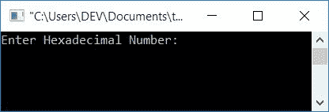
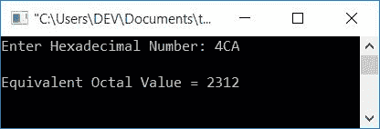

# C 程序：将十六进制转换为八进制

> 原文：<https://codescracker.com/c/program/c-program-convert-hexadecimal-to-octal.htm>

在本文中，您将学习并获得关于用户(在运行时)给定的数字从十六进制到八进制的转换代码。

在参加该计划之前，如果您不清楚:

*   十六进制数
*   八进制数
*   十六进制到八进制的转换

然后参照[十六进制到八进制](/computer-fundamental/hexadecimal-to-octal.htm)的逐步转换过程。现在让我们继续这个项目。

## C 语言中的十六进制到八进制

在 C 编程中，要把十六进制数转换成八进制数，你必须要求用户输入十六进制数，然后把它转换成等价的八进制值。然后以八进制显示等效值，如下面给出的程序所示。

**注意-** 没有任何从十六进制到八进制的直接转换。因此你可以选择 [十六进制到十进制](/c/program/c-program-convert-hexadecimal-to-decimal.htm)，然后 [十进制到八进制](/c/program/c-program-convert-decimal-to-octal.htm)，或者 [十六进制到二进制](/c/program/c-program-convert-hexadecimal-to-binary.htm)，然后 [二进制到八进制](/c/program/c-program-convert-binary-to-octal.htm)。

让我们创建一个程序，将十六进制转换为二进制，然后将二进制转换为八进制。随后，同样的程序也用第二种方法创建。在我看来，第二种方式更容易创造或理解。

```
#include<stdio.h>
#include<conio.h>
#include<string.h>
int main()
{
    int i=0, chk=0, len, rem, binDigit, octalDigit;
    long long binaryInt=0, temp=1, octalNum, binaryNum;
    char hexdec[11], binnum[40]="";
    printf("Enter Hexadecimal Number: ");
    gets(hexdec);
    while(hexdec[i])
    {
        switch(hexdec[i])
        {
            case '0':
                strcat(binnum, "0000");
                break;
            case '1':
                strcat(binnum, "0001");
                break;
            case '2':
                strcat(binnum, "0010");
                break;
            case '3':
                strcat(binnum, "0011");
                break;
            case '4':
                strcat(binnum, "0100");
                break;
            case '5':
                strcat(binnum, "0101");
                break;
            case '6':
                strcat(binnum, "0110");
                break;
            case '7':
                strcat(binnum, "0111");
                break;
            case '8':
                strcat(binnum, "1000");
                break;
            case '9':
                strcat(binnum, "1001");
                break;
            case 'A':
                strcat(binnum, "1010");
                break;
            case 'a':
                strcat(binnum, "1010");
                break;
            case 'B':
                strcat(binnum, "1011");
                break;
            case 'b':
                strcat(binnum, "1011");
                break;
            case 'C':
                strcat(binnum, "1100");
                break;
            case 'c':
                strcat(binnum, "1100");
                break;
            case 'D':
                strcat(binnum, "1101");
                break;
            case 'd':
                strcat(binnum, "1101");
                break;
            case 'E':
                strcat(binnum, "1110");
                break;
            case 'e':
                strcat(binnum, "1110");
                break;
            case 'F':
                strcat(binnum, "1111");
                break;
            case 'f':
                strcat(binnum, "1111");
                break;
            default:
                chk = 1;
                break;
        }
        i++;
    }
    if(chk==0)
    {
        len = strlen(binnum);
        while(len!=0)
        {
            if(binnum[len-1]=='0')
                binDigit=0;
            else
                binDigit=1;
            binaryInt = binaryInt + (binDigit*temp);
            temp = temp*10;
            len--;
        }
        binaryNum = binaryInt;
        octalNum = 0;
        temp = 1;
        while(binaryNum>0)
        {
            rem = binaryNum%1000;
            switch(rem)
            {
                case 0:
                    octalDigit = 0;
                    break;
                case 1:
                    octalDigit = 1;
                    break;
                case 10:
                    octalDigit = 2;
                    break;
                case 11:
                    octalDigit = 3;
                    break;
                case 100:
                    octalDigit = 4;
                    break;
                case 101:
                    octalDigit = 5;
                    break;
                case 110:
                    octalDigit = 6;
                    break;
                case 111:
                    octalDigit = 7;
                    break;
            }
            octalNum = (octalDigit*temp) + octalNum;
            binaryNum = binaryNum/1000;
            temp = temp*10;
        }
        printf("\nEquivalent Octal Value = %lld", octalNum);
    }
    else
        printf("\nInvalid Hexadecimal Character/Digit");
    getch();
    return 0;
}
```

这个程序是使用 **Code::Blocks** IDE 编译和执行的。这是运行示例。这是样本运行的第一个快照:



现在提供任何输入值(作为十六进制数)，比如说 **4CA** 并按下 **ENTER** 键，以查看其在八进制数系统中的等效值 ，如下面给出的第二个快照所示:



在上面的程序中，我们已经将十六进制值转换为等价的二进制值。要了解更多信息，请参考 C 教程中的[十六进制到二进制。](/c/c-program-convert-hexadecimal-to-binary.htm)

执行此转换后，我们应用了下面给出的代码:

```
len = strlen(binnum);
while(len!=0)
{
    if(binnum[len-1]=='0')
        binDigit=0;
    else
        binDigit=1;
    binaryInt = binaryInt + (binDigit*temp);
    temp = temp*10;
    len--;
}
```

将存储在字符数组中的二进制值转换为整数形式。然后应用从二进制到八进制的转换。你也可以参考 C 语言教程 中的[二进制转八进制，根据自己的选择修改上面给出的代码。](/c/program/c-program-convert-binary-to-octal.htm)

### 使用间接转换将 C 中的十六进制转换为八进制

这个程序将给定的十六进制数(由用户在运行时)转换成十进制数。然后十进制等价转换成八进制等价。

```
#include<stdio.h>
#include<conio.h>
#include<math.h>
int main()
{
    int decnum=0, rem, i=0, len=0, octnum[30];
    char hexnum[10];
    printf("Enter any Hexadecimal Number: ");
    scanf("%s", hexnum);
    while(hexnum[i]!='\0')
    {
        len++;
        i++;
    }
    len--;
    i=0;
    while(len>=0)
    {
        rem = hexnum[len];
        if(rem>=48 && rem<=57)
            rem = rem-48;
        else if(rem>=65 && rem<=70)
            rem = rem-55;
        else if(rem>=97 && rem<=102)
            rem = rem-87;
        else
        {
            printf("\nYou've entered an invalid Hexadecimal digit");
            getch();
            return 0;
        }
        decnum = decnum + (rem*pow(16, i));
        len--;
        i++;
    }
    i=0;
    while(decnum != 0)
    {
        octnum[i] = decnum%8;
        i++;
        decnum = decnum/8;
    }
    printf("\nEquivalent Octal Value = ");
    for(i=(i-1); i>=0; i--)
        printf("%d", octnum[i]);
    getch();
    return 0;
}
```

对于以上代码的深入学习，可以按照*十六进制到十进制*和*十进制到八进制*的单独程序进行。

#### 其他语言的相同程序

*   [C++ 十六进制转八进制](/cpp/program/cpp-program-convert-hexadecimal-to-octal.htm)
*   [Java 十六进制转八进制](/java/program/java-program-convert-hexadecimal-to-octal.htm)
*   [Python 十六进制转八进制](/python/program/python-program-convert-hexadecimal-to-octal.htm)

[C 在线测试](/exam/showtest.php?subid=2)

* * *

* * *