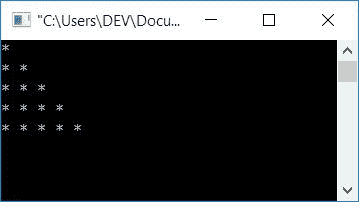
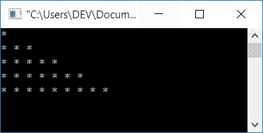
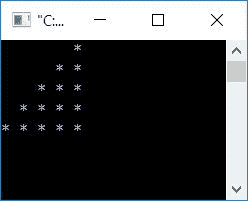
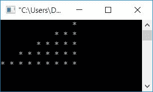
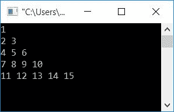
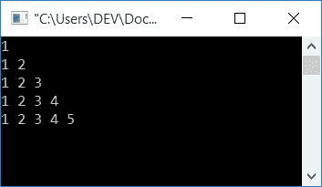
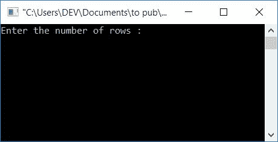
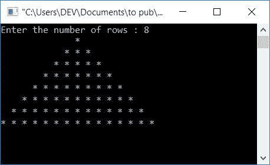

# C 程序：打印星形和金字塔形图案

> 原文：<https://codescracker.com/c/program/c-program-print-star-pyramid-patterns.htm>

在这篇文章中，你将学习到如何用 C 语言打印一些著名的图案，比如半金字塔图案，全金字塔图案。本文中给出的一些著名模式有:

*   使用星形的半金字塔图案
*   使用数字的半金字塔图案
*   星星的图案
*   使用星形的全金字塔图案

## C 语言中的模式程序

要在 C 编程中打印数字和星星的图案，必须使用两个[作为循环](/c/c-for-loop.htm)。外 **为**回路，内**为** [回路](/c/c-loops.htm)。循环的外部**负责行，而**循环的内部**负责列。**

下面是一个接一个打印不同图案的 C 程序:

### 使用星形打印半金字塔

这个程序使用星形模式打印半金字塔。

```
#include<stdio.h>
#include<conio.h>
int main()
{
    int i, j;
    for(i=0; i<5; i++)
    {
        for(j=0; j<=i; j++)
            printf("* ");
        printf("\n");
    }
    getch();
    return 0;
}
```

由于该程序是在 **Code::Blocks** IDE 下编写的，因此下面是示例运行的快照:



#### 程序解释

1.  初始化任意两个整型变量比如说 **i** 和 **j**
2.  这里，变量 **i** 用于行，变量[T3**j**用于列](/c/c-variables.htm)
3.  这意味着如果您增加变量 **i** 的值，操作将转到下一行
4.  如果您增加变量 **j** 的值，操作将进行到下一列
5.  一定要换行，或者使用换行语句(**printf(" \ n ")；**)转到下一行之前
6.  因此，这里最初变量 **i** 的值被初始化为 0，并且 0 显然小于 5，因此条件 评估为真，然后程序流进入循环的外部**内部**
7.  变量 **j** 的值被初始化为 0，并检查 **j** 的值(即 0)是否小于 或等于 **i** 的值(即 0)
8.  条件评估为真，因此程序流进入循环的内部**，并且打印一个 ***** (星号)**
9.  程序流程再次转到循环的内部**的第三条语句，在那里 **j** 的值增加并变成 **1****
10.  程序流程再次转到循环的内部**的第二条语句，并检查 **j < =i** (1 < =0)或 是否不存在，此时条件评估为假**
11.  因此程序流不会进入循环的内部**，而是进入**循环的外部**的第三条语句**
12.  在那里， **i** 的值增加(如 0++ ),并且当 **1 < 5** 为 真时，条件 **i < 5** 评估为真，然后程序流再次进入循环的外部**内部**
13.  现在从第 **7** <sup>第</sup>步(更新值为 I)开始处理代码，直到循环的外部**的条件评估为假**

### 打印星形图案

该程序以下列方式打印星形图案:

*   第一排一颗星
*   第二排三颗星
*   第三排五星
*   第四排七颗星
*   第五排九颗星

这里每行第一列的所有第一颗星用一条垂直线表示。为了更好地理解，我们来看一下该计划:

```
#include<stdio.h>
#include<conio.h>
int main()
{
    int i, j, k=1;
    for(i=0; i<5; i++)
    {
        for(j=0; j<k; j++)
            printf("* ");
        k=k+2;
        printf("\n");
    }
    getch();
    return 0;
}
```

当编译并执行上述 C 程序时，它将产生以下结果:



#### 程序解释

*   这里我们已经初始化了一个额外的变量，比如说 **k** ，初始值为 1
*   这次我们没有拿 **j** 和 **i** 做比较，而是拿它和 **k** 做比较
*   因为要从第一、第二、第三、第四和第五行开始打印 1、3、5、7 和 9
*   对于循环语句，每次从内部**退出后，我们都将 **k** 的值增加 2**
*   因此，在第一时间 **j** (最初保持 0)在第一时间与 1 进行比较
*   在第二次 **j** (最初保持为 0)在程序流程在外循环 之后进入内循环的**时第二次与 3 进行比较。这里最初 o < 3 评估为真，因此程序流进入**循环的内部**并执行语句 ，与 **k** (保持 3)相比， **j** 的值增加并变为 1，因此条件**1<3**T34】评估为真，程序流再次进入**循环的内部**并执行其语句，再次执行**j**T35 的值 比较 **k** 或检查条件 **j < k** 或(2 < 3】评估为真， 程序流程再次进入**循环的内**内部，执行其语句， **j** 的值再次递增， 变为 3，此时条件 **3 < 3** 评估为假，因此程序流程转到外【T44】的递增部分**
*   在第三次 **j** (最初保持为 0)与 5 比较时，循环的内**的每次运行**
*   在第四次 **j** (最初保持 0)与 7 比较时，循环的内**的每次运行**
*   在第五次 **j** (最初保持 0)与 9 比较时，循环的内**的每次运行**
*   例如，第一次，循环语句的 inner **只执行一次，因为 **k** 的值最初为 1**
*   第二次，循环语句的内部**被执行 3 次。因为它的条件 **j < k** 三次评估为 真，因为**j<k**(0<3)**j<k**(1<3)**j<k**(2<3)评估为真**
*   以这种方式，1、3、5、7 和 9 颗星印在第一、第二、第三、第四和第五行上，如上面给出的快照所示

### 使用星形打印金字塔的前半部分

该程序以如下方式使用星形模式打印第一个半金字塔:

*   第一行 8 个空格和 1 个星号
*   第二排 6 个空格和 2 个星号
*   第三排 4 个空格和 3 个星号
*   第四排 2 个空格和 4 个星号
*   第五行有 0 个空格和 5 个星号

在每个星号后使用空格。让我们来看看这个程序:

```
#include<stdio.h>
#include<conio.h>
int main()
{
    int i, j, space=8;
    for(i=0; i<5; i++)
    {
        for(j=0; j<space; j++)
            printf(" ");
        space = space-2;
        for(j=0; j<=i; j++)
            printf("* ");
        printf("\n");
    }
    getch();
    return 0;
}
```

以下是示例运行的快照:



在每行开始打印之前，先打印空格。即第一、第二、第三、第四和第五行上 8、6、4、2 和 0 个空间。以及每行上 1、2、3、4 和 5 个星号(在空格之后)。

### 星星的印刷图案

该程序以下列方式打印星形图案:

*   16 个空格和 1 个星号
*   12 个空格和 3 个星号
*   8 个空格和 5 个星号
*   4 个空格和 7 个星号
*   0 空间和 9 星

在每个星号后使用空格。让我们看看这里给出的程序:

```
#include<stdio.h>
#include<conio.h>
int main()
{
    int i, j, space=16, k=1;
    for(i=0; i<5; i++)
    {
        for(j=0; j<space; j++)
            printf(" ");
        space = space-4;
        for(j=0; j<k; j++)
            printf("* ");
        k = k+2;
        printf("\n");
    }
    getch();
    return 0;
}
```

上面程序的示例运行快照如下:



这个程序和上面的有点类似。除此之外，我们必须首先打印 16 个空格，每次递减 4 个空格。并在开始时打印 1 个星号，每次到下一行时将星号的值增加 2。

### 使用自然数打印半金字塔

这个程序使用自然数打印半金字塔:

```
#include<stdio.h>
#include<conio.h>
int main()
{
    int i, j, num=1;
    for(i=0; i<5; i++)
    {
        for(j=0; j<=i; j++)
        {
            printf("%d ", num);
            num++;
        }
        printf("\n");
    }
    getch();
    return 0;
}
```

下面是示例运行的屏幕截图:



从上面的程序中可以看出，两个循环的代码与本文的第一个程序相同，除了这里我们使用了另一个变量 **num** ，这样在用 1 初始化它之后，我们将它递增 1，每次打印从 1 开始的自然数 。这里不考虑行和列。

### 在每行上使用自然数打印半金字塔

这个程序也打印半金字塔使用自然数，但不像以前的程序。该程序以下列方式打印图案:

*   第一排 1 个
*   第二排 1 2 个
*   第三排 1 2 3
*   第四排的 1 2 3 4
*   第五排的 1 2 3 4 5

正如您可以清楚地看到的，这里我们必须在每次进入负责列的 循环的内部**之前，将 **num** 的值初始化为 1。以便在每一行从 1 开始打印自然数。程序如下:**

```
#include<stdio.h>
#include<conio.h>
int main()
{
    int i, j, num=1;
    for(i=0; i<5; i++)
    {
        num = 1;
        for(j=0; j<=i; j++)
        {
            printf("%d ", num);
            num++;
        }
        printf("\n");
    }
    getch();
    return 0;
}
```

让我们看看上面程序的输出示例，如这里的快照所示:



### 使用星形打印整个金字塔

这个程序使用星形打印纯金字塔图案。这里用户在运行时决定金字塔的高度。

也就是说，下面的 C 程序要求用户输入打印星形金字塔的行数:

```
#include <stdio.h>
#include<conio.h>
int main()
{
    int i, space, rownum, k=0;
    printf("Enter the number of rows : ");
    scanf("%d", &rownum);
    for(i=1; i<=rownum; i++)
    {
        for(space=1; space<=(rownum-i); space++)
            printf("  ");
        while(k!=(2*i-1))
        {
            printf("* ");
            k++;
        }
        k=0;
        printf("\n");
    }
    getch();
    return 0;
}
```

当您在自己的终端执行上述程序时，下面是您将在输出屏幕上看到的初始输出的快照:



现在输入任意数量的行，比如说 **8** 并按下**回车键**来查看输出，如这里给出的快照所示:



#### 其他语言的相同程序

*   [C++模式程序](/cpp/program/cpp-program-print-star-pyramid-patterns.htm)
*   [Java 模式程序](/java/program/java-program-print-star-pyramid-patterns.htm)
*   [Python 模式程序](/python/program/python-program-print-star-pyramid-patterns.htm)

[C 在线测试](/exam/showtest.php?subid=2)

* * *

* * *