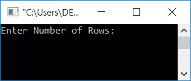
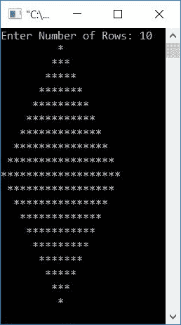
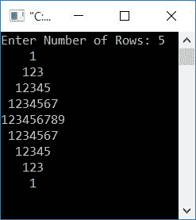
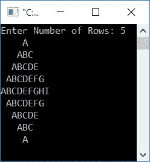

# C 程序：打印菱形图案

> 原文：<https://codescracker.com/c/program/c-program-print-diamond-pattern.htm>

在本文中，您将通过以下方式学习并获得关于菱形图案打印的代码:

*   星星的菱形图案
*   菱形数字图案
*   字母的菱形图案

## 印刷菱形图案的星星

让我们创建一个程序，要求用户输入上半部分钻石的行大小来打印星星的菱形图案。例如，如果用户输入 5 作为行大小，则打印出大小为 **5*2-1** 或 **9** 行的星形菱形。

```
#include<stdio.h>
#include<conio.h>
int main()
{
    int i, j, row, space;
    printf("Enter Number of Rows: ");
    scanf("%d", &row);
    space = row-1;
    for(i=1; i<=row; i++)
    {
        for(j=1; j<=space; j++)
            printf(" ");
        space--;
        for(j=1; j<=(2*i-1); j++)
            printf("*");
        printf("\n");
    }
    space = 1;
    for(i=1; i<=(row-1); i++)
    {
        for(j=1; j<=space; j++)
            printf(" ");
        space++;
        for(j=1; j<=(2*(row-i)-1); j++)
            printf("*");
        printf("\n");
    }
    getch();
    return 0;
}
```

这个程序是在 **Code::Blocks** IDE 下构建和运行的。下面是它的输出:



现在输入行数，比如说 **10** 来打印扩展到 **row-1** 行的菱形图案。 也就是说，对于第 10 行，它将打印 9 行菱形图案，如下图所示:



#### 程序解释

如果用户输入 10 作为钻石的尺寸，那么在打印钻石的上半部分时要记住以下几点:

*   在第一行，打印 9 个空格和一个星号
*   在第二行，打印 8 个空格和三个星号
*   在第三行，打印 7 个空格和 5 个星号
*   在第四行，打印 6 个空格和 7 个星号
*   在第五行，打印 5 个空格和 9 个星号
*   在第六行，打印 4 个空格和 11 个星号
*   在第七行，打印 3 个空格和 13 个星号
*   在第八行，打印两个空格和十五个星号
*   在第九行，打印 1 个空格和 17 个星号
*   在第十行，印上十九颗星

对于钻石的下半部分:

*   在第一行，打印 1 个空格和 17 个星号
*   在第二行，打印 2 个空格和 15 个星号
*   在第三行，打印 3 个空格和 13 个星号
*   在第四行，打印 4 个空格和 11 个星号
*   在第五行，打印 5 个空格和 9 个星号
*   在第六行，打印 6 个空格和 7 个星号
*   在第七行，打印 7 个空格和 5 个星号
*   在第八行，打印 8 个空格和三个星号
*   在第九行，打印 9 个空格和一个星号

假设用户输入为 10:

*   10 被初始化为[变量](/c/c-variables.htm) *行*
*   使用语句
    `space = row-1;`
    9 将空间*初始化为*
*   现在程序流执行循环的
*   在 *i=1* 的循环第一次运行*时，模拟运行如下:*
    1.  在[循环](/c/c-loops.htm)中，1 被初始化为 *i* ，并检查其是否小于或等于*行*
    2.  该条件评估为真，因为显然 *i* (1)的值小于*行* (10)的值
    3.  因此，程序流进入循环体内，并为循环执行另一个
    **   这次，1 被初始化为 *j* ，并检查它是否小于或等于*空间* (9)的值*   条件评估为真*   因此，程序流进入循环体，只执行一条语句，即打印空格的
        `printf(" ");`
        *   现在变量 *j* 递增，程序流程再次转到循环的条件部分，并且 检查 *j* (2)的更新值或递增值是否小于或等于*空间* (9)的值*   该条件再次评估为真。因此，程序流再次进入循环，并打印另一个空格*   以这种方式，间隔的打印继续，直到 *j* 的值变得大于*间隔*的值*   因此，在第一行总共打印了 9 个空格*   然后递减*空格*的值，以在下一行(比前一行)少打印一个空格*   现在程序流程转到第二个 *`for`循环*部分(出现在第一个外部`for`循环内部)*   在那里，1 被初始化为 *j* ，并检查它是否小于或等于((2*i)-1)的值*   由于第一次运行时 *i* 的值为 1，因此将 *j* 与 *(2*i)-1* 或 *(2*1)-1* 或 *1* 进行比较*   条件评估为真*   因此，程序流进入循环内部并打印一个星号(*)*   然后增加 *j* 的值，并再次与((2*i)-1)进行比较*   这次， *j* (2)的值不小于或等于(2*i)-1，即 *1**   因此，条件评估为假，并且程序流退出循环*   并且使用换行符(\n)，程序流现在从新的一行开始下一个输出(打印)内容*
**   在 *i=2* 的循环第二次运行*时，空运行为:*
    *   使用循环的第一个*，打印 8 个空格。如上所述，从步骤 1 到步骤 10 的过程相同，更新值为 *i**
    *   再次减少*空格*的值，以在下次打印时少打印一个空格。现在*空间=8*
    *   将第二个*用于循环*，打印 3 颗星。过程从步骤 12 到步骤 19 进行，如上所述，更新值为 *i*
    *   然后进行第 20 步*   在 *i=3* 的循环第三次运行*时，空运行为:*
    *   用新的值 *i* (3)进行从步骤 1 到步骤 10 的类似操作。也就是说，打印 7 个空格
    *   减少*空间*的值。现在*空间=7*
    *   用新的值 *i* (3)进行从步骤 12 到步骤 19 的类似操作。即打印 5 颗星
    *   工艺步骤 20*   继续执行循环，直到 *i* 的值变为 11*   因为 11 不小于或等于*行* (10)，所以条件评估为假，并且程序流程退出该循环*   以类似的方式印刷钻石的下半部分*   间隔的初始值*为 1**   因为，在下半部分的第一行，我们只需要打印一个空格*

 *## 打印菱形数字图案

这是另一个打印菱形数字图案的程序。在每一行中，数字从 1 开始。该程序与前一个程序相似。除此之外，使用一个变量比如 **num** (在程序开始时用 1 初始化)来打印数字，而不是星号。 每次打印后增加**号**的数值。

**注意-** 始终记得在语句`printf("\n");`后用 1 初始化 *num* ，以便每行从 1 开始

```
#include<stdio.h>
#include<conio.h>
int main()
{
    int i, j, row, space, num=1;
    printf("Enter Number of Rows: ");
    scanf("%d", &row);
    space = row-1;
    for(i=1; i<=row; i++)
    {
        for(j=1; j<=(space); j++)
            printf(" ");
        space--;
        for(j=1; j<=(2*i-1); j++)
        {
            printf("%d", num);
            num++;
        }
        printf("\n");
        num=1;
    }
    space = 1;
    for(i=1; i<=(row-1); i++)
    {
        for(j=1; j<=(space); j++)
            printf(" ");
        space++;
        for(j=1; j<=(2*(row-i)-1); j++)
        {
            printf("%d", num);
            num++;
        }
        printf("\n");
        num=1;
    }
    getch();
    return 0;
}
```

下面是上述程序产生的输出，假设用户输入了 5 作为钻石的大小:



## 打印字母的菱形图案

这个节目和上一个节目几乎一样。代替数字，使用一个使用变量的字符，比如说**ch**T6**char**类型。用 **A** 初始化。其余的事情与前面的程序相似。

```
#include<stdio.h>
#include<conio.h>
int main()
{
    int i, j, row, space;
    char ch='A';
    printf("Enter Number of Rows: ");
    scanf("%d", &row);
    space = row-1;
    for(i=1; i<=row; i++)
    {
        for(j=1; j<=(space); j++)
            printf(" ");
        space--;
        for(j=1; j<=(2*i-1); j++)
        {
            printf("%c", ch);
            ch++;
        }
        ch='A';
        printf("\n");
    }
    space = 1;
    for(i=1; i<=(row-1); i++)
    {
        for(j=1; j<=(space); j++)
            printf(" ");
        space++;
        for(j=1; j<=(2*(row-i)-1); j++)
        {
            printf("%c", ch);
            ch++;
        }
        ch='A';
        printf("\n");
    }
    getch();
    return 0;
}
```

假设用户输入 5:



#### 其他语言的相同程序

*   [C++ 打印菱形图案](/cpp/program/cpp-program-print-diamond-pattern.htm)
*   [Java 印花菱形图案](/java/program/java-program-print-diamond-pattern.htm)

[C 在线测试](/exam/showtest.php?subid=2)

* * *

* * **