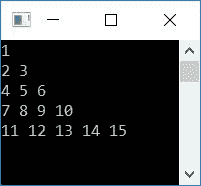

# 打印弗洛伊德三角形的 c 程序

> 原文：<https://codescracker.com/c/program/c-program-print-floyd-triangle.htm>

在这篇文章中，你将学习并获得用 C 语言打印弗洛伊德三角形的代码。但是在开始之前，让我们先了解一下弗洛伊德的三角形。

### 弗洛伊德的三角形是什么

弗洛伊德三角形是使用自然数创建的直角三角形，如下所示:

```
1
2 3
4 5 6
7 8 9 10
11 12 13 14 15
```

可以一直延续到任意行数。这里弗洛伊德的三角形最多只显示了 5 行。

## 用 C 语言打印弗洛伊德的三角形

现在让我们创建一个程序来打印具有 5 行或多行的弗洛伊德三角形:

```
#include<stdio.h>
#include<conio.h>
int main()
{
    int i, j, num=1;
    for(i=0; i<5; i++)
    {
        for(j=0; j<=i; j++)
        {
            printf("%d ", num);
            num++;
        }
        printf("\n");
    }
    getch();
    return 0;
}
```

这个程序是在 **Code::Blocks** IDE 下构建和运行的。下面是它的运行示例:



上述程序的预演如下:

*   最初*数字=1*
*   在循环的第一个(外部)[内，0 被初始化为 *i* 并检查其是否小于 5](/c/c-for-loop.htm)
*   条件评估为真。因此程序流进入循环内部
*   现在在循环的第二个*内，0 被初始化为 *j* 并检查是否小于或等于 *i* (0)的值*
*   条件评估为真。因此，程序流程进入循环，并打印出 *num* 的值，即 1，然后递增其值
*   现在*数字=2*
*   程序流程转到循环的内部*的更新部分，并增加 *j* 的值。现在 *j* 的值是 2。*
*   程序流程转到条件部分，检查 *j* 的值是否小于或等于 *i* 的值
*   条件评估为假。因此程序流从循环的内部*退出*
*   打印新的行字符。也就是说，下一个输出的东西从下一行开始
*   现在程序流程转到更新循环的外部*部分。在那里，增加 *i* 的值，并检查它是否小于 5*
*   条件再次评估为真。因此，程序流再次进入循环内部，并再次执行内部循环
*   继续该过程，直到循环的外部*的条件评估为假*

### 允许用户定义弗洛伊德三角形的大小

这是另一个程序，它做的工作和上一个一样，那就是打印弗洛伊德的三角形。但是用户可以定义弗洛伊德三角形的大小。换句话说，程序询问用户，弗洛伊德三角形扩展了多少行。

```
#include<stdio.h>
#include<conio.h>
int main()
{
    int i, j, num=1, row;
    printf("Enter Number of Rows: ");
    scanf("%d", &row);
    for(i=0; i<row; i++)
    {
        for(j=0; j<=i; j++)
        {
            printf("%d ", num);
            num++;
        }
        printf("\n");
    }
    getch();
    return 0;
}
```

假设用户输入为 10:


#### 其他语言的相同程序

*   [C++打印弗洛伊德三角形](/cpp/program/cpp-program-print-floyd-triangle.htm)
*   [Java 打印弗洛伊德三角形](/java/program/java-program-print-floyd-triangle.htm)
*   [蟒蛇皮印花弗洛伊德三角](/python/program/python-program-print-floyd-triangle.htm)

[C 在线测试](/exam/showtest.php?subid=2)

* * *

* * *