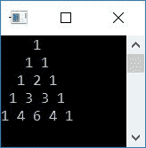
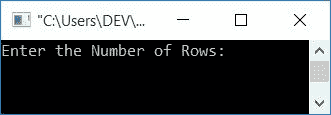
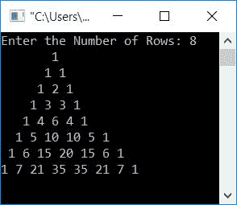

# 打印帕斯卡三角形的 c 程序

> 原文：<https://codescracker.com/c/program/c-program-print-pascal-triangle.htm>

在这篇文章中，你将学习并获得用 C 编程打印帕斯卡三角形的代码。但是在浏览程序之前，如果你不清楚帕斯卡三角，那么我推荐你参考一下关于[帕斯卡三角](/nonprog/pascal-triangle.htm)的简短描述。在那里，在很短的时间内，你将得到在上面创建程序所需的一切 。但是现在，下面的图片告诉了它的一切。


这个图形定义了帕斯卡三角形。但是在那篇文章中，我已经写了创建帕斯卡三角形的最简单的算法。

## 打印帕斯卡三角形

让我们创建一个程序，不使用任何[函数](/c/c-functions.htm)和公式打印帕斯卡三角形。这个程序只遵循 的算法，使用循环和逻辑来扩展帕斯卡三角形。

```
#include<stdio.h>
#include<conio.h>
int main()
{
    int row, col, i=1, j=0, arr[5], arrTemp[5];
    arr[0] = 1;
    arr[1] = 1;
    for(row=0; row<5; row++)
    {
        for(col=4; col>row; col--)
            printf(" ");
        for(col=0; col<=row; col++)
        {
            if(row==0)
                printf("1");
            else
            {
                if(col==0 || col==row)
                    printf("1 ");
                else
                {
                    arrTemp[i] = arr[j]+arr[j+1];
                    printf("%d ", arrTemp[i]);
                    i++;
                    j++;
                }
            }
        }
        printf("\n");
        arrTemp[i] = 1;
        if(row>1)
        {
            j=0;
            arr[j]=1;
            for(j=1, i=1; j<=row; j++, i++)
                arr[j] = arrTemp[i];
            i=1;
            j=0;
        }
    }
    getch();
    return 0;
}
```

这个程序是在 **Code::Blocks** IDE 下构建和运行的。这是它的示例输出。



在上面的程序中，我们使用了两个[数组](/c/c-arrays.htm)，第一个数组表示 **arr[]** 保存前一行的列值，而第二个数组表示 **arrTemp[]** 保存下一行的列值。也就是说:

*   最初，1 被初始化为第一个数组的索引号 0 和 1，比如说 **arr[]**
*   即 *arr[0]=1* 和 *arr[1]=1*
*   现在使用这个数组，计算下一行的列值的方式是将第 0 个和第 1 个索引处的值相加，并初始化为第二个数组的第 1 个索引，比如 **arrTemp[]**

上述程序的预演如下:

1.  最初， **i=1** ， **j=0** ， **arr[0]=1** ， **arr[1]=1**
2.  现在使用[进行循环](/c/c-for-loop.htm)，0 初始化为*行*(现在**行=0** )
3.  检查它是否小于 5。条件评估为真，因此程序流进入循环。在其中，使用第一个*作为*循环，打印了 4 个空格
4.  现在程序流程转到循环的第二个
**   那里 0 被初始化为 *col* (现在 **col=0** )*   检查*列*是否小于或等于*行*的值*   条件评估为真，因此程序流进入该循环。使用 [if 语句](/c/c-if-statement.htm)， 检查*行*的值是否等于 0*   条件评估为真，因此如果阻塞，程序流进入*内部，并在输出上打印 1。 跳过 *else* 块**   现在程序流程转到更新循环的内部第一个*的一部分，增加*列*的值**   现在 **col=1***   使用*栏*的新值处理步骤 6*   条件评估为假*   现在，下一条语句是
    `printf("\n");`
    ，它告诉编译器从下一行或新的一行开始下一次输出*   现在 1 被初始化为 *arrTemp[i]* 。因为 *i* 的前一个值是 1。因此 **arrTemp[1] = 1***   创建一个 *if* 块来检查*行*的值是否大于 1*   条件评估为假，因此如果块被跳过，则*。**   并且程序流程转到循环的外部*的更新部分。*行*的值增加**   现在**行=1***   流程步骤 3 至 5*   使用第*行*的新值(即 1)执行第 6 步*   现在 **col=0** 又来了*   阅读第 7 步*   条件评估为假，因为*行*不等于 0*   因此，程序流程进行到*否则*块。在 *else* 块内，检查 *col*的值是否等于 0 或 row 的值*   因为它的值等于 0，所以打印出 1*   增加*栏*的值(现在**栏=1***   并检查它是否小于或等于第*行*。条件评估为真，程序流 再次进入循环*   再次执行 *else* 块*   在它内部，如果块评估为真，则*的条件为真，因为 *col (1)* 等于 *row(1)*。因此再次打印 1**   再次增加*栏*的值(现在**栏=2** )并检查条件。这一次，条件 评估为假*   工艺步骤 13 至 17*   现在**行=2***   流程步骤 3 至 5*   使用第*行*的新值(即 2)执行第 6 步*   现在 **col=0** 又来了*   过程步骤 7、23、24、25、26、27、28*   现在 **col=2***   此时，如果块的*的条件评估为假，则程序流程转到*否则*块**   其中，*arrTemp[I]= arr[j]+arr[j+1]*或*arrTemp[1]= arr[0]+arr[0+1]*或 *arrTemp[1] = 1+1* 或 **arrTemp[1] = 2***   现在 **i=2** 和 **j=1***   阅读第 9 步*   现在 **col=3***   使用*栏*的新值处理步骤 6*   工艺步骤 12 至 15*   条件评估为真，因此程序流进入 *if* 块*   现在 **j=0** ， *arr[j]=1* 或者 **arr[0]=1***   循环的*被执行。成功执行后**   我们将有， **arr[0]=1** ， **arr[1]=2** ，arr[2]=1*   现在 **i=1** 和 **j=0***   工艺步骤 17*   现在**行=3***   过程从步骤 33 继续，直到*行*的值等于 5。那就是外 的条件*对于循环*评估为假*

 *## 用公式打印帕斯卡三角形

现在让我们创建另一个程序来做同样的工作，但是使用一个公式来查找列值(一个接一个)并直接打印出来，而没有上面程序中给出的那么多逻辑。但是要提高编程技能，最好还是用以前的方法。

```
#include<stdio.h>
#include<conio.h>
long int fact(int);
int main()
{
    int i, c;
    for(i=0; i<5; i++)
    {
        for(c=4; c>i; c--)
            printf(" ");
        for(c=0; c<=i; c++)
            printf("%ld ", fact(i)/(fact(c)*fact(i-c)));
        printf("\n");
    }
    getch();
    return 0;
}
long int fact(int n)
{
    int i, res=1;
    for(i=1; i<=n; i++)
        res = res*i;
    return res;
}
```

它将产生与前一个相同的输出。公式在帕斯卡三角形的单独教程中给出。也就是说，帕斯卡三角形的每一行的列值可以计算为:

```
value = (row!)/((column!)*(row-columns)!)
```

其中**行**是行号，**列**是列号。

**注意** -行和列都从 0 开始。

**！**代表阶乘。要了解，如何求一个数的阶乘，那么参考 [在 C 中求阶乘](/c/program/c-program-find-factorial.htm)。

例如，第 4 <sup>行第 2 <sup>和第</sup>列的值将为:</sup>

```
value = (row!)/((column!)*(row-columns)!)
      = (4!)/((2!)*(4-2)!)
      = (24)/(2*(2!))
      = 24/(2*2)
      = 24/4
      = 6
```

所以 6 是出现在第四行第二列的数字，实际上是在第五行第三列。

## 打印帕斯卡三角形，最多 n 行

这个程序要求用户定义帕斯卡三角形的大小，即他/她想要打印多少行帕斯卡三角形:

```
#include<stdio.h>
#include<conio.h>
long int fact(int);
int main()
{
    int i, c, rowLimit;
    printf("Enter the Number of Rows: ");
    scanf("%d", &rowLimit);
    for(i=0; i<rowLimit; i++)
    {
        for(c=(rowLimit-1); c>i; c--)
            printf(" ");
        for(c=0; c<=i; c++)
            printf("%ld ", fact(i)/(fact(c)*fact(i-c)));
        printf("\n");
    }
    getch();
    return 0;
}
long int fact(int n)
{
    int i, res=1;
    for(i=1; i<=n; i++)
        res = res*i;
    return res;
}
```

下面是它的运行示例:



现在供给行数，也就是最多多少行，帕斯卡三角形就展开了。假设用户输入了 8 作为行数，并按下了`ENTER`键。下面是上面程序产生的输出:



#### 其他语言的相同程序

*   [C++打印帕斯卡三角形](/cpp/program/cpp-program-print-pascal-triangle.htm)
*   [Java 打印帕斯卡三角形](/java/program/java-program-print-pascal-triangle.htm)

[C 在线测试](/exam/showtest.php?subid=2)

* * *

* * **