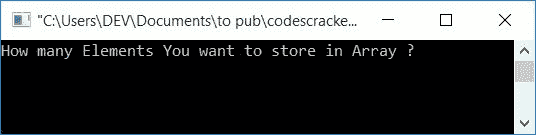
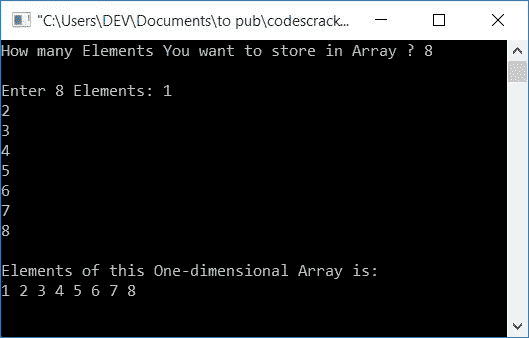

# C 程序一维数组

> 原文：<https://codescracker.com/c/program/c-program-one-dimensional-array.htm>

在本文中，您将学习并获得在 C 程序中使用一维(1D)数组的代码。举个例子，

```
int arr[10] = {1, 2, 3, 4, 5, 6, 7, 8, 9, 10};
```

数组 **arr[]** 是一个大小为 10 的一维数组。因为在数组中，索引是从 0 开始的，所以 所有的 10 个数字都以这样的方式存储:

*   **1** 存储在 **arr[0]**
*   **2** 存储在 **arr[1]**
*   **3** 存储在 **arr[2]**
*   等等

最后一个数字， **10** 存储在 **arr[9]** 中。让我们继续下面给出的一维数组的程序。

## C 语言中的一维数组程序

这是使用一维数组的程序。问题是，**用 C 写一个程序，要求用户 输入一维数组的大小和元素，并将其作为输出打印出来。**这个问题的答案如下:

```
#include<stdio.h>
#include<conio.h>
int main()
{
    int arr[50], size, i;
    printf("How many Elements You want to store in Array ? ");
    scanf("%d", &size);
    printf("\nEnter %d Elements: ", size);
    for(i=0; i<size; i++)
        scanf("%d", &arr[i]);
    printf("\nElements of this One-dimensional Array is:\n");
    for(i=0; i<size; i++)
        printf("%d ", arr[i]);
    getch();
    return 0;
}
```

这个程序是在 **Code::Blocks** 下构建和运行的，下面是运行示例:



现在输入一维数组的大小，比如说 **8** ，然后逐个输入任意 8 个数字，比如说 **1，2，3，4，5，6，7，8** ，按**回车**键，可以看到如下截图所示的输出:



要详细了解数组，请参考 C 教程中的[数组。让我们看一下 上面程序中使用的一些主要步骤。](/c/c-arrays.htm)

#### 前一程序中使用的步骤

这些是前面程序中使用的一些主要步骤。假设用户输入 **8** 作为大小， 1，2，3，4，5，6，7，8 作为数组的元素:

*   因为用户输入 **8** 作为数组的大小，所以 8 被初始化为**大小**变量
*   最初， **i** 的值是 **0** 并且 **0** 小于**大小**变量的值
*   因此程序流程进入 **for** 循环，扫描一个值并将其存储在索引号 **I<sup>th</sup>T5】**
*   因为 **i** 的值为 0，所以第一个值 **1** 被存储在 **str[0]**
*   程序流程使用循环的**的第三条语句增加 **i** 的值，其值变为 **1****
*   现在再次检查 **1** 是否小于 size 的值
*   因为 1 再次小于**大小**变量的值(该变量的值为 8)
*   然后，程序流再次进入循环，并扫描另一个值
*   将该值存储在 **str[i]** 或 **str[1]**
*   现在，程序流程再次转到作为(循环 变量的)更新部分的循环的**的第三条语句，并递增 **i** 的值**
*   **i** 的值变为 2，并检查它是否小于 size 的值
*   因为它小于变量**大小**的值
*   所以程序流再次进入循环
*   继续该过程，直到循环的**的条件评估为假，即 当 **i** 的值变为 8 时，则表示 8 不小于 8(T4 大小**的值)
*   因此程序流从第一个**退出到**循环
*   从第一个 **for** 循环中退出后，我们有一个大小为 8 的一维数组，其中的元素以一种方式存储，
    *   1 位于 **str[0]**
    *   2 在 **str[1]**
    *   3 在 **str[2}**
    *   依此类推，直到..
    *   8 是在 **str[7]**
*   现在使用另一个**作为**循环，在输出屏幕上打印输入的数组，如上面给出的程序所示。好了

#### 其他语言的相同程序

*   [C++ 1D 数组程序](/cpp/program/cpp-program-one-dimensional-array.htm)
*   [Java 1D 数组程序](/java/program/java-program-one-dimensional-array.htm)
*   [Python 1D 数组程序](/python/program/python-program-one-dimensional-array.htm)

[C 在线测试](/exam/showtest.php?subid=2)

* * *

* * *