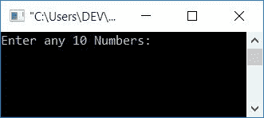
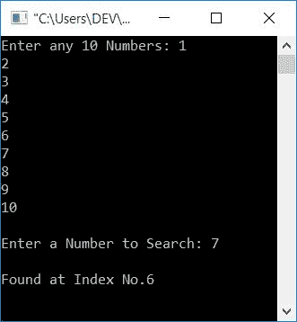
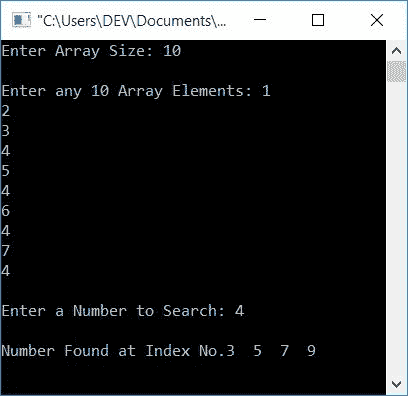

# C 程序：线性搜索

> 原文：<https://codescracker.com/c/program/c-program-linear-search.htm>

在这篇文章中，你将学习并获得使用线性搜索技术从给定的[数组](/c/c-arrays.htm) 中搜索数字或元素的代码。但是在浏览程序之前，如果你想检查用于 线性搜索的算法，那么参考[线性搜索](/computer-fundamental/linear-search.htm)。

## C 语言中的线性搜索

线性搜索是从数组中搜索元素的最简单的方法。也很好学。让我们先在它上面创建一个程序。问题是*用 C 写一个程序，要求用户输入任意 10 个数组元素，然后 要求输入一个数字从给定的数组中搜索。*这个问题的答案是:

```
#include<stdio.h>
#include<conio.h>
int main()
{
    int arr[10], i, num, pos;
    printf("Enter any 10 Numbers: ");
    for(i=0; i<10; i++)
        scanf("%d", &arr[i]);
    printf("\nEnter a Number to Search: ");
    scanf("%d", &num);
    for(i=0; i<10; i++)
    {
        if(arr[i]==num)
        {
            pos=i;
            break;
        }
    }
    printf("\nFound at Index No.%d", pos);
    getch();
    return 0;
}
```

这个程序是在 **Code::Blocks** IDE 下构建和运行的。下面是它的运行示例:



现在提供任意 10 个数字，比如说 **1，2，3，4，5，6，7，8，9，10** ，然后输入一个数字，比如说 **7** 来进行搜索。 按下`ENTER`时。下面是生成的输出:



从上面的代码中可以看出，数字(存储在 **num** 中)会与每个数字逐一进行比较。也就是说， 第一个数字(在 **0 <sup>第</sup>T5】索引处的数字)与 **num** 进行比较。如果找到，则将索引缩写为变量，比如 **pos** ，并借助 [break 关键字](/c/c-break-statement.htm)，退出循环。打印**位置**的值作为数字的 索引。否则，检查下一个索引处的数字。继续这个过程，直到找到号码。**

**注意** -之前的程序有两个限制。第一种是，如果用户输入一个不在列表中的 号码。第二个是，如果用户输入一个在列表 或数组中出现不止一次的数字。为了克服这个问题，我们创建了另一个程序。

## C 语言中重复项的线性搜索

这个程序查找并打印出可用的索引号。如果给定的数字以重复的顺序出现在给定的数组中。然后这个程序也打印出所有可用的索引。

```
#include<stdio.h>
#include<conio.h>
int main()
{
    int arr[50], size, i, num, arrTemp[50], j=0, count=0;
    printf("Enter Array Size: ");
    scanf("%d", &size);
    printf("\nEnter any %d Array Elements: ", size);
    for(i=0; i<size; i++)
        scanf("%d", &arr[i]);
    printf("\nEnter a Number to Search: ");
    scanf("%d", &num);
    for(i=0; i<size; i++)
    {
        if(arr[i]==num)
        {
            arrTemp[j] = i;
            j++;
            count++;
        }
    }
    if(count>0)
    {
        printf("\nNumber Found at Index No.");
        size = count;
        for(i=0; i<size; i++)
            printf("%d  ", arrTemp[i]);
    }
    else
        printf("\nNumber does not Found!");
    getch();
    return 0;
}
```

假设用户已经输入了数组大小为 **10** ，其 10 个元素为 **1，2，3，4，5，4，6，4，7，4** 。 和 **4** 是要搜索的号码。因此，下面是您将看到的示例输出:



这里使用的主要逻辑是:

*   如果号码匹配。然后只需将当前索引号初始化为另一个数组，比如 **arrTemp[]**
*   每次增加一个[变量](/c/c-variables.htm)表示**计数**，初始化数组 **arrTemp[]** 的索引号
*   数组 **arrTemp[]** 保存可用的索引号，变量 **count** 保存 **arrTemp[]** 的大小

#### 其他语言的相同程序

*   [C++线性搜索](/cpp/program/cpp-program-linear-search.htm)
*   [Java 线性搜索](/java/program/java-program-linear-search.htm)

[C 在线测试](/exam/showtest.php?subid=2)

* * *

* * *