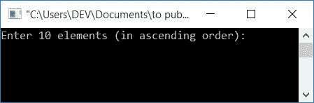
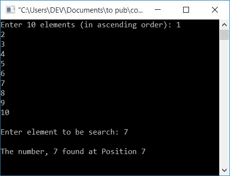
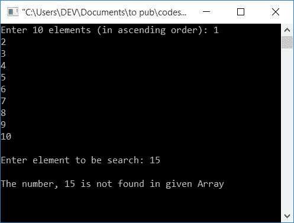
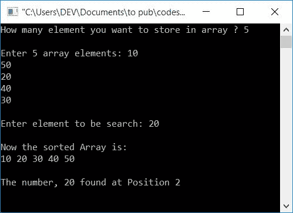
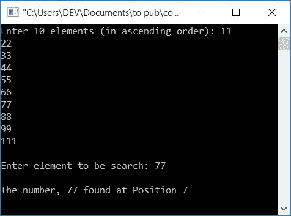

# C 程序：二分搜索

> 原文：<https://codescracker.com/c/program/c-program-binary-search.htm>

在本文中，您将学习并获得关于如何使用二分搜索法技术从给定数组中搜索元素的代码。但是在浏览这个程序之前，如果你不知道二分搜索法是如何工作的，那么我推荐你浏览一下二分搜索法的一步一步的工作。

以下是您将在这里完成的程序列表，以及一步一步的解释:

*   不使用功能的二分搜索法
*   二分搜索法使用函数
*   使用递归的二分搜索法

## C 中的二分搜索法

这是二分搜索法最简单的程序。从最简单的意义上来说，这里我们直接要求用户输入 10 个元素或数字，而不指定数组的大小，然后输入他/她所需的元素数量。此外，该程序中不包括排序代码块。所以我要求输入已经排序的数组作为输入。让我们来看看这个程序:

```
#include<stdio.h>
#include<conio.h>
int main()
{
    int i, arr[10], search, first, last, middle;
    printf("Enter 10 elements (in ascending order): ");
    for(i=0; i<10; i++)
        scanf("%d", &arr[i]);
    printf("\nEnter element to be search: ");
    scanf("%d", &search);
    first = 0;
    last = 9;
    middle = (first+last)/2;
    while(first <= last)
    {
        if(arr[middle]<search)
            first = middle+1;
        else if(arr[middle]==search)
        {
            printf("\nThe number, %d found at Position %d", search, middle+1);
            break;
        }
        else
            last = middle-1;
        middle = (first+last)/2;
    }
    if(first>last)
        printf("\nThe number, %d is not found in given Array", search);
    getch();
    return 0;
}
```

这个程序是在 **Code::Blocks** IDE 下编写的。以下是示例运行的初始快照:



现在按升序提供任意 10 个元素，比如说 **1、2、3、4、5、6、7、8、9、**和 **10** ，然后按**回车** 键。再次输入要搜索的任何元素或数字，比如说 **7** ，按 **ENTER** 键查看此处快照中给出的输出:



如果用户提供以上输出中输入的所有 10 个数字。但是这一次，当他/她输入任何数字，比如说 **15** 来从给定的数字列表中进行 搜索时，您将会看到以下输出:



#### 程序解释

1.  声明所有需要的[变量](/c/c-variables.htm) say **i，arr[]，search， **int** 的 first，last，middle** (整型)
2.  这里 **arr[]** 被声明为大小为 10，以存储多达 10 个元素或数字
3.  现在接收用户输入的 10 个数字
4.  由于数组中的索引从 0 开始，所以第一个元素存储在 **arr[0]** 中，第二个元素存储在**arr[1]** 中，依此类推
5.  现在要求输入要搜索的数字，并将其存储在**搜索**变量中
6.  现在初始化 **0** 到**第一个** (index)，9 到**最后一个** (index)，用 **第一个+最后一个/2** 求**中间** (index)的值
7.  创建一个 **while** 循环，继续运行直到**第一个**(索引)的值小于或等于 最后一个(索引)的值
8.  上述步骤的含义是，循环内的进程继续运行，直到间隔变为零，正如本文开头给出的逻辑所述
9.  在 **while** 循环内，首先检查中间索引处的值( **arr【中间】**)是否小于 **search** (要搜索的数字)或者是否使用 **if** 语句
10.  如果是，则初始化 **middle+1** 到 **first** 并转到循环的最后一条语句，即 **middle =(first+last)/2**
11.  如果第 9 <sup>步</sup>判断为假，则执行下面给出的进一步步骤
12.  现在程序流程转到**否则-如果**部分，并检查在 中间的元素( **arr【中间】**)是否等于**搜索**(要搜索的号码)
13.  如果相等，则打印位置。这里，我们将索引号加 1，以显示编号的位置。因为索引从 0 开始。例如，在一个数组中，有 4 个数表示 **10，20，30，40** 。 所以，指数将会是 **0，1，2，3** 。但是通常人们是这样知道的:
    *   10 预设在第一个位置
    *   20 出现在第二位置
    *   30 出现在第三位置
    *   40 出现在第四位置
14.  所以我给中间的**加了 1，并把它的值作为数组中给定数字的位置打印出来**
15.  现在程序流程进行到 **while** 循环的最后一条语句，即**middle =(first+last)/2；**
16.  如果第 12 个<sup>步</sup>评估为假，则 **else** 块被评估，并且 **middle-1** 被分配给 **last**并继续运行循环，直到**的条件同时**循环评估为假

这是用 c 语言修改的二分搜索法程序版本(如上所述)。这里我们让用户在运行时决定数组的大小。在执行二分搜索法之前，使用冒泡排序来对给定的数组进行升序排序。

**重要的** -这个程序从排序的数组中找到数字的位置，而不是从用户在 运行时输入的实际数组中。例如，如果用户提供 **10，50，20，30，40** 作为数组输入，而 **20** 作为要搜索的数字。然后这个程序 对数组进行排序，所以数组变成 **10，20，30，40，50** 并且 **20** 的位置将会是 **2** 。

```
#include<stdio.h>
#include<conio.h>
int main()
{
    int i, j, n, arr[100], search, first, last, middle, temp;
    printf("How many element you want to store in array ? ");
    scanf("%d", &n);
    printf("\nEnter %d array elements: ", n);
    for(i=0; i<n; i++)
        scanf("%d", &arr[i]);
    printf("\nEnter element to be search: ");
    scanf("%d", &search);

    // sorting given array using bubble sort
    for(i=0; i<(n-1); i++)
    {
        for(j=0; j<(n-i-1); j++)
        {
            if(arr[j]>arr[j+1])
            {
                temp = arr[j];
                arr[j] = arr[j+1];
                arr[j+1] = temp;
            }
        }
    }

    // sort array
    printf("\nNow the sorted Array is:\n");
    for(i=0; i<n; i++)
        printf("%d ", arr[i]);

    // back to binary search
    first = 0;
    last = n-1;
    middle = (first+last)/2;
    while(first <= last)
    {
        if(arr[middle]<search)
            first = middle+1;
        else if(arr[middle]==search)
        {
            printf("\n\nThe number, %d found at Position %d", search, middle+1);
            break;
        }
        else
            last = middle-1;
        middle = (first+last)/2;
    }
    if(first>last)
        printf("\nThe number, %d is not found in given Array", search);
    getch();
    return 0;
}
```

以下是示例运行的快照:



### 使用自定义函数的 C 语言二分搜索法程序

现在修改本文的第一个程序，它做同样的工作，但是这次使用下面给出的程序中所示的函数:

```
#include<stdio.h>
#include<conio.h>
int binarySearchFun(int arr[], int);
int main()
{
    int i, arr[10], search, pos;
    printf("Enter 10 elements (in ascending order): ");
    for(i=0; i<10; i++)
        scanf("%d", &arr[i]);
    printf("\nEnter element to be search: ");
    scanf("%d", &search);
    pos = binarySearchFun(arr, search);
    if(pos==0)
        printf("\nThe number, %d is not found in given Array", search);
    else
        printf("\nThe number, %d found at Position %d", search, pos);
    getch();
    return 0;
}
int binarySearchFun(int arr[], int search)
{
    int first, last, middle;
    first = 0;
    last = 9;
    middle = (first+last)/2;
    while(first <= last)
    {
        if(arr[middle]<search)
            first = middle+1;
        else if(arr[middle]==search)
        {
            return (middle+1);
        }
        else
            last = middle-1;
        middle = (first+last)/2;
    }
    return 0;
}
```

这是运行上述程序后产生的示例输出的快照:



#### 程序解释

*   在上面的程序中，在函数 **binarySearchFun()** 中，如果找到了数字或者条件 **arr[middle]= = search**评估为真，那么 **middle+1** 作为返回值返回给函数 **binarySearchFun()** ，该函数终止
*   该函数的返回值被初始化为 **main()** 函数中的 **pos** 变量
*   否则，如果没有一个元素(来自数组)匹配给定的数字(待搜索)，那么从 **binarySearchFun()** 函数退出 **while** 循环后，**返回 0；**语句被执行， **0** 被返回 并被初始化为 **main()函数**内的 **pos** 变量
*   现在使用 [if-else](/c/c-if-statement.htm) case(在 **main()** 函数中)检查并打印该号码是否是找到的
*   如果找到，则打印其位置，否则打印为，编号未找到

要了解关于函数的更多信息，请参考 C 教程中的[函数。](/c/c-functions.htm)

### 使用递归的 C 语言二分搜索法程序

这是关于二分搜索法的最后一个节目。这个程序使用递归函数，通过二分搜索法技术从给定的数组中找出数字。让我们来看看这个程序:

```
#include<stdio.h>
#include<conio.h>
int binarySearchRecFun(int [], int, int, int);
int main()
{
    int i, arr[10], search, pos;
    printf("Enter 10 elements (in ascending order): ");
    for(i=0; i<10; i++)
        scanf("%d", &arr[i]);
    printf("\nEnter element to be search: ");
    scanf("%d", &search);
    pos = binarySearchRecFun(arr, 0, 9, search);
    if(pos==0)
        printf("\nThe number, %d is not found in given Array", search);
    else
        printf("\nThe number, %d found at Position %d", search, pos);
    getch();
    return 0;
}
int binarySearchRecFun(int arr[], int first, int last, int search)
{
    int middle;
    if(first>last)
        return 0;
    middle = (first+last)/2;
    if(arr[middle]==search)
        return (middle+1);
    else if(arr[middle]>search)
        binarySearchRecFun(arr, first, middle-1, search);
    else if(arr[middle]<search)
        binarySearchRecFun(arr, middle+1, last, search);
}
```

您将得到与上述程序输出所示相同的输出，即二分搜索法使用函数。要了解更多关于递归的知识，请参考 C 教程中的[递归。](/c/c-recursion.htm)

#### 其他语言的相同程序

*   [C++ 二分搜索法](/cpp/program/cpp-program-binary-search.htm)
*   [爪哇二分搜索法](/java/program/java-program-binary-search.htm)

[C 在线测试](/exam/showtest.php?subid=2)

* * *

* * *