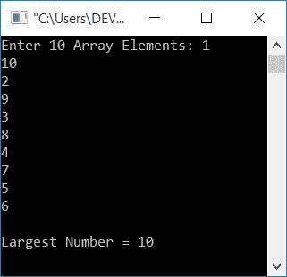

# C 程序：寻找数组中最大数字

> 原文：<https://codescracker.com/c/program/c-program-find-largest-element-in-array.htm>

在本教程中，您将学习并获得关于在使用和不使用用户定义的[函数](/c/c-functions.htm)的情况下从给定列表(或[数组](/c/c-arrays.htm))中查找最大数字的代码。

## 在没有函数的数组中寻找最大的元素/数字

让我们先创建一个不使用任何函数的程序，从所有程序中找出最大的一个。

```
#include<stdio.h>
#include<conio.h>
int main()
{
    int arr[10], i, large;
    printf("Enter 10 Array Elements: ");
    for(i=0; i<10; i++)
        scanf("%d", &arr[i]);
    i=0;
    large = arr[i];
    while(i<10)
    {
        if(large<arr[i])
            large = arr[i];
        i++;
    }
    printf("\nLargest Number = %d", large);
    getch();
    return 0;
}
```

这个程序是在 **Code::Blocks** IDE 下构建和运行的。下面是它的运行示例:


现在提供任意 10 个数字，然后按`ENTER`查看所有给定的 10 个数字中最大的一个，如下所示:



这个程序非常简单易懂，唯一使用的主要逻辑是:

1.  从用户处获得所有 10 个数字后，0 被初始化为[变量](/c/c-variables.htm) **i**
2.  **arr[i]** (第一个数)被初始化为**大**
3.  创建第二个语句是为了假设第一个数字是最大的一个
4.  将该数字(大中的值)与其余 9 个数字进行比较
5.  如果这个数(**大**的值)小于任何一个数，那么将那个数初始化为**大**
6.  从 [while 循环](/c/c-while-loop.htm)中退出后，我们有一个**大的**变量， 拥有给定列表中最大的数字
7.  所以只需将其值作为输出打印出来

## 使用函数查找数组中最大的元素

现在让我们使用一些额外的特性创建一个相同目的的程序。额外的功能是，用户可以定义数组的大小。这个程序是使用一个名为 **findLargest()** 的用户自定义函数创建的

```
#include<stdio.h>
#include<conio.h>
int findLargest(int [], int);
int main()
{
    int arr[10], i, large, size;
    printf("Enter Array Size: ");
    scanf("%d", &size);
    printf("Enter %d Array Elements: ", size);
    for(i=0; i<size; i++)
        scanf("%d", &arr[i]);
    large = findLargest(arr, size);
    printf("\nLargest Number = %d", large);
    getch();
    return 0;
}
int findLargest(int arr[], int n)
{
    int lrg, i=0;
    lrg = arr[i];
    while(i<n)
    {
        if(lrg<arr[i])
            lrg = arr[i];
        i++;
    }
    return lrg;
}
```

下面是它的运行示例:


#### 其他语言的相同程序

*   [C++ 在数组中找到最大的数字](/cpp/program/cpp-program-find-largest-element-in-array.htm)
*   [Java 在数组中找到最大的数字](/java/program/java-program-find-largest-element-in-array.htm)

[C 在线测试](/exam/showtest.php?subid=2)

* * *

* * *