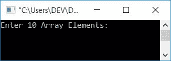

# C 程序：寻找数组中最小的数

> 原文：<https://codescracker.com/c/program/c-program-find-smallest-element-in-array.htm>

在本教程中，您将学习并获得关于在使用和不使用用户定义的[函数](/c/c-functions.htm)的情况下在[数组](/c/c-arrays.htm)中寻找最小数的代码。

在 C 编程中，要从给定的数组中找到最小的元素，你必须要求用户输入一个数组的所有元素。然后按照下面给出的程序，从所有的小块中找出:

```
#include<stdio.h>
#include<conio.h>
int main()
{
    int arr[10], small, i;
    printf("Enter 10 Array Elements: ");
    for(i=0; i<10; i++)
        scanf("%d", &arr[i]);
    i=0;
    small=arr[i];
    while(i<10)
    {
        if(small>arr[i])
            small = arr[i];
        i++;
    }
    printf("\nSmallest Number = %d", small);
    getch();
    return 0;
}
```

这个程序是在 **Code::Blocks** IDE 下构建和运行的。下面是它的运行示例:



现在提供任意 10 个数字作为数组元素，比如说 **10，8，9，3，7，1，2，4，6，5** 和`ENTER`键，看看下面的输出:


在接收到输入之后，也就是来自用户的 10 个数字，作为数组元素。索引 0 处的值(第一个数字)被初始化为**小**T2 变量(假设第一个数字是最小的 数字)。然后使用 [`while`循环](/c/c-while-loop.htm)逐一与其余 9 个数字进行比较，并检查 是否大于。如果是，那么简单地将该值初始化为**小**，并继续在下一个索引处检查 值，直到与所有 10 个数字进行比较。最后打印出**小**的值作为输出。

## 使用用户定义的函数

让我们创建另一个程序来做同样的工作，并添加一个额外的特性。额外的功能是，这个程序允许用户定义数组的大小，然后输入给定大小的元素。这个程序使用一个用户定义的函数**find small()**查找最小值。

```
#include<stdio.h>
#include<conio.h>
int findSmallest(int [], int);
int main()
{
    int arr[50], small, i, size;
    printf("Enter Array Size: ");
    scanf("%d", &size);
    printf("Enter %d Array Elements: ", size);
    for(i=0; i<size; i++)
        scanf("%d", &arr[i]);
    small=findSmallest(arr, size);
    printf("\nSmallest Number = %d", small);
    getch();
    return 0;
}
int findSmallest(int arr[], int n)
{
    int i=0, small;
    small=arr[i];
    while(i<n)
    {
        if(small>arr[i])
            small = arr[i];
        i++;
    }
    return small;
}
```

下面是它的运行示例:


#### 其他语言的相同程序

*   C++ 在数组中找到最小的数字
*   [Java 找到数组中最小的数字](/java/program/java-program-find-smallest-element-in-array.htm)

[C 在线测试](/exam/showtest.php?subid=2)

* * *

* * *