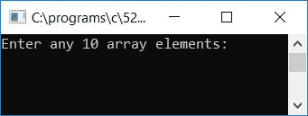

# C 程序：打印偶数位置的数组元素

> 原文：<https://codescracker.com/c/program/c-program-print-array-element-at-even-position.htm>

在本教程中，我们将学习如何用 C 语言创建一个程序，要求用户输入[数组](/c/c-arrays.htm) 元素，以打印出现在偶数索引号或偶数位置的所有数组元素。这是节目单。

```
#include<stdio.h>
#include<conio.h>
int main()
{
    int arr[10], i;
    printf("Enter any 10 array elements: ");
    for(i=0; i<10; i++)
        scanf("%d", &arr[i]);
    printf("\nValues stored at even position are:\n");
    for(i=0; i<10; i++)
    {
        if(i%2==0)
            printf("%d ", arr[i]);
    }
    getch();
    return 0;
}
```

由于程序是在 **Code::Blocks** IDE 下编写的，因此在成功构建和运行之后，这里是示例运行的第一个快照:



众所周知，数组中的索引从 0 开始，因此这是示例运行的第二个快照。用户必须提供任意 10 个数字作为给定数组的 10 个数组元素，然后按`ENTER`键查看以下输出:


以下是上述程序中使用的一些主要步骤:

*   接收任意 10 个数字作为数组元素
*   为从第 0 <sup>号</sup>到第 9 <sup>号</sup>号(数组元素)的循环星创建一个
***   在循环的**内，检查索引号是否为偶数***   如果是偶数，则打印该偶数索引号处的值*   这样，在运行程序后，我们将在输出屏幕上看到偶数编号的所有数组元素**

 **### 允许用户定义数组大小

下面是上述程序的修改版本。在这个程序中，我们允许用户在运行时输入数组的大小:

```
#include<stdio.h>
#include<conio.h>
int main()
{
    int arr[100], i, limit;
    printf("How many elements you want to store inside the array: ");
    scanf("%d", &limit);
    printf("Enter any %d array elements: ", limit);
    for(i=0; i<limit; i++)
        scanf("%d", &arr[i]);
    printf("\n\nValues stored at even position (with array and its index) are:\n");
    for(i=0; i<limit; i++)
    {
        if(i%2==0)
            printf("arr[%d] = %d\n", i, arr[i]);
    }
    getch();
    return 0;
}
```

以下是样本运行的最终快照:


以下是上述程序中使用的一些主要步骤:

*   接收数组的大小，比如 20
*   现在接收任意 20 个数字作为 20 个数组元素
*   然后按照前面程序中的所有步骤进行操作
*   即逐个查找偶数索引号以打印存储在偶数索引号处的所有值

[C 在线测试](/exam/showtest.php?subid=2)

* * *

* * ***