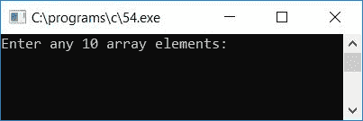
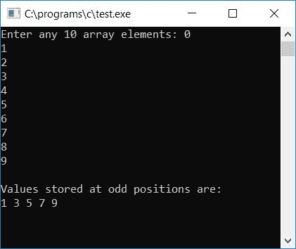
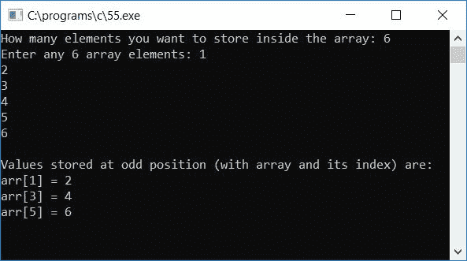

# C 程序：打印奇数位置的数组元素

> 原文：<https://codescracker.com/c/program/c-program-print-array-element-at-odd-position.htm>

在本教程中，我们将学习如何用 C 语言创建一个程序来读取数组元素，然后打印奇数位置的所有数组元素(按索引)。问题是，**用 C 写一个程序来读取一个 整数数组中的 10 个值，并打印所有存储在奇数位置的值。**下面是它的回答:

```
#include<stdio.h>
#include<conio.h>
int main()
{
    int arr[10], i;
    printf("Enter any 10 array elements: ");
    for(i=0; i<10; i++)
        scanf("%d", &arr[i]);
    printf("\nValues stored at odd positions are:\n");
    for(i=0; i<10; i++)
    {
        if(i%2!=0)
            printf("%d ", arr[i]);
    }
    getch();
    return 0;
}
```

该程序是在 **Code::Blocks** IDE 下编写的，因此在成功构建和运行之后，这是示例运行的 第一个快照:



为数组提供任意 10 个数字或元素，按`ENTER`键查看存储在奇数位置(奇数索引位置)的值:



#### 程序解释

*   接收任意 10 个数字作为 10 个数组元素
*   为循环创建一个[从第一个数字(出现在索引号 0 处)开始到最后一个数字(出现在索引号 9 处)](/c/c-for-loop.htm)
*   检查当前索引号是否为奇数
*   如果是，则打印存储在该索引号处的值

### 允许用户定义数组大小

现在让我们修改上面的程序，允许用户决定数组的长度:

```
#include<stdio.h>
#include<conio.h>
int main()
{
    int arr[100], i, limit;
    printf("How many elements you want to store inside the array: ");
    scanf("%d", &limit);
    printf("Enter any %d array elements: ", limit);
    for(i=0; i<limit; i++)
        scanf("%d", &arr[i]);
    printf("\nValues stored at odd position (with array and its index) are:\n");
    for(i=0; i<limit; i++)
    {
        if(i%2!=0)
            printf("arr[%d] = %d\n", i, arr[i]);
    }
    getch();
    return 0;
}
```

以下是示例运行的最终快照:



以下是上述程序中使用的一些主要步骤:

*   接收数组的长度，比如说 20
*   接收 20 个数字作为 20 个数组元素
*   遵循与上述程序步骤相同的程序
*   即找到并打印奇数索引号处的值

[C 在线测试](/exam/showtest.php?subid=2)

* * *

* * *