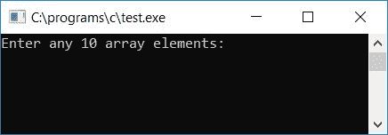
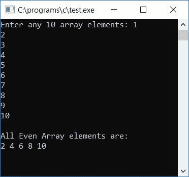
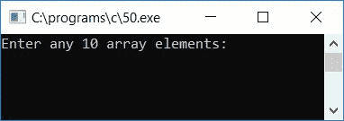
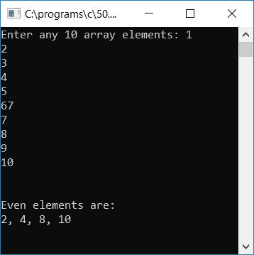
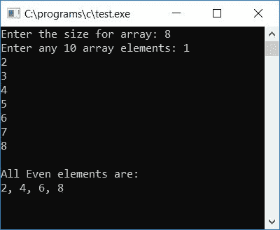

# 打印数组中偶数的 c 程序

> 原文：<https://codescracker.com/c/program/c-program-print-even-array-elements.htm>

在本教程中，我们将学习如何用 C 语言创建一个程序，要求用户(在运行时)输入[数组](/c/c-arrays.htm)元素 ，并打印出所有偶数数组元素。程序如下:

```
#include<stdio.h>
#include<conio.h>
int main()
{
    int arr[10], i;
    printf("Enter any 10 array elements: ");
    for(i=0; i<10; i++)
        scanf("%d", &arr[i]);
    printf("\nAll Even Array elements are:\n");
    for(i=0; i<10; i++)
    {
        if(arr[i]%2==0)
        {
            printf("%d ", arr[i]);
        }
    }
    getch();
    return 0;
}
```

该程序是在 **Code::Blocks** IDE 下构建和运行的，下面是示例运行的第一个快照:



为数组提供任意 10 个元素，并按`ENTER`键查看给定 10 个数组元素的 中的所有偶数，如这里给出的第二个快照所示:



#### 程序解释

*   接收任意 10 个数组元素
*   为循环创建[从 0 到 9 开始](/c/c-for-loop.htm)
*   在循环的**内，检查当前元素是否为偶数**
*   如果是偶数，打印出来并继续检查下一个数组元素，直到所有的 10 个元素都被检查并打印出来
*   这样，我们将看到所有偶数数组元素作为输出

### 仅从数组中复制偶数

现在让我们修改上面的程序来创建另一个数组，比如说 **b[]** ，它将保存原始数组的所有偶数:

```
#include<stdio.h>
#include<conio.h>
int main()
{
    int arr[10], i, b[10], j=0, count=0;
    printf("Enter any 10 array elements: ");
    for(i=0; i<10; i++)
        scanf("%d", &arr[i]);
    for(i=0; i<10; i++)
    {
        if(arr[i]%2==0)
        {
            b[j] = arr[i];
            count++;
            j++;
        }
    }
    printf("\n\nEven elements are:\n");
    for(i=0; i<count; i++)
    {
        if(i==(count-1))
            printf("%d", b[i]);
        else
            printf("%d, ", b[i]);
    }
    getch();
    return 0;
}
```

这是示例运行的第一个快照:



为数组提供任意 10 个元素，然后按`ENTER`键查看输出，如这里给出的第二个快照所示:



#### 程序解释

*   接收任意 10 个数组元素
*   为创建一个**循环从 0 到 9 开始**
*   在循环的**内，检查当前元素是否为偶数**
*   如果是偶数，那么将这个元素放入第二个数组，比如数组 **b[]**
*   数组 **b[]** 的索引将从 0 开始，并且每当 元素被发现为偶数(在原始数组中)并且被放置在该数组中时，每次索引值增加 1
*   在检查并将每个原始数组元素(如果发现是偶数)放入第二个数组后，说 **b[]** ， 从**出来用于**循环
*   现在打印第二个数组的值，比如说 **b[]** ，它将保存原始数组的所有偶数数组元素

### 允许用户定义数组大小

这是上述程序的修改版本。在该程序中，用户还可以提供阵列的大小。

```
#include<stdio.h>
#include<conio.h>
int main()
{
    int arr[10], i, b[10], j=0, count=0, size;
    printf("Enter the size for array: ");
    scanf("%d", &size);
    printf("Enter any 10 array elements: ");
    for(i=0; i<size; i++)
        scanf("%d", &arr[i]);
    for(i=0; i<size; i++)
    {
        if(arr[i]%2==0)
        {
            b[j] = arr[i];
            count++;
            j++;
        }
    }
    printf("\nAll Even elements are:\n");
    for(i=0; i<count; i++)
    {
        if(i==(count-1))
            printf("%d", b[i]);
        else
            printf("%d, ", b[i]);
    }
    getch();
    return 0;
}
```

以下是上述程序的最终快照:



[C 在线测试](/exam/showtest.php?subid=2)

* * *

* * *