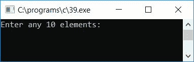
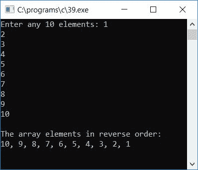
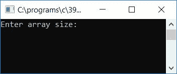
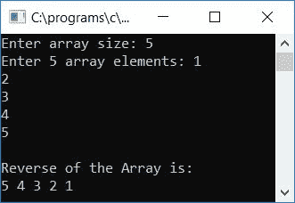
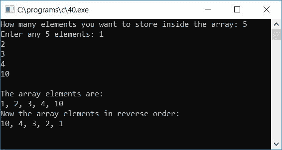

# C 程序：反转数组

> 原文：<https://codescracker.com/c/program/c-program-reverse-array.htm>

在本教程中，您将学习并获得 c 语言中关于反转数组的代码

*   第一个元素成为最后一个，最后一个元素成为第一个
*   类似地，第二个元素变成倒数第二个，倒数第二个元素变成第二个
*   等等

例如，如果给定的数组是:

```
2 6 4 8
```

那么它的反过来将是

```
8 4 6 2
```

## 打印数组的反面

在反转数组之前，让我们先创建一个程序，它将接收 10 个数组元素，并以相反的顺序打印数组。

若要以相反的顺序打印数组元素，请从最后一个到第一个开始索引。也就是说，如果用户提供了 10 个数组元素，那么将首先打印索引号为 9 的数组，最后打印索引号为 0 的元素。以这种方式，逆序的数组被打印出来，如下面给出的程序所示:

```
#include<stdio.h>
#include<conio.h>
int main()
{
    int arr[10], i;
    printf("Enter any 10 elements: ");
    for(i=0; i<10; i++)
    {
        scanf("%d", &arr[i]);
    }
    printf("\nThe array elements in reverse order:\n");
    for(i=9; i>=0; i--)
    {
        if(i==0)
            printf("%d", arr[i]);
        else
            printf("%d, ", arr[i]);
    }
    getch();
    return 0;
}
```

上面给出的程序是在 **Code::Blocks** IDE 下编写的，因此在成功构建和运行之后，下面是它的运行示例:



提供任意 10 个数组元素，并按`ENTER`键以相反顺序查看给定的 10 个数组元素 ，如示例运行的第二个快照所示:



## 反转一个数组

现在让我们修改上面的程序，让它接收一个数组的大小，比如说 **5** 。然后会要求 输入 5 个数组元素。收到数组元素后，这个程序将反转数组，然后在输出中打印出 数组。在前面的程序中，我们已经以相反的顺序打印了数组，但并没有真正反转它

```
#include<stdio.h>
#include<conio.h>
int main()
{
    int arr[50], size, i, j, temp;
    printf("Enter array size: ");
    scanf("%d",&size);
    printf("Enter %d array elements: ", size);
    for(i=0; i<size; i++)
        scanf("%d",&arr[i]);
    j=i-1;  // now j will point to the last element
    i=0;   //  and i will be point to the first element
    while(i<j)
    {
        temp=arr[i];
        arr[i]=arr[j];
        arr[j]=temp;
        i++;
        j--;
    }
    printf("\nReverse of the Array is:\n");
    for(i=0; i<size; i++)
        printf("%d ",arr[i]);
    getch();
    return 0;
}
```

该程序是在 **Code::Blocks** IDE 下编写的，下面是示例运行的第一个快照:



提供数组的大小，比如说 **5** ，然后输入任意 5 个数组元素，按`ENTER`键 反转数组。并打印其反面，如示例运行的第二个快照所示:



#### 程序解释

*   接收数组大小比如说 **5**
*   然后接收 5 个数组元素
*   使用 [`while`循环](/c/c-while-loop.htm)，由于这里数组的大小是 **5** 因此最后出现的元素，也就是 出现在第 4 个<sup>索引 的元素将被初始化为第 0 个<sup>索引</sup>出现在第 0 个<sup>索引</sup>索引的元素将被初始化为第 4 个<sup>第</sup>索引，然后第 3 个<sup>第</sup>将被初始化为第 1 个<sup>索引</sup></sup>
*   这样，我们就可以像上面的程序中显示的那样反转数组
*   最后打印反转后的数组

## 打印原始数组及其反面

让我们再创建一个程序来接收数组的大小和元素。并将按原始顺序和相反顺序打印数组元素:

```
#include<stdio.h>
#include<conio.h>
int main()
{
    int arr[100], i, limit;
    printf("How many elements you want to store inside the array: ");
    scanf("%d", &limit);
    printf("Enter any %d elements: ", limit);
    for(i=0; i<limit; i++)
    {
        scanf("%d", &arr[i]);
    }
    printf("\nThe array elements are:\n");
    for(i=0; i<limit; i++)
    {
        if(i==(limit-1))
            printf("%d", arr[i]);
        else
            printf("%d, ", arr[i]);
    }
    printf("\nNow the array elements in reverse order:\n");
    for(i=(limit-1); i>=0; i--)
    {
        if(i==0)
            printf("%d", arr[i]);
        else
            printf("%d, ", arr[i]);
    }
    getch();
    return 0;
}
```

以下是运行示例:



#### 其他语言的相同程序

*   [C++ 反向数组](/cpp/program/cpp-program-reverse-array.htm)
*   [Java 反向数组](/java/program/java-program-reverse-array.htm)

[C 在线测试](/exam/showtest.php?subid=2)

* * *

* * *