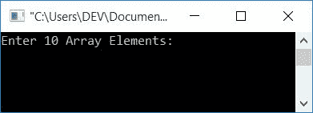
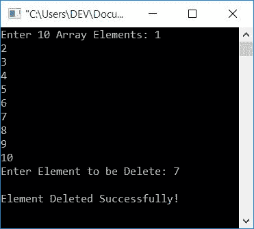
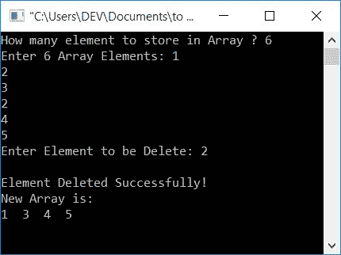
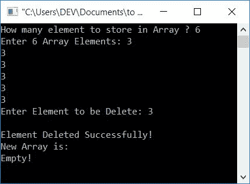

# C 程序：从数组中删除元素

> 原文：<https://codescracker.com/c/program/c-program-delete-element-from-array.htm>

在本教程中，您将学习并获得从用户(在运行时)给出的[数组](/c/c-arrays.htm) 中删除元素的代码。

## 从数组中删除元素

让我们首先创建一个程序，它从列表中删除所需的元素，并打印出这样的消息:元素已删除。

```
#include<stdio.h>
#include<conio.h>
int main()
{
    int arr[10], del, i, j, found=0, size;
    printf("Enter 10 Array Elements: ");
    for(i=0; i<10; i++)
        scanf("%d", &arr[i]);
    printf("Enter Element to be Delete: ");
    scanf("%d", &del);
    size = 10;
    for(i=0; i<size; i++)
    {
        if(arr[i]==del)
        {
            for(j=i; j<(size-1); j++)
                arr[j] = arr[j+1];
            found=1;
            i--;
            size--;
        }
    }
    if(found==0)
        printf("\nElement does not found in the list!");
    else
        printf("\nElement Deleted Successfully!");
    getch();
    return 0;
}
```

这个程序是在 **Code::Blocks** IDE 下构建和运行的。下面是它的运行示例:



现在提供任意 10 个数字，然后提供一个必须从给定数组中删除的元素。下面是它的运行示例:



#### 程序解释

*   这里所有的 10 个数组元素以一种 的方式存储在 **arr[]** 中
    *   第一个数字进入 **arr[0]**
    *   第二个数字进入 **arr[1]**
    *   等等
*   为循环创建一个[，运行 10 次来比较给定元素 和列表中所有可用的元素](/c/c-for-loop.htm)
*   如果给定的元素(将被删除)在任何索引处与一个数字匹配，比如 4
*   然后将所有元素从这里向后移动一个索引。喜欢
    *   索引 5 处的元素被移动到 4
    *   索引 6 处的元素被移动到 5
    *   等等
*   初始化 1 到**发现**，只检查这个 [if 块](/c/c-if-statement.htm) 是否被执行。如果执行，那么在列表中找到给定的数字。否则，不会找到
*   然后递减 **i** 的值，从一个索引开始检查(从进入循环的内**之前开始)**
*   因为，可能索引 4 处的新元素又等于这个数了
*   还要减少**大小**的值，因为删除了 1 个元素
*   并且继续相同的过程，直到与给定数组的所有元素进行比较
*   现在检查找到的的值**是否为 0**
*   如果它的值为 0，则找不到任何匹配。所以打印一条消息表示元素不存在
*   否则，如果它的值不为零，那么就意味着，它的值为 1，并像元素被删除一样打印这个值。好了
*   不要忘记在程序开始时将 0 初始化为找到的

如您所见，元素被删除了。但要澄清的是，它实际上是否删除了元素。然后我们必须在移除元素后打印数组。让我们创建一个程序来解决这个问题。

## 删除元素并打印新数组

下面是上述程序的完整版本。

```
#include<stdio.h>
#include<conio.h>
int main()
{
    int arr[50], size, del, i, j, found=0;
    printf("How many element to store in Array ? ");
    scanf("%d", &size);
    printf("Enter %d Array Elements: ", size);
    for(i=0; i<size; i++)
        scanf("%d", &arr[i]);
    printf("Enter Element to be Delete: ");
    scanf("%d", &del);
    for(i=0; i<size; i++)
    {
        if(arr[i]==del)
        {
            for(j=i; j<(size-1); j++)
                arr[j] = arr[j+1];
            found=1;
            i--;
            size--;
        }
    }
    if(found==0)
        printf("\nElement does not found in the list!");
    else
    {
        printf("\nElement Deleted Successfully!");
        printf("\nNew Array is:\n");
        if(size==0)
            printf("Empty!");
        else
        {
            for(i=0; i<size; i++)
                printf("%d  ", arr[i]);
        }
    }
    getch();
    return 0;
}
```

让我们取它的两个样本运行。第一个是:



从上面的快照可以看出，列表中出现了两次元素 **2** ，并且删除了 。现在让我们检查一下，如果数组中的所有元素都相同。用户输入要删除的相同元素，如下所示:



正如你所看到的，因为数组的所有元素都是相同的，也就是 3。并且用户输入 3 来删除，因此在删除 3 之后，数组变成空的。

#### 其他语言的相同程序

*   从数组中删除元素
*   [Java 从数组中删除元素](/java/program/java-program-delete-element-from-array.htm)

[C 在线测试](/exam/showtest.php?subid=2)

* * *

* * *