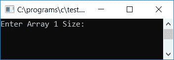

# C 程序：合并两个数组

> 原文：<https://codescracker.com/c/program/c-program-merge-two-arrays.htm>

在本教程中，我们将学习如何合并任意两个[数组](/c/c-arrays.htm)以形成包含两个给定数组的所有元素 的第三个数组。我们还将学习按升序和降序合并数组。

## 在 C #中合并两个数组

要在 C 编程中合并任意两个数组，首先将第一个数组中的每个元素添加到第三个数组(目标数组)中。然后开始将第二个数组的每个元素追加到第三个数组(目标数组)，如下面给出的程序所示。

下面的 C 程序要求用户输入**数组 1** 的大小及其元素，然后输入**数组 2** 的大小及其元素，合并形成新的数组(目标数组或第三数组)，然后显示 合并后数组的结果。这里我们直接显示了合并后的数组。您也可以在合并前对两个数组进行排序。为了学习排序，这里列出了三种对任何数组进行排序的技术:

*   [C 气泡排序](/c/program/c-program-bubble-sort.htm)
*   [C 选择排序](/c/program/c-program-selection-sort.htm)
*   [C 插入排序](/c/program/c-program-Insertion-sort.htm)

现在让我们看看合并两个给定数组的程序。问题是，**用 C 写一个程序来合并 用户在运行时**输入的任意两个数组。这个问题的答案是:

```
#include<stdio.h>
#include<conio.h>
int main()
{
    int arr1[50], arr2[50], size1, size2, i, k, merge[100];
    printf("Enter Array 1 Size: ");
    scanf("%d", &size1);
    printf("Enter Array 1 Elements: ");
    for(i=0; i<size1; i++)
    {
        scanf("%d", &arr1[i]);
        merge[i] = arr1[i];
    }
    k = i;
    printf("\nEnter Array 2 Size: ");
    scanf("%d", &size2);
    printf("Enter Array 2 Elements: ");
    for(i=0; i<size2; i++)
    {
        scanf("%d", &arr2[i]);
        merge[k] = arr2[i];
        k++;
    }
    printf("\nThe new array after merging is:\n");
    for(i=0; i<k; i++)
        printf("%d ", merge[i]);
    getch();
    return 0;
}
```

由于上述程序是在 **Code::Blocks** IDE 下编写的，因此在成功构建并运行后，您将在输出屏幕上获得以下 输出:



现在提供第一个数组的大小和元素，然后提供第二个数组的大小和元素。按`ENTER` 键查看合并后的数组输出:


#### 程序解释

*   第一个数组的接收大小为 **4**
*   然后接收第一个数组的 4 个元素
*   在接收循环的[中的第一个数组元素时，将每个元素和 每个元素初始化到接收后的**合并**数组中](/c/c-for-loop.htm)
*   也就是说，第一数组的第一、第二、第三和第四元素被初始化为索引号为 merge[0]、merge[1]、merge[2]和 merge[3]的合并数组
*   收到第一个数组的所有 4 个元素后
*   将[变量](/c/c-variables.htm) **i** 的值初始化为任意变量比如 **k** 。现在 k 持有值 4(在这种情况下)
*   第二个数组的接收大小为 **4**
*   然后接收第二个数组的 4 个元素
*   在循环的**中接收第二个数组元素时，接收后将每个 元素初始化到**合并**数组中**
*   这一次，从最后一次索引结束的地方开始合并数组的索引，即 4(k 的起始值)
*   也就是说，第二数组的第一、第二、第三和第四元素被初始化为索引号为 merge[4]、merge[5]、merge[6]和 merge[7]的合并数组
*   现在创建一个循环，从 0 开始到变量 **k** 的值，这里是从 0 到 7
*   并在循环中打印合并后的数组

## 按升序合并两个数组

问题是，**用 C 写一个程序来读取两个数组 A 和 B 中的值，将两个数组的元素按照 升序合并到第三个数组 C 中。最后打印所有数组**。这个问题的答案如下:

```
#include<stdio.h>
#include<conio.h>
int main()
{
    int a[10], b[10], c[20], i, j, limitC, temp;
    printf("Enter 10 elements in array A:");
    for(i=0; i<10; i++)
        scanf("%d", &a[i]);
    printf("Enter 10 elements in array B:");
    for(i=0; i<10; i++)
        scanf("%d", &b[i]);
    printf("\nElements of Array A are:\n");
    for(i=0; i<10; i++)
    {
        if(i==9)
            printf("%d", a[i]);
        else
            printf("%d, ", a[i]);
    }
    printf("\n\nElements of Array B are:\n");
    for(i=0; i<10; i++)
    {
        if(i==9)
            printf("%d", b[i]);
        else
            printf("%d, ", b[i]);
    }

    // merging the two arrays
    for(i=0; i<10; i++)
        c[i] = a[i];
    for(j=0; j<10; j++)
    {
        c[i] = b[j];
        i++;
    }

    // sorting the merged array
    for(j=0; j<19; j++)
    {
        for(i=0; i<19; i++)
        {
            if(c[i]>c[i+1])
            {
                temp = c[i];
                c[i] = c[i+1];
                c[i+1] = temp;
            }
        }
    }
    printf("\n\nElements of Array C are:\n");
    for(i=0; i<20; i++)
    {
        if(i==19)
            printf("%d", c[i]);
        else
            printf("%d, ", c[i]);
    }
    getch();
    return 0;
}
```

这是示例运行的第一个快照:


现在为数组 A 提供任意 10 个数组元素，然后为数组 B 提供 10 个数组元素，按`ENTER`键查看三个数组。 前两个数组是给定的数组，然后第三个数组将是包含数组 A 和数组 B 的所有元素并按升序排列的数组。这是第二张快照:


除了我们使用了一些额外的代码来按升序排列合并后的数组之外，上面的程序中使用了相同的概念来合并两个数组。以升序排列每一个元素

*   为循环创建一个从 0 开始到数组大小的
***   并且在 **for** 循环内部，创建另一个`for`循环，用不同的循环变量从 0 开始到数组的大小*   在第二个 **for** 循环中，比较数组中的每个元素*   如果第一个数组元素大于第二个数组元素*   然后将第一个放在第二个上，第二个放在第一个上*   做同样的事情，直到所有的元素都按照升序排列**

 **### 允许用户定义数组大小

这个程序做的工作和前面的程序一样，也就是按照升序合并两个给定的数组。唯一的区别是，这个程序允许用户定义数组的大小及其元素:

```
#include<stdio.h>
#include<conio.h>
int main()
{
    int a[50], b[50], c[100], limitA, limitB, i, j, limitC, temp;
    printf("How many elements you want to store in array A: ");
    scanf("%d", &limitA);
    printf("How many elements you want to store in array B: ");
    scanf("%d", &limitB);
    printf("Enter %d elements in array A:", limitA);
    for(i=0; i<limitA; i++)
        scanf("%d", &a[i]);
    printf("Enter %d elements in array B:", limitB);
    for(i=0; i<limitB; i++)
        scanf("%d", &b[i]);
    printf("\nElements of Array A are:\n");
    for(i=0; i<limitA; i++)
    {
        if(i==(limitA-1))
            printf("%d", a[i]);
        else
            printf("%d, ", a[i]);
    }
    printf("\n\nElements of Array B are:\n");
    for(i=0; i<limitB; i++)
    {
        if(i==(limitB-1))
            printf("%d", b[i]);
        else
            printf("%d, ", b[i]);
    }
    for(i=0; i<limitA; i++)
        c[i] = a[i];
    for(j=0; j<limitB; j++)
    {
        c[i] = b[j];
        i++;
    }
    limitC = i;
    for(j=0; j<(limitC-1); j++)
    {
        for(i=0; i<(limitC-1); i++)
        {
            if(c[i]>c[i+1])
            {
                temp = c[i];
                c[i] = c[i+1];
                c[i+1] = temp;
            }
        }
    }
    printf("\n\nElements of Array C are:\n");
    for(i=0; i<limitC; i++)
    {
        if(i==(limitC-1))
            printf("%d", c[i]);
        else
            printf("%d, ", c[i]);
    }
    getch();
    return 0;
}
```

以下是示例运行的最终快照:


## 按降序合并两个数组

现在让我们创建另一个程序，它将按降序合并两个给定的数组:

```
#include<stdio.h>
#include<conio.h>
int main()
{
    int a[10], b[10], c[20], i, j, limitC, temp;
    printf("Enter 10 elements in array A:");
    for(i=0; i<10; i++)
        scanf("%d", &a[i]);
    printf("Enter 10 elements in array B:");
    for(i=0; i<10; i++)
        scanf("%d", &b[i]);
    printf("\nElements of Array A are:\n");
    for(i=0; i<10; i++)
    {
        if(i==9)
            printf("%d", a[i]);
        else
            printf("%d, ", a[i]);
    }
    printf("\n\nElements of Array B are:\n");
    for(i=0; i<10; i++)
    {
        if(i==9)
            printf("%d", b[i]);
        else
            printf("%d, ", b[i]);
    }

    // merging the two arrays
    for(i=0; i<10; i++)
        c[i] = a[i];
    for(j=0; j<10; j++)
    {
        c[i] = b[j];
        i++;
    }

    // sorting the merged array
    for(j=0; j<19; j++)
    {
        for(i=0; i<19; i++)
        {
            if(c[i]<c[i+1])
            {
                temp = c[i];
                c[i] = c[i+1];
                c[i+1] = temp;
            }
        }
    }
    printf("\n\nElements of Array C are:\n");
    for(i=0; i<20; i++)
    {
        if(i==19)
            printf("%d", c[i]);
        else
            printf("%d, ", c[i]);
    }
    getch();
    return 0;
}
```

下面是示例运行的最终快照:


现在让我们修改上面的程序，允许用户为两个数组创建限制或大小。问题是，**用 C 写一个程序读取两个数组的大小和值，将两个数组的元素按照 降序合并到第三个数组中。最后打印所有的数组。**下面给出的程序是这个问题的答案:

```
#include<stdio.h>
#include<conio.h>
int main()
{
    int a[50], b[50], c[100], limitA, limitB, i, j, limitC, temp;
    printf("How many elements you want to store in array A: ");
    scanf("%d", &limitA);
    printf("How many elements you want to store in array B: ");
    scanf("%d", &limitB);
    printf("Enter %d elements in array A:", limitA);
    for(i=0; i<limitA; i++)
        scanf("%d", &a[i]);
    printf("Enter %d elements in array B:", limitB);
    for(i=0; i<limitB; i++)
        scanf("%d", &b[i]);
    printf("\nElements of Array A are:\n");
    for(i=0; i<limitA; i++)
    {
        if(i==(limitA-1))
            printf("%d", a[i]);
        else
            printf("%d, ", a[i]);
    }
    printf("\n\nElements of Array B are:\n");
    for(i=0; i<limitB; i++)
    {
        if(i==(limitB-1))
            printf("%d", b[i]);
        else
            printf("%d, ", b[i]);
    }
    for(i=0; i<limitA; i++)
        c[i] = a[i];
    for(j=0; j<limitB; j++)
    {
        c[i] = b[j];
        i++;
    }
    limitC = i;
    for(j=0; j<(limitC-1); j++)
    {
        for(i=0; i<(limitC-1); i++)
        {
            if(c[i]<c[i+1])
            {
                temp = c[i];
                c[i] = c[i+1];
                c[i+1] = temp;
            }
        }
    }
    printf("\n\nElements of Array C are:\n");
    for(i=0; i<limitC; i++)
    {
        if(i==(limitC-1))
            printf("%d", c[i]);
        else
            printf("%d, ", c[i]);
    }
    getch();
    return 0;
}
```

这是示例运行的最终快照:


### 其他语言的相同程序

*   [C++ 合并两个数组](/cpp/program/cpp-program-merge-two-arrays.htm)
*   [Java 合并两个数组](/java/program/java-program-merge-two-arrays.htm)

[C 在线测试](/exam/showtest.php?subid=2)

* * *

* * ***