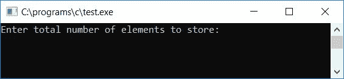
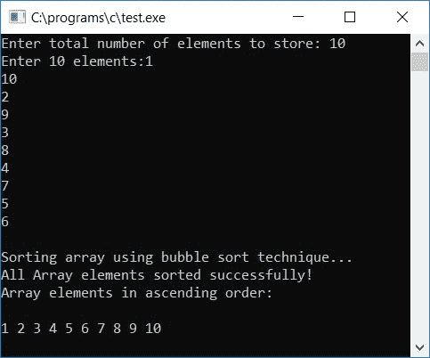
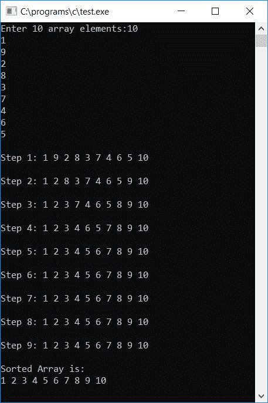
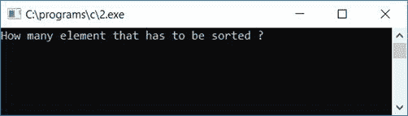
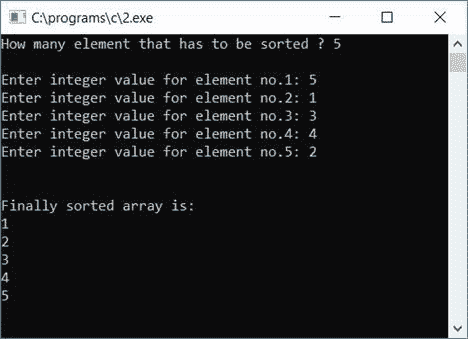

# 冒泡排序的 c 程序

> 原文：<https://codescracker.com/c/program/c-program-bubble-sort.htm>

在本教程中，我们将学习如何用 C 语言创建一个程序，使用冒泡排序技术对一个[数组](/c/c-arrays.htm) 进行升序排序。最后我们还创建了一个[函数](/c/c-functions.htm) ，它可以用来对任何给定的数组进行升序排序。

但是在浏览程序之前，如果你不知道冒泡排序是如何工作的，那么请参考[冒泡排序](/computer-fundamental/bubble-sort.htm)的逐步工作。现在让我们继续，用 C 程序实现它。

## C #中的冒泡排序

现在让我们在 C 程序中实现冒泡排序，如下所示。稍后我会解释每一行代码。问题是，**用 C 写一个程序，使用冒泡排序技术**对给定数组进行升序排序。这个问题的答案是:

```
#include<stdio.h>
#include<conio.h>
int main()
{
    int arr[50], i, j, n, temp;
    printf("Enter total number of elements to store: ");
    scanf("%d", &n);
    printf("Enter %d elements:", n);
    for(i=0; i<n; i++)
        scanf("%d", &arr[i]);
    printf("\nSorting array using bubble sort technique...\n");
    for(i=0; i<(n-1); i++)
    {
        for(j=0; j<(n-i-1); j++)
        {
            if(arr[j]>arr[j+1])
            {
                temp = arr[j];
                arr[j] = arr[j+1];
                arr[j+1] = temp;
            }
        }
    }
    printf("All Array elements sorted successfully!\n");
    printf("Array elements in ascending order:\n\n");
    for(i=0; i<n; i++)
        printf("%d ", arr[i]);
    getch();
    return 0;
}
```

由于上述程序是在 **Code::Blocks** IDE 下编写的，因此在成功构建和运行之后，这里是示例运行的第一个 快照:



现在提供数组的大小，比如说 **10** ，然后输入 **10** 数组元素。提供数组大小及其元素后，按 回车键，使用冒泡排序法按升序排序并打印所有数组元素。下面是示例运行的第二个快照:



#### 程序解释

*   我们要求用户输入阵列大小
*   然后输入该大小的数组元素
*   现在为了排序，我们使用 first (outer) [作为从 0 到(n-1)的循环](/c/c-for-loop.htm)，因为数组索引从 0 而不是 1 开始 。
*   然后第二个(内部)**为**从 0 到(n-i-1)循环。因为我们必须比较两个连续的元素，如果第一个元素的 大于第二个，那么我们必须交换。
*   例如，如果 I 的值为 0，那么 j 的值也将为 0，然后使用 [if 语句](/c/c-if-statement.htm)，将第 0 个<sup>第</sup>元素与(0+1) <sup>第</sup>或 第 1 个<sup>第</sup>元素进行比较。如果存在于 0 的元素将大于存在于 1 的元素，则交换将被执行。
*   循环将运行到最后，即，如果数组中总共有 10 个元素，那么最后第 8 个<sup>元素</sup>元素 将与第(8+1) <sup>元素</sup>进行比较，即第 9 个<sup>元素</sup>元素，也就是最后一个。
*   在运行循环来检查、比较和交换每一个连续的元素(或者每第 j 个<sup>元素到第</sup>元素到第 (j+1)<sup>元素)之后，我们已经按照升序对数组进行了排序。</sup>
*   最后打印出相同的数组，它将按升序显示所有的元素

### 每次排序后显示数组

如果您想在每次排序后显示数组，那么您可以使用下面的程序:

```
#include<stdio.h>
#include<conio.h>
int main()
{
    int arr[10], i, j, temp;
    printf("Enter 10 array elements:");
    for(i=0; i<10; i++)
        scanf("%d", &arr[i]);
    for(i=0; i<(10-1); i++)
    {
        for(j=0; j<(10-i-1); j++)
        {
            if(arr[j]>arr[j+1])
            {
                temp = arr[j];
                arr[j] = arr[j+1];
                arr[j+1] = temp;
            }
        }
        printf("\n");
        printf("Step %d: ", i+1);
        for(j=0; j<10; j++)
            printf("%d ", arr[j]);
        printf("\n");
    }
    printf("\nSorted Array is:\n");
    for(i=0; i<10; i++)
        printf("%d ", arr[i]);
    getch();
    return 0;
}
```

这是这个程序的最终快照:



### 用函数实现 C 语言中的冒泡排序程序

下面是另一个程序，它使用用户定义的函数 **bubbleSort()** 做同样的工作:

```
#include<stdio.h>
#include<conio.h>
void bubbleSort(int arr[], int n);
int main()
{
    int arr[100], nos, i;
    printf("How many element that has to be sorted ? ");
    scanf("%d", &nos);
    printf("\n");
    for(i=0; i<nos; i++)
    {
        printf("Enter integer value for element no.%d: ",i+1);
        scanf("%d",&arr[i]);
    }
    bubbleSort(arr, nos);
    printf("\n\nFinally sorted array is:\n");
    for(i=0; i<nos; i++)
        printf("%d\n",arr[i]);
    getch();
    return 0;
}
void bubbleSort(int arr[], int no)
{
    int i, j, temp;
    for(i=no-2; i>=0; i--)
    {
        for(j=0; j<=i; j++)
        {
            if(arr[j]>arr[j+1])
            {
                temp = arr[j];
                arr[j] = arr[j+1];
                arr[j+1] = temp;
            }
        }
    }
}
```

在成功构建和运行之后。下面是示例运行的第一个屏幕截图:



这是示例运行的第二个屏幕截图:



#### 程序解释

除了函数之外，所有步骤都与(本文的)第一个程序中讨论的相同。这里我们使用了函数来实现冒泡排序。以下是在这种情况下如何使用函数的一些主要步骤:

*   这里我们要求用户输入数组大小，然后使用**代替** [循环](/c/c-loops.htm)逐个输入该大小的所有元素
*   我们已经将数组和数组大小传递给了函数。传递数组意味着传递数组元素，这里方括号中是数组大小，例如，arr[10]是可选。
*   经过以上两个步骤，我们在功能步骤。在函数中，我们使用了与上面讨论的相同的技术，即从头到尾比较每个连续的元素。
*   如果第一个大于第二个，则交换，如果第二个大于第三个，则交换，依此类推。
*   但是这里我们用(no-1)初始化了 I。此处**无**表示元件总数。例如， 如果元素总数是 10，那么 I 被初始化为 8，在第二个循环中，j 被初始化为 0。
*   然后在第一次运行时，将第 j 个<sup>元素与第(j+1) <sup>个</sup>元素进行比较。即第 0 个<sup>元素</sup>与第(0+1) <sup>元素</sup>(1<sup>ST</sup>)元素相比是 。在第二次运行时，将 1 个<sup>第一个</sup>元件与 2 个<sup>第二个</sup>元件进行比较，以此类推。该循环将总共运行 8 次，以将第 8 个<sup>元素与第 9 个<sup>元素 进行比较，第 9 个</sup>元素是最后一个元素。</sup></sup>
*   成功完成上述所有步骤后，函数执行将结束，我们的数组将按升序排序。
*   现在我们只需要在循环的帮助下显示数组元素

#### 其他语言的相同程序

*   [C++冒泡排序](/cpp/program/cpp-program-bubble-sort.htm)
*   [Java 冒泡排序](/java/program/java-program-bubble-sort.htm)

[C 在线测试](/exam/showtest.php?subid=2)

* * *

* * *