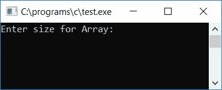
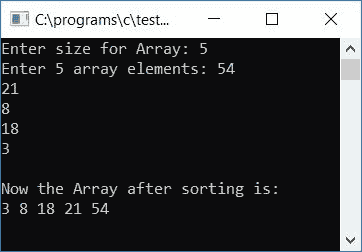
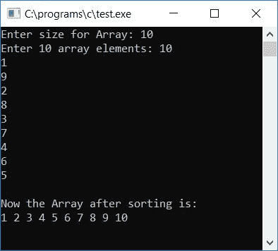
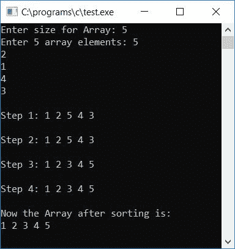
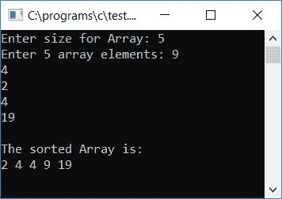

# 选择排序的 c 程序

> 原文：<https://codescracker.com/c/program/c-program-selection-sort.htm>

在本教程中，我们将学习如何用 C 创建一个程序，使用选择排序技术对一个[数组](/c/c-arrays.htm)进行排序。最后，我们还创建了一个 [函数](/c/c-functions.htm)，它可以使用选择排序技术对任何给定的数组进行升序排序。

但是在浏览程序之前，如果您不知道选择排序是如何工作的，那么请参考[选择排序](/computer-fundamental/selection-sort.htm)的逐步工作。现在让我们继续，用 C 程序实现它。

## C 选择分类程序

在 C 编程中，要使用选择排序技术对数组进行升序排序，你必须要求用户输入数组大小及其元素。然后应用选择排序机制并将排序后的数组作为输出打印出来，就像下面给出的程序一样:

```
#include<stdio.h>
#include<conio.h>
int main()
{
    int size, arr[50], i, j, temp, small, count=0, index;
    printf("Enter size for Array: ");
    scanf("%d", &size);
    printf("Enter %d array elements: ", size);
    for(i=0; i<size; i++)
        scanf("%d", &arr[i]);
    for(i=0; i<(size-1); i++)
    {
        small = arr[i];
        for(j=(i+1); j<size; j++)
        {
            if(small>arr[j])
            {
                small = arr[j];
                count++;
                index = j;
            }
        }
        if(count!=0)
        {
            temp = arr[i];
            arr[i] = small;
            arr[index] = temp;
        }
        count=0;
    }
    printf("\nNow the Array after sorting is:\n");
    for(i=0; i<size; i++)
        printf("%d ", arr[i]);
    getch();
    return 0;
}
```

由于上面的程序是在 **Code::Blocks** IDE 下编写的，因此这里是成功构建和运行后的运行示例。 这是样品运行的第一张快照:



现在提供数组的大小，比如说 **5** 和它的元素 **54 21 8 18 3** ，并按回车键查看排序后的数组 ，如这里给出的示例运行的第二个快照所示:



这是另一个运行示例。这是最终的快照:



## C 选择排序程序讲解

*   用户在运行时接收数组的大小
*   用户在运行时接收数组大小的元素
*   例如，如果用户提供了 5 作为数组大小，那么请他/她输入 5 个数组元素
*   为循环创建一个[，从 0 运行到比数组的(大小-1)小 1。 也就是说，如果数组的大小是 **5** ，那么运行从 0 到比 **5-1** 或 **4** 小 1 的循环](/c/c-for-loop.htm)
*   在循环内部，将当前索引处的元素初始化为一个变量，比如说 **small**
*   并且使用另一个**用于**循环(从 0 运行到比数组的大小小 1)，检查**小** 变量中的值是否大于任何元素(存在于索引等于 **i+1** 到(大小-1 或 4)的值)
*   如果是，则将该元素初始化为**小** [变量](/c/c-variables.htm) 并递增**计数器**变量，然后将 **j** (循环 变量的内部**)的当前值初始化为**索引**变量(保存最小元素出现处的索引号)**
*   永远不要忘记在程序开始时初始化 0 到计数变量
*   现在从循环的内**退出后，检查**计数**是否为 0 以外的值**
*   如果它包含除 0 以外的任何值，则程序流程进入循环的内部**的 [if 语句](/c/c-if-statement.htm)。而它 的意思是，任何元素都被初始化为**小**变量**
*   因此，我们必须执行交换操作，即将元素放在任何变量开始处，比如说 **temp** 、 ，然后在开始处初始化 **small** 的值，最后在交换前将 **temp** 的值初始化到从 元素初始化为 **small** 变量的索引处
*   交换后，初始化 0 到**计数**变量并继续
*   例如，如果用户输入 5 作为数组大小，输入 **54 21 8 18 3** 作为数组元素
*   然后在循环第一次运行**时， **i** 保持为 0。并且 **i < (size-1)** 或 **0 < 0(5-1)** 或 **0 < 4** 评估为真。因此程序流程进入[循环](/c/c-loops.htm)**
*   在 **arr[0]** 或 **54** 的值被初始化为 **small** 。因此**小**容纳 54
*   现在在循环的内**中， **i+1** (0+1)或 **1** 的值被初始化为 **j** (内循环的变量)。 因此 **j** 持有 1。且 1 小于**尺寸**或 **5** 。因此程序流程进入**循环的内部
***   现在语句 **small > arr[j]** 或 **54 > arr[1]** 或 **54 > 21** 被评估为真， 因此 **arr[j]** 或 **arr[1]** 或 **21** 被初始化为 **small** 。计数**的值**使 递增并变为 1，并且 **j** 或 **1** 的值被初始化为**索引***   再次增加 **j** 的值，并比较 **j** 是否小于**大小**，即 **j(2)**小于**大小(5)** ，因此程序流程再次进入循环*   并且再次**小> arr[j]** 或 **21 > arr[2]** 或 **21 > 8** 评估为真，因此在交换之后*   变量**小**保存 **8** ，**计数**保存 **2** ，**指标**保存 2*   再次增加 **j** 的值，并比较 **j** 是否小于**大小**，即 **j(3)**小于**大小(5)** ，因此程序流程再次进入循环*   并且再次**small>arr【j】**或**8>arr【3】**或 **8 > 18** 评估为假，因此不执行交换*   变量**小**保存 **8** ，**计数**保存 **2** ，**指标**保存 2*   再次增加 **j** 的值，并比较 **j** 是否小于**大小**，即 **j(4)**小于**大小(5)** ，因此程序流程再次进入循环*   并且再次**小>arr【j】T1】或**8>arr【4】T3】或 **8 > 3** 评估为真，因此在交换之后*****   变量**小**保存 **3** ，**计数**保存 **3** ，**索引**保存 4*   再次增加 **j** 的值，并比较 **j** 是否小于**大小**，即 j(5)是否小于**大小(5)** 。此处，条件评估为假，程序流程返回到循环的外部 **，并增加 **i** 的值。然后检查 **i** 是否小于**size-1**T26 或 **5-1** 或 **4** 的情况。其评估为真，因此程序流程再次进入循环内部并执行上述类似的 步骤，直到**循环的外部**的条件评估为假****

如果你想打印数组元素作为一步一步排序的数组元素显示在输出屏幕上连同其最终的数组。然后，您可以修改上面的代码，如下所示，在每个排序步骤后打印数组元素:

```
#include<stdio.h>
#include<conio.h>
int main()
{
    int size, arr[50], i, j, temp, small, count=0, index;
    printf("Enter size for Array: ");
    scanf("%d", &size);
    printf("Enter %d array elements: ", size);
    for(i=0; i<size; i++)
        scanf("%d", &arr[i]);
    for(i=0; i<(size-1); i++)
    {
        small = arr[i];
        for(j=(i+1); j<size; j++)
        {
            if(small>arr[j])
            {
                small = arr[j];
                count++;
                index = j;
            }
        }
        if(count!=0)
        {
            temp = arr[i];
            arr[i] = small;
            arr[index] = temp;
        }
        printf("\nStep %d: ", i+1);
        for(j=0; j<size; j++)
            printf("%d ", arr[j]);
        printf("\n");
        count=0;
    }
    printf("\nNow the Array after sorting is:\n");
    for(i=0; i<size; i++)
        printf("%d ", arr[i]);
    getch();
    return 0;
}
```

以下是示例运行的最终快照:



### 使用函数在 C #中选择排序

让我们创建相同的程序，即使用选择排序技术对数组进行升序排序，但这一次是借助于[函数](/c/c-functions.htm)。这里选择排序是在一个名为 **selsort()** 的函数中实现的，这个函数 使用两个参数，一个是数组，第二个是它的大小，如下面给出的程序所示:

```
#include<stdio.h>
#include<conio.h>
void selsort(int arr[], int size);
int main()
{
    int size, arr[50], i;
    printf("Enter size for Array: ");
    scanf("%d", &size);
    printf("Enter %d array elements: ", size);
    for(i=0; i<size; i++)
        scanf("%d", &arr[i]);
    selsort(arr, size);
    printf("\nThe sorted Array is:\n");
    for(i=0; i<size; i++)
        printf("%d ", arr[i]);
    getch();
    return 0;
}
void selsort(int arr[], int size)
{
    int i, j, temp, small, count=0, index;
    for(i=0; i<(size-1); i++)
    {
        small = arr[i];
        for(j=(i+1); j<size; j++)
        {
            if(small>arr[j])
            {
                small = arr[j];
                count++;
                index = j;
            }
        }
        if(count!=0)
        {
            temp = arr[i];
            arr[i] = small;
            arr[index] = temp;
        }
        count=0;
    }
}
```

以下是上述程序的最终快照:



除了我们在这里实现了一个函数 **selsort()** 之外，上述程序中使用的概念与第一个程序中使用的概念相似。 所有的选择排序技术都在这个函数中实现。我们只需将任何数组及其大小作为参数传递给函数 。数组中的所有元素都按升序排序。

#### 其他语言的相同程序

*   [C++选择排序](/cpp/program/cpp-program-selection-sort.htm)
*   [Java 选择排序](/java/program/java-program-selection-sort.htm)

[C 在线测试](/exam/showtest.php?subid=2)

* * *

* * *