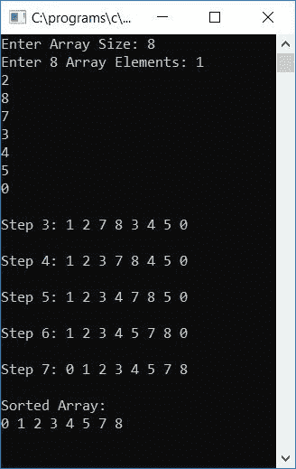

# C 程序：插入排序

> 原文：<https://codescracker.com/c/program/c-program-Insertion-sort.htm>

在本教程中，我们将学习如何用 C 语言创建一个程序，使用插入排序技术对一个[数组](/c/c-arrays.htm) 进行升序排序。这里我们还创建了一个[函数](/c/c-functions.htm) ，它可以用来按照升序插入排序技术对任何给定的数组进行排序(由用户在运行时进行排序)。

但是在浏览这个程序之前，如果你不知道插入排序实际上是如何工作的，那么我建议你一步一步地浏览一下[插入排序](/computer-fundamental/insertion-sort.htm)的工作过程。 让我们继续，用 C 程序实现它。

## C #中的插入排序

让我们先来看一下插入排序程序。稍后，我将解释这个程序中涉及的每一个步骤。问题是，**用 C 写一个程序，使用插入排序 技术**对任意给定的数组进行升序排序。这个问题的答案是:

```
#include<stdio.h>
#include<conio.h>
int main()
{
    int arr[50], size, i, j, k, element, index;
    printf("Enter Array Size: ");
    scanf("%d", &size);
    printf("Enter %d Array Elements: ", size);
    for(i=0; i<size; i++)
        scanf("%d", &arr[i]);
    for(i=1; i<size; i++)
    {
        element = arr[i];
        if(element<arr[i-1])
        {
            for(j=0; j<=i; j++)
            {
                if(element<arr[j])
                {
                    index = j;
                    for(k=i; k>j; k--)
                        arr[k] = arr[k-1];
                    break;
                }
            }
        }
        else
            continue;
        arr[index] = element;
    }
    printf("\nSorted Array:\n");
    for(i=0; i<size; i++)
        printf("%d ", arr[i]);
    getch();
    return 0;
}
```

由于上面的程序是在 **Code::Blocks** IDE 下编写的，因此在成功构建并运行之后，您将得到下面的 输出。这是示例运行的第一个快照:


现在提供数组的大小，比如说 **5** 并输入任意 5 个数组元素。然后按 ENTER 键对数组进行排序。下面是 示例运行的第二个快照:


让我们再做一次样品测试。以下是示例运行的最终快照:


#### 程序解释

*   接收数组的大小，然后接收该大小的元素
*   也就是说，如果用户提供 5 作为数组大小，那么请他/她为该数组输入任意 5 个元素
*   为循环创建一个从 1 到比数组小 1 的循环
*   在[循环](/c/c-loops.htm)内，初始化当前元素，即当前元素在 **I**<sup>th</sup>数组中的索引到任意[变量](/c/c-variables.htm)比如**元素**
*   使用 [if 语句](/c/c-if-statement.htm)检查当前元素是否小于前一元素
    *   如果是，则程序流程进入 **if** 块
    *   在 **if** 块内，为从 start (0)运行到**的**循环创建另一个**小于或等于**的 **i** 的 值(外循环变量)
    *   在这个循环中，检查**元素**的值是否小于 **arr[j]** 的值
    *   如果是，那么将当前索引初始化为一个变量，比如说**索引**，并使用**将所有元素逐个推到其下一个索引 进行**循环
    *   也就是为循环创建一个**，从 **i** 的值开始运行，直到它大于 **j**的值(外部循环变量)**
    *   永远不要忘记使用 [break 关键字](/c/c-break-statement.htm)来中断循环的

***   如果**的语句如果**的条件评估为假，那么使用 [继续关键字](/c/c-continue-statement.htm)告诉编译器 返回到循环的外层**。也就是说，增加它的变量，并继续进行上述相同的过程***   执行此操作后，继续增加循环变量(I)的第一个**，初始化**元素** 变量在 **arr【索引】**的值***   例如，如果用户将 **1 5 2 4 3** 作为数组提供*   因此，在第一次运行循环的**时***   循环变量 **i** 初始化为 1，并且 **i <大小**或 **1 < 5** 评估为真，因此程序 流程进入循环内部*   在 **arr[i]** 或 **arr[1]** 或 **5** 的值被初始化为**元素***   并且**元素< arr[i-1]** 或 **5 < arr[0]** 或 **5 < 1** 评估为假，因此程序流程转到 **else**块，并且使用 **continue** 关键字程序流程返回到第一个**进行**循环*   也就是说，没有进行任何交换，因此数组仍保持其原始顺序，即 **1 5 2 4 3***   当程序流程再次回到循环的**并增加 **i** 的值时***   现在 **i** 持有 2， **i <大小**或者 **2 < 5** 求值为真。因此，程序流再次进入循环*   在 **arr[i]** 或 **arr[2]** 或 **2** 的值被初始化为**元素***   并且**元素< arr[i-1]** 或 **2 < arr[1]** 或 **2 < 5** 评估为真，因此程序流程进入 **if** 块*   **j**(循环的内层**的循环变量)的值初始化为 0，并且 **j < =i** 或 **0 < =2** 评估为真，因此程序流程进入循环内部***   并且**元素<arr【j】**或 **2 < 1** 评估为假，因此程序流返回到循环 的内部**并增加 **j** 的值***   现在 **j** 保持 1 并且 **j < =i** 或者 **1 < =2** 评估为真。因此程序流进入循环内部*   并且**元素<arr【j】**或 **2 < 5** 再次评估为真，因此程序流程进入 **if** 块*   并且 **j** 或 **1** 被初始化为**索引**变量。并且 **i** 或 **2** 的值被初始化为 **k** (循环变量)*   并且 **k > j** 或 **2 > 1** 评估为真，因此程序流程进入循环内部，并且 **arr[k-1]** 或 **arr[1]**或 **5** 在 **arr[k]** 或 **arr[2]** 被初始化*   **k** 的值现在递减，变成 **1** 。并且 **k > j** 或 **1 > 1** 评估为假*   因此，程序流程退出该循环，并找到 **break** 关键字。使用该程序流程退出外 **进行**循环(第二个)并回到第一个**进行**循环*   现在新的数组是 **1 2 5 4 3***   在那里， **i** 的值再次增加，并且 **i <大小**或 **3 < 5** 评估为真，因此 程序流再次进入循环内部，并遵循如上所述的相同过程，按照插入排序技术对数组进行排序**

 **### 每次插入排序后打印数组

如果您想在输出屏幕上看到每次排序后的步进数组，那么您可以用下面的程序修改上面的程序:

```
#include<stdio.h>
#include<conio.h>
int main()
{
    int arr[50], size, i, j, k, element, index;
    printf("Enter Array Size: ");
    scanf("%d", &size);
    printf("Enter %d Array Elements: ", size);
    for(i=0; i<size; i++)
        scanf("%d", &arr[i]);
    for(i=1; i<size; i++)
    {
        element = arr[i];
        if(element<arr[i-1])
        {
            for(j=0; j<=i; j++)
            {
                if(element<arr[j])
                {
                    index = j;
                    for(k=i; k>j; k--)
                        arr[k] = arr[k-1];
                    break;
                }
            }
        }
        else
            continue;
        arr[index] = element;
        printf("\nStep %d: ", i);
        for(j=0; j<size; j++)
            printf("%d ", arr[j]);
        printf("\n");
    }
    printf("\nSorted Array:\n");
    for(i=0; i<size; i++)
        printf("%d ", arr[i]);
    getch();
    return 0;
}
```

以下是样本运行的最终快照:


这是另一个样本运行的最终快照:



### 使用 while 循环在 C #中插入排序

让我们创建另一个程序，它也按照插入排序技术对任何给定的数组进行升序排序。这里我们使用了 [while 循环](/c/c-while-loop.htm)来缩短代码:

```
#include<stdio.h>
#include<conio.h>
int main()
{
    int arr[5], i, j, elem;
    printf("Enter any 5 array elements: ");
    for(i=0; i<5; i++)
        scanf("%d", &arr[i]);
    for(i=1; i<5; i++)
    {
        elem = arr[i];
        j = i-1;
        while((elem<arr[j]) && (j>=0))
        {
            arr[j+1] = arr[j];
            j--;
        }
        arr[j+1] = elem;
    }
    printf("\nSorted Array in ascending order:\n");
    for(i=0; i<5; i++)
        printf("%d ", arr[i]);
    getch();
    return 0;
}
```

以下是样本运行的最终快照:


### 使用函数在 C #中插入排序

让我们创建一个函数，它采用任意两个参数(数组及其大小)按照插入排序技术对数组进行升序排序。下面的程序与上面的一样，只是我们创建了一个执行排序的函数:

```
#include<stdio.h>
#include<conio.h>
void insertsort(int arr[], int size);
int main()
{
    int arr[50], size, i;
    printf("How many element you want to store? ");
    scanf("%d", &size);
    printf("Enter any %d array elements: ", size);
    for(i=0; i<size; i++)
        scanf("%d", &arr[i]);
    insertsort(arr, size);
    printf("\nSorted Array in ascending order:\n");
    for(i=0; i<size; i++)
        printf("%d ", arr[i]);
    getch();
    return 0;
}
void insertsort(int arr[], int size)
{
    int i, elem, j;
    for(i=1; i<size; i++)
    {
        elem = arr[i];
        j = i-1;
        while((elem<arr[j]) && (j>=0))
        {
            arr[j+1] = arr[j];
            j--;
        }
        arr[j+1] = elem;
    }
}
```

从上面的程序可以看出，我们在程序开始时声明了一个函数，即在 **main()** 函数之前。 这个函数接受任意两个参数，第一个是数组，第二个是它的大小。我们已经定义了函数，这样在调用 函数后，程序成功执行函数定义中定义的动作。以下是示例运行的最终快照:


#### 其他语言的相同程序

*   [C++ 插入排序](/cpp/program/cpp-program-Insertion-sort.htm)
*   [Java 插入排序](/java/program/java-program-Insertion-sort.htm)

[C 在线测试](/exam/showtest.php?subid=2)

* * *

* * ***