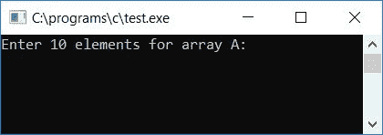
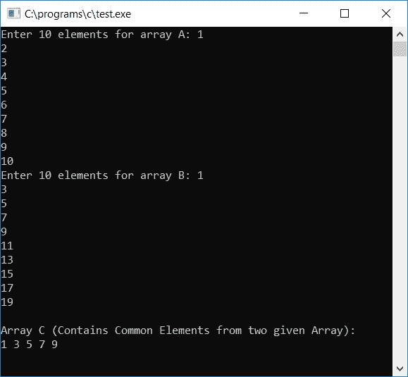
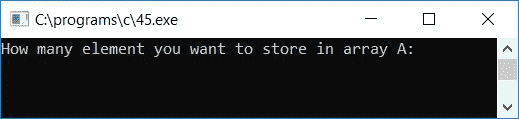
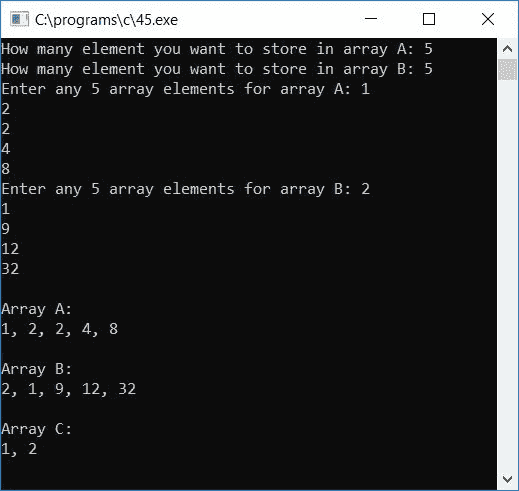

# C 程序：从两个数组中寻找并打印公共元素

> 原文：<https://codescracker.com/c/program/c-program-common-element-in-two-array.htm>

在本教程中，我们将学习如何创建一个程序，允许用户为两个数组输入任意 10-10 个数组元素，然后将两个数组中的所有公共元素放入第三个数组中。这里，我们必须将公共元素放入第三个数组中，而不要放入任何重复的元素。最后输出第三个数组的值。

## 从 C #中的两个数组中寻找公共元素

问题是，*用 C 写一个程序，从用户那里读取两个数组 a[10]和 b[10]的 10-10 个元素，然后将两个数组的公共 元素放在第三个数组中，不放任何重复的元素，然后打印第三个数组的值。*下面给出的程序 就是这个问题的答案:

```
#include<stdio.h>
#include<conio.h>
int main()
{
    int a[10], b[10], c[10], i, j, k=0, x, count;
    printf("Enter 10 elements for array A: ");
    for(i=0; i<10; i++)
        scanf("%d", &a[i]);
    printf("Enter 10 elements for array B: ");
    for(i=0; i<10; i++)
        scanf("%d", &b[i]);
    for(i=0; i<10; i++)
    {
        for(j=0; j<10; j++)
        {
            if(a[i]==b[j])
            {
                count = 0;
                for(x=0; x<k; x++)
                {
                    if(a[i]==c[x])
                        count++;
                }
                if(count==0)
                {
                    c[k] = a[i];
                    k++;
                }
            }
        }
    }
    printf("\nArray C (Contains Common Elements from two given Array):\n");
    for(i=0; i<k; i++)
        printf("%d ", c[i]);
    getch();
    return 0;
}
```

由于上述程序是在 **Code::Blocks** IDE 下编写的，因此在成功构建和运行之后，这里是示例运行 ，您也将在输出屏幕上看到它。这是示例运行的第一个快照:



现在，为两个数组提供任意 10 个数组元素，然后按 ENTER 键查看两个数组的公共元素，如示例运行的第二个快照所示:



以下是上述程序中使用的一些主要步骤:

*   接收第一个数组的任意 10 个元素，比如 **a[10]**
*   再次接收第二个数组的任意 10 个元素，比如 **b[10]**
*   为从 0 到 9 运行的循环创建一个
***   在其中，为循环创建另一个**，也是从 0 到 9 运行***   我们在这里为循环创建了两个**，来比较第一个数组的每个元素和第二个数组的每个元素***   这里循环的两个**是这样创建的，第一个数组的第 0 个<sup>元素</sup>与第二个数组的所有 10 个元素 进行比较，然后第一个数组的第 1 个<sup>元素</sup>与第二个数组的所有 10 个元素进行比较，...将第一个数组的第 9 个<sup>元素与第二个数组的所有 10 个元素进行比较</sup>***   在循环的内层**中，使用 **if** 语句检查两个数组的当前元素是否相等***   如果是，那么再次检查这个元素是否已经存在于第三个数组中，比如说 **c[]** 是否存在*   如果是，则增加任何变量的值，比如说 **count** 以在以后检查，count 是否保持其初始值为 0*   如果它保存它的原始值，那么我们必须把当前元素放在第三个数组中，否则如果 count 有值，那么它意味着当前元素已经存在于第三个数组中*   因为我们没有放任何重复的元素，所以继续检查下一个匹配*   将两个数组中所有匹配的元素(没有任何重复的元素)从两个**循环中取出***   最后打印第三个数组的值，它显示了来自两个给定数组的所有公共元素**

 **让我们修改上面的程序，允许用户提供数组及其元素的大小。然后将公共元素放入第三个数组，没有任何重复的元素。最后打印出所有三个数组作为输出。程序如下:

```
#include<stdio.h>
#include<conio.h>
int main()
{
    int a[50], b[50], c[50], i, limitA, limitB, j, k=0, x, count=0;
    printf("How many element you want to store in array A: ");
    scanf("%d", &limitA);
    printf("How many element you want to store in array B: ");
    scanf("%d", &limitB);
    printf("Enter any %d array elements for array A: ", limitA);
    for(i=0; i<limitA; i++)
        scanf("%d", &a[i]);
    printf("Enter any %d array elements for array B: ", limitB);
    for(i=0; i<limitB; i++)
        scanf("%d", &b[i]);
    for(i=0; i<limitA; i++)
    {
        for(j=0; j<limitB; j++)
        {
            if(a[i]==b[j])
            {
                count=0;
                for(x=0; x<k; x++)
                {
                    if(a[i]==c[x])
                        count++;
                }
                if(count==0)
                {
                    c[k]=a[i];
                    k++;
                }
            }
        }
    }
    printf("\nArray A:\n");
    for(i=0; i<limitA; i++)
    {
        if(i==(limitA-1))
            printf("%d", a[i]);
        else
            printf("%d, ", a[i]);
    }
    printf("\n\nArray B:\n");
    for(i=0; i<limitB; i++)
    {
        if(i==(limitB-1))
            printf("%d", b[i]);
        else
            printf("%d, ", b[i]);
    }
    printf("\n\nArray C:\n");
    for(i=0; i<k; i++)
    {
        if(i==(k-1))
            printf("%d", c[i]);
        else
            printf("%d, ", c[i]);
    }
    getch();
    return 0;
}
```

该程序是在 **Code::Blocks** IDE 下构建和运行的，下面是示例运行的第一个快照:



让我们提供两个数组的大小和元素，按`ENTER`键查看两个数组和第三个数组，第三个数组 包含两个给定数组的公共元素，如示例运行的第二个快照所示:



[C 在线测试](/exam/showtest.php?subid=2)

* * *

* * ***