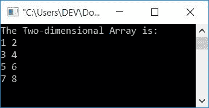
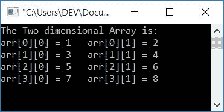
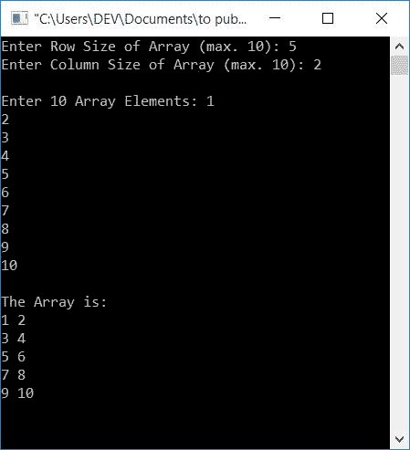

# C 程序：二维数组

> 原文：<https://codescracker.com/c/program/c-program-two-dimensional-array.htm>

在本文中，您将学习并获得一些使用二维(2D)数组的程序代码。举个例子，

```
int arr[4][2] = {{1, 2}, {3, 4}, {5, 6}, {7, 8}};
```

是一个二维数组。数组名为 **arr[][]** ，有 4 对 **2-2** 元素。也就是说， 第一个大小表示对的总数，第二个大小表示每对中有多少个元素存储在 中。从 **1** 到 **8** 的所有数字都以这样的方式存储在数组 **arr[][]** 中

*   1 存储在 **arr[0][0]**
*   2 存储在 **arr[0][1]**
*   3 存储在 **arr[1][0]**
*   4 存储在 **arr[1][1]**
*   等等

你也可以把它想成二维数组的元素是以行和列的形式放置的。也就是说，第一个索引显示行，而第二个索引显示列。因此，从上面声明和定义数组 **arr[][]** 的语句可以看出，有 4 行和 2 列。现在让我们继续下面给出的程序。

## C 语言中的二维数组程序

这是使用二维数组的最简单的 C 程序。这里二维数组的元素在程序运行时被自动初始化。这意味着，它不要求用户帮助定义大小或输入 2D 数组的一些元素。让我们看一下节目单。

```
#include<stdio.h>
#include<conio.h>
int main()
{
    int arr[4][2] = {{1, 2}, {3, 4}, {5, 6}, {7, 8}};
    int i, j;
    printf("The Two-dimensional Array is:\n");
    for(i=0;  i<4; i++)
    {
        for(j=0; j<2; j++)
            printf("%d ", arr[i][j]);
        printf("\n");
    }
    getch();
    return 0;
}
```

这个程序是在 **Code::Blocks** IDE 下构建和运行的。下面是上述程序产生的输出:



因为数组大小定义为 **arr[4][2]** 。这意味着，我们有 4 双。并且在每对中有 2 个元素。所以在这里我们首先为运行 4 次的循环创建了一个[，然后在其中的 ，我们为循环创建了另一个**，当程序流从外循环进入这个 循环时，每次运行 2 次。这样，语句，**](/c/c-for-loop.htm)

```
printf("%d ", arr[i][j]);
```

索引值从 **arr[0][0]** 到 **arr[3][1]** 总共执行 8 次。让我们用下面给出的程序来验证一下。

你也可以用下面给出的程序修改上面的程序，打印数组的元素及其索引。也就是说，哪个元素存储在哪个索引处。程序如下:

```
#include<stdio.h>
#include<conio.h>
int main()
{
    int arr[4][2] = {{1, 2}, {3, 4}, {5, 6}, {7, 8}};
    int i, j;
    printf("The Two-dimensional Array is:\n");
    for(i=0;  i<4; i++)
    {
        for(j=0; j<2; j++)
            printf("arr[%d][%d] = %d\t", i, j, arr[i][j]);
        printf("\n");
    }
    getch();
    return 0;
}
```

这是它的输出:



### 允许用户定义数组大小

让我们看另一个程序，允许用户定义二维数组的大小，然后输入给定大小的元素。这是关于 2D 维数组的最后一个程序，让你对它有完整的了解:

```
#include<stdio.h>
#include<conio.h>
int main()
{
    int arr[10][10], row, col, i, j;
    printf("Enter Row Size of Array (max. 10): ");
    scanf("%d", &row);
    printf("Enter Column Size of Array (max. 10): ");
    scanf("%d", &col);
    printf("\nEnter %d Array Elements: ", row*col);
    for(i=0; i<row; i++)
    {
        for(j=0; j<col; j++)
            scanf("%d", &arr[i][j]);
    }
    printf("\nThe Array is:\n");
    for(i=0; i<row; i++)
    {
        for(j=0; j<col; j++)
            printf("%d ", arr[i][j]);
        printf("\n");
    }
    getch();
    return 0;
}
```

下面给出的快照显示了这个句子上面给出的程序的运行示例:



要了解 C 语言中数组的更多信息，请参考 C 语言中的[数组](/c/c-arrays.htm)教程。

#### 其他语言的相同程序

*   [C++ 二维数组程序](/cpp/program/cpp-program-two-dimensional-array.htm)
*   [Java 二维数组程序](/java/program/java-program-two-dimensional-array.htm)

[C 在线测试](/exam/showtest.php?subid=2)

* * *

* * *