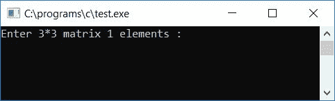
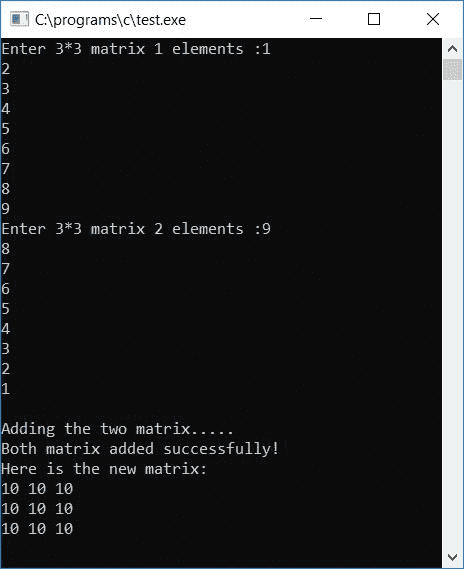
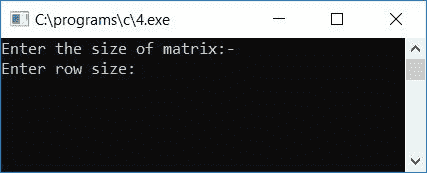
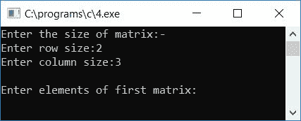
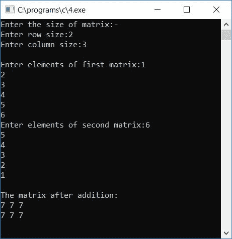

# C 程序：将两个矩阵相加

> 原文：<https://codescracker.com/c/program/c-program-add-two-matrices.htm>

在这篇文章中，你将学习 c 语言中的两个矩阵相加，但是在阅读这个程序之前，如果你不知道两个矩阵是如何相加的，那么我推荐你一定要参考[矩阵相加](/nonprog/matrix-addition.htm)一文。在那里，很快 就会看到矩阵加法是如何进行的。

## C 语言中的矩阵加法

要在 C 编程中添加任何两个矩阵，你必须要求用户输入两个矩阵的所有元素，现在开始添加两个矩阵以形成一个新的矩阵。添加两个矩阵后，显示第三个矩阵，这是用户给定的两个矩阵相加的结果，如这里给出的程序所示。

```
#include<stdio.h>
#include<conio.h>
int main()
{
    int mat1[3][3], mat2[3][3], i, j, mat3[3][3];
    printf("Enter 3*3 matrix 1 elements :");
    for(i=0; i<3; i++)
    {
        for(j=0; j<3; j++)
            scanf("%d",&mat1[i][j]);
    }
    printf("Enter 3*3 matrix 2 elements :");
    for(i=0; i<3; i++)
    {
        for(j=0; j<3; j++)
            scanf("%d",&mat2[i][j]);
    }
    printf("\nAdding the two matrix.....");
    for(i=0; i<3; i++)
    {
        for(j=0; j<3; j++)
            mat3[i][j]=mat1[i][j]+mat2[i][j];
    }
    printf("\nBoth matrix added successfully!");
    printf("\nHere is the new matrix:\n");
    for(i=0; i<3; i++)
    {
        for(j=0; j<3; j++)
            printf("%d ",mat3[i][j]);
        printf("\n");
    }
    getch();
    return 0;
}
```

由于上述程序是在 **Code::Blocks** IDE 下编写的，因此在成功构建并运行之后，这里是 的运行示例，以便更好地理解。这是示例运行的第一个快照:



现在向第一个 3*3 矩阵提供任意 9 个元素，然后再向第二个 3*3 矩阵提供 9 个元素。按`ENTER` 键查看输出。输出将是给定两个矩阵的相加结果，如示例 运行的第二个快照所示:



#### 程序解释

1.  对矩阵 1 取 9 个元素，对循环使用
2.  这里首先， **i** 从 0 开始， **j** 从 0 开始
3.  因此，第一个元素被初始化为 **mat1[0][0]**
4.  现在 **j** 增加并变成 1， **i** 仍然保持值 0
5.  因此，第二个元素被初始化为 **mat1[0][1]**
6.  同样，第三个元素被初始化为 **mat1[0][2]**
7.  现在当 **j** 变为 3 时，那么条件 **j < 3** 评估为假
8.  因此，编译器跳过这个循环，转到外部的[循环](/c/c-loops.htm)
9.  并且增加 **i** 的值
10.  由于 **i** 保持为 0，因此 **i** 递增后现在变为 1
11.  编译器再次进入内部循环，并再次将 **j** 初始化为 0
12.  现在，从步骤 2 到步骤 7 的相同过程再次开始，但是这里 **i** 保持 1，而不是 0
13.  即，第四、第五和第六元素被初始化为 **mat1[1][0]** 、 **mat1[1][1]** 和 **mat1[1][2]**
14.  以类似的方式，剩余的元素被初始化为矩阵 1 和矩阵 2
15.  要添加矩阵，我们必须对两个矩阵使用类似的相应索引号，如 mat1[0][0] + mat2[0][0]将被添加并初始化到第三个矩阵 mat3[0][0]，mat1[0][1] + mat2[0][1]将被添加并初始化到第三个矩阵 mat3[0][1]等。
16.  以类似的方式，对所有 9 个元素都这样做，并初始化为第三个矩阵的相应索引
17.  最后打印第三个矩阵的值作为输出

### 允许用户定义矩阵大小

让我们用一些额外的特性来修改上面的程序。额外的功能是，用户可以定义矩阵的大小:

```
#include<stdio.h>
#include<conio.h>
int main()
{
    int mat1[10][10], mat2[10][10], matadd[10][10];
    int x, y, i, j;
    printf("Enter the size of matrix:-\n");
    printf("Enter row size:");
    scanf("%d",&x);
    printf("Enter column size:");
    scanf("%d",&y);
    printf("\nEnter elements of first matrix:");
    for(i=0; i<x; i++)
    {
        for(j=0; j<y; j++)
            scanf("%d", &mat1[i][j]);
    }
    printf("Enter elements of second matrix:");
    for(i=0; i<x; i++)
    {
        for(j=0; j<y; j++)
            scanf("%d", &mat2[i][j]);
    }
    for(i=0; i<x; i++)
    {
        for(j=0; j<y; j++)
            matadd[i][j] = mat1[i][j] + mat2[i][j];
    }
    printf("\nThe matrix after addition:\n");
    for(i=0; i<x; i++)
    {
        for(j=0; j<y; j++)
            printf("%d ",matadd[i][j]);
        printf("\n");
    }
    getch();
    return 0;
}
```

这是示例运行的第一个屏幕截图:



这是提供行和列大小后的第二个截图:



而这是提供了两个矩阵的 **2*3** 矩阵元素后的第三张截图:



#### 其他语言的相同程序

*   [C++ 添加两个矩阵](/cpp/program/cpp-program-add-two-matrices.htm)
*   [Java 添加两个矩阵](/java/program/java-program-add-two-matrices.htm)
*   [Python 添加两个矩阵](/python/program/python-program-add-two-matrices.htm)

[C 在线测试](/exam/showtest.php?subid=2)

* * *

* * *