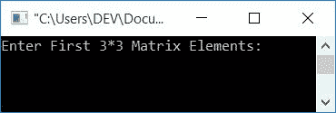
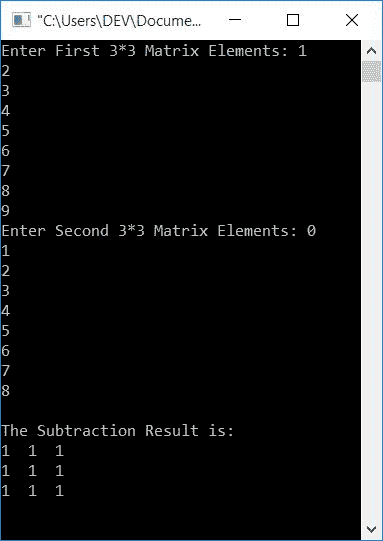
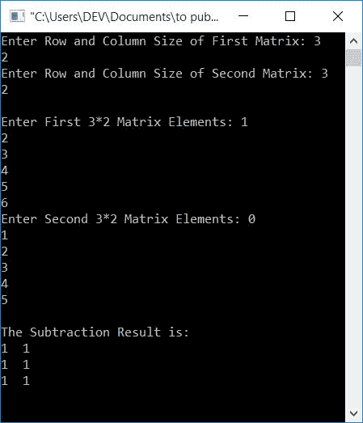

# C 程序：两个矩阵相减

> 原文：<https://codescracker.com/c/program/c-program-subtract-matrices.htm>

在本文中，您将学习并获得用 c 语言编写的矩阵减法代码。

*   3x3 矩阵减法
*   期望大小的矩阵减法

### 矩阵减法是如何执行的？

上面有单独的教程，就是[矩阵减法](/nonprog/matrix-subtraction.htm)。 在很短的时间内，你将完全了解矩阵减法是如何执行的。但是现在 任何两个 3*3 矩阵的减法被执行如下:

```
matSub[i][j] = mat1[i][j] - mat2[i][j];
```

其中 **i** 和 **j** 表示行和列。在将 *i* 和 *j* 的值置为 0 时:

```
matSub[0][0] = mat1[0][0] - mat2[0][0];
```

上述语句显示，第二个矩阵的第一个数字(或元素)从第一个矩阵的第一个数字中减去，并初始化为第三个矩阵的第一个元素(保存两个矩阵的相减结果)。

**注-** 第一个矩阵的第 0 <sup>行</sup>和第 0 <sup>列</sup>的数字减去第二个矩阵的第 0 <sup>行</sup>和第 0 <sup>列</sup>的数字。并且其减法结果得到初始化为结果矩阵的第 0 <sup>行和第 0 <sup>列的值的 。对所有元素应用相同的减法 过程</sup></sup>

## C 语言中的 3*3 矩阵减法

在 C 编程中要减去两个矩阵，你必须要求用户输入两个 3*3 的矩阵。即，为第一个矩阵输入 9 个元素，然后为第二个矩阵输入 9 个元素。现在从第一个矩阵中减去第二个矩阵。如下面给出的程序所示，在输出中打印减法结果。

```
#include<stdio.h>
#include<conio.h>
int main()
{
    int mat1[3][3], mat2[3][3], matSub[3][3], i, j;
    printf("Enter First 3*3 Matrix Elements: ");
    for(i=0; i<3; i++)
    {
        for(j=0; j<3; j++)
            scanf("%d", &mat1[i][j]);
    }
    printf("Enter Second 3*3 Matrix Elements: ");
    for(i=0; i<3; i++)
    {
        for(j=0; j<3; j++)
            scanf("%d", &mat2[i][j]);
    }
    for(i=0; i<3; i++)
    {
        for(j=0; j<3; j++)
            matSub[i][j] = mat1[i][j] - mat2[i][j];
    }
    printf("\nThe Subtraction Result is:\n");
    for(i=0; i<3; i++)
    {
        for(j=0; j<3; j++)
            printf("%d  ", matSub[i][j]);
        printf("\n");
    }
    getch();
    return 0;
}
```

这个程序是在 *Code::Blocks* IDE 下构建和运行的。下面是它的运行示例:



现在为第一个矩阵输入任意 9 个数字，然后为第二个矩阵输入 9 个数字。然后按`ENTER`键查看两个给定矩阵的减法 。以从第二个矩阵中减去第一个矩阵的方式执行减法:



如果你为第一个矩阵输入 9 个元素，比如说 **mat1[][]** 。然后这些元素以这样的方式储存:

*   第一个元素存储在 **mat1[0][0]**
*   第二个元素存储在 **mat[0][1]**
*   第三个元素存储在 **mat1[0][2]**
*   第四个元素存储在 **mat1[1][0]**
*   第五元素存储在 **mat1[1][1]**
*   等等

第二矩阵也是如此。现在，使用循环的[对两个矩阵进行减法运算，结果如下:](/c/c-for-loop.htm)

*   循环的外部*评估或执行 3 次*
*   并且循环的外*每执行一次，循环*的内*执行 3 次*
*   所以在第一次执行循环的外*时，*循环的内*执行 3 次。因此:*
    1.  matSub[0][0] = mat1[0][0] - mat2[0][0]
    2.  matSub[0][1] = mat1[0][1] - mat2[0][1]
    3.  matSub[0][2] = mat1[0][2] - mat2[0][2]
*   会被处决。在第二次执行循环的外*时，*循环的内*再次执行 3 次。 故又:*
    1.  matSub[1][0] = mat1[1][0] - mat2[1][0]
    2.  matSub[1][1] = mat1[1][1] - mat2[1][1]
    3.  matSub[1][2] = mat1[1][2] - mat2[1][2]
*   会被处决。第三次执行也发生了同样的事情:
    1.  matSub[2][0] = mat1[2][0] - mat2[2][0]
    2.  matSub[2][1] = mat1[2][1] - mat2[2][1]
    3.  matSub[2][2] = mat1[2][2] - mat2[2][2]
*   这样，矩阵 **matSub[][]** 保存两个给定矩阵的相减结果
*   现在打印 **matSub[][]** 的值

这里**【0】【0】**表示对应于写在它之前的矩阵的第一个元素。而**【0】【1】**表示 第二个元素，**【1】【0】**表示第四个元素，**【2】**表示最后一个元素

要了解循环的*的工作原理，请参考 c 语言中循环的[的单独教程](/c/c-for-loop.htm)*

循环的*首先且仅在其初始化部分执行一次。然后检查条件， 如果条件评估为真，则程序流执行作为循环*的这个*的块出现的所有语句。 然后更新循环变量或程序流去更新部分。更新该值后，会检查条件。如果它再次评估 为真，那么程序流再次执行其代码块的相同工作。该过程继续，直到 条件评估为假*

## 减去所需大小的两个矩阵

这个程序有一个额外的特点。也就是说，它允许用户定义两个矩阵的大小。

```
#include<stdio.h>
#include<conio.h>
int main()
{
    int rowSize1, colSize1, rowSize2, colSize2, i, j;
    int mat1[10][10], mat2[10][10], matSub[10][10];
    printf("Enter Row and Column Size of First Matrix: ");
    scanf("%d%d", &rowSize1, &colSize1);
    printf("Enter Row and Column Size of Second Matrix: ");
    scanf("%d%d", &rowSize2, &colSize2);
    if(rowSize1==rowSize2 && colSize1==colSize2)
    {
        printf("\nEnter First %d*%d Matrix Elements: ", rowSize1, colSize1);
        for(i=0; i<rowSize1; i++)
        {
            for(j=0; j<colSize1; j++)
                scanf("%d", &mat1[i][j]);
        }
        printf("Enter Second %d*%d Matrix Elements: ", rowSize2, colSize2);
        for(i=0; i<rowSize2; i++)
        {
            for(j=0; j<colSize2; j++)
                scanf("%d", &mat2[i][j]);
        }
        printf("\nThe Subtraction Result is:\n");
        for(i=0; i<rowSize1; i++)
        {
            for(j=0; j<colSize1; j++)
            {
                matSub[i][j] = mat1[i][j] - mat2[i][j];
                printf("%d  ", matSub[i][j]);
            }
            printf("\n");
        }
    }
    else
        printf("\nSubtraction can't be Performed!");
    getch();
    return 0;
}
```

下面是它的运行示例:



**注意=** 如果大小不匹配，则无法执行减法。也就是说，如果第一个 矩阵的行大小不等于第二个矩阵的<u>行大小，或者第一个矩阵的</u>列大小不等于第二个矩阵的 列大小，那么就不能执行减法。

在上面的程序中，在减法的时候，我们已经打印了每次减法后的元素。

#### 其他语言的相同程序

*   [C++减去两个矩阵](/cpp/program/cpp-program-subtract-matrices.htm)
*   [Java 减去两个矩阵](/java/program/java-program-subtract-matrices.htm)
*   [Python 减去两个矩阵](/python/program/python-program-subtract-two-matrices.htm)

[C 在线测试](/exam/showtest.php?subid=2)

* * *

* * *