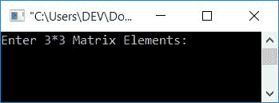
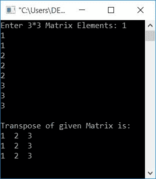
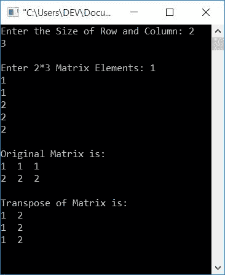

# C 程序：求矩阵转置

> 原文：<https://codescracker.com/c/program/c-program-transpose-matrix.htm>

在这篇文章中，你将学习并获得用户在运行时使用 C 程序寻找给定矩阵的转置的代码。但是在开始程序之前，我们先来了解一下，如何求任意矩阵的转置。

### 如何求一个矩阵的转置？

矩阵的转置可以通过以列交换行或以行交换列来计算。例如，如果给定一个矩阵，比如说矩阵 **A** 是:

```
1  1  1
2  2  2
3  3  3
```

那么，它的转置比方说**A<sup>T</sup>T3】就会是:**

```
1  2  3
1  2  3
1  2  3
```

如您所见，所有三行都被切换为三列，其方式如下:

*   原始矩阵第 0 <sup>行</sup>和第 0 <sup>列</sup>的元素，到第 0 <sup>行</sup>和第 0 <sup>列 <sup>T</sup></sup>
*   原始矩阵的第 0 <sup>行</sup>和第 1 <sup>行</sup>的元素，到第 1 <sup>行</sup>和第 0 <sup>行</sup>列 A <sup>T</sup>
*   原始矩阵第 0 <sup>行</sup>和第 2 <sup>第</sup>列的元素，到第 2 <sup>第</sup>行 和第 0 <sup>第</sup>列 A <sup>T</sup>
*   原始矩阵第 1 <sup>行第</sup>列和第 0 <sup>第</sup>列的元素，到第 0 <sup>行第</sup>行第 行和第 1 <sup>行第</sup>列第 <sup>T</sup>
*   原始矩阵的第 1 <sup>行第</sup>列和第 1 <sup>行第</sup>列的元素，到 A <sup>T</sup> 的第 1 <sup>行第</sup>列和第 1 <sup>列第</sup>列
*   原始矩阵第 1 <sup>行第</sup>列和第 2 <sup>第</sup>列的元素，到第 2 <sup>第</sup>行第 行和第 1 <sup>行第</sup>列第 <sup>T</sup>
*   同样的，原始矩阵的下三个元素进入矩阵**A<sup>T</sup>T3】**

## 在 C 语言中求矩阵的转置

这个程序是为 3*3 矩阵创建的。这是一个 3 行 3 列的矩阵。因此，这个程序要求用户为矩阵输入 9 个元素，然后将找到它的转置:

```
#include<stdio.h>
#include<conio.h>
int main()
{
    int mat[3][3], i, j, matTrans[3][3];
    printf("Enter 3*3 Matrix Elements: ");
    for(i=0; i<3; i++)
    {
        for(j=0; j<3; j++)
            scanf("%d", &mat[i][j]);
    }
    // Transposing the Matrix...
    for(i=0; i<3; i++)
    {
        for(j=0; j<3; j++)
            matTrans[j][i] = mat[i][j];
    }
    printf("\nTranspose of given Matrix is:\n");
    for(i=0; i<3; i++)
    {
        for(j=0; j<3; j++)
            printf("%d  ", matTrans[i][j]);
        printf("\n");
    }
    getch();
    return 0;
}
```

这个程序是在 *Code::Blocks* IDE 下构建和运行的。下面是它的运行示例:



现在为矩阵输入任意 9 个元素，并按`ENTER`键查看以下输出:



以下代码块负责转置矩阵:

```
for(i=0; i<3; i++)
{
    for(j=0; j<3; j++)
        matTrans[j][i] = mat[i][j];
}
```

如果你想详细了解循环的[，那么参考上面的单独教程 。但是现在，上面的代码块以这样的方式执行，初始化部分 say **i=0** 在循环开始时只执行 一次，每次进入循环内部的代码块时，必须检查其条件 (循环的第二条语句)。如果条件评估为真，那么只有程序流进入循环体内并执行所有语句](/c/c-for-loop.htm)

让我们假设，用户输入 9 个元素作为 **1，1，1，2，2，2，3，3，3** 。因此 **mat[0][0]=1， mat[0][1]=1，mat[0][2]=1，mat[1][0]=2，mat[1][1]=2** 等等。因为， *i* 从 0 开始执行，直到 其值变为 3，因此循环总共执行 3 次。也就是说，两个循环都以如下方式执行 3 次:

*   第一次执行循环的外层*，循环*的内层*执行三次。因此*
    *   第一次执行时，`matTrans[j][i] = mat[i][j]`或`matTrans[0][0] = mat[0][0]`或 或 **matTrans[0][0] = 1**
    *   第二次执行时，`matTrans[j][i] = mat[i][j]`或`matTrans[1][0] = mat[0][1]`或 或 **matTrans[1][0] = 1**
    *   在第三次执行时，`matTrans[j][i] = mat[i][j]`或`matTrans[2][0] = mat[0][2]`或 或 **matTrans[2][0] = 1**
*   在第二次执行循环的外层*时，循环*的内层*再次执行三次。因此*
    *   第一次执行时，`matTrans[j][i] = mat[i][j]`或`matTrans[0][1] = mat[1][0]`或 或 **matTrans[0][1] = 2**
    *   第二次执行时，`matTrans[j][i] = mat[i][j]`或`matTrans[1][1] = mat[1][1]`或 或 **matTrans[1][1] = 2**
    *   在第三次执行时，`matTrans[j][i] = mat[i][j]`或`matTrans[2][1] = mat[1][2]`或 或 **matTrans[2][1] = 2**
*   在第三次执行循环的外层*时，循环*的内层*再次执行三次。因此*
    *   第一次执行时，`matTrans[j][i] = mat[i][j]`或`matTrans[0][2] = mat[2][0]`或 或 **matTrans[0][2] = 3**
    *   第二次执行时，`matTrans[j][i] = mat[i][j]`或`matTrans[1][2] = mat[2][1]`或 或 **matTrans[1][2] = 3**
    *   在第三次执行时，`matTrans[j][i] = mat[i][j]`或`matTrans[2][2] = mat[2][2]`或 或 **matTrans[2][2] = 3**

这样，我们将得到一个名为 **matTrans[][]** 的矩阵，其值为:

*   matTrans[0][0] = 1
*   matTrans[0][1] = 2
*   matTrans[0][2] = 3
*   matTrans[1][0] = 1
*   matTrans[1][1] = 2
*   matTrans[1][2] = 2
*   matTrans[2][0] = 1
*   matTrans[2][1] = 2
*   matTrans[2][2] = 3

这是给定矩阵 **A** 的转置。

### 允许用户定义矩阵维度

该程序允许用户定义原始矩阵的尺寸。也就是说，用户必须输入矩阵的行和列的大小。并输入给定大小的矩阵元素。然后将计算并打印转置:

```
#include<stdio.h>
#include<conio.h>
int main()
{
    int mat[10][10], rowSize, colSize, i, j, matTrans[10][10];
    printf("Enter the Size of Row and Column: ");
    scanf("%d%d", &rowSize, &colSize);
    printf("\nEnter %d*%d Matrix Elements: ", rowSize, colSize);
    for(i=0; i<rowSize; i++)
    {
        for(j=0; j<colSize; j++)
            scanf("%d", &mat[i][j]);
    }
    printf("\nOriginal Matrix is:\n");
    for(i=0; i<rowSize; i++)
    {
        for(j=0; j<colSize; j++)
            printf("%d  ", mat[i][j]);
        printf("\n");
    }
    // Transposing the Matrix.....
    for(i=0; i<rowSize; i++)
    {
        for(j=0; j<colSize; j++)
            matTrans[j][i] = mat[i][j];
    }
    printf("\nTranspose of Matrix is:\n");
    for(i=0; i<colSize; i++)
    {
        for(j=0; j<rowSize; j++)
            printf("%d  ", matTrans[i][j]);
        printf("\n");
    }
    getch();
    return 0;
}
```

以下是运行示例:



#### 其他语言的相同程序

*   [C++转置矩阵](/cpp/program/cpp-program-transpose-matrix.htm)
*   [Java 转置矩阵](/java/program/java-program-transpose-matrix.htm)
*   [Python 转置矩阵](/python/program/python-program-transpose-matrix.htm)

[C 在线测试](/exam/showtest.php?subid=2)

* * *

* * *