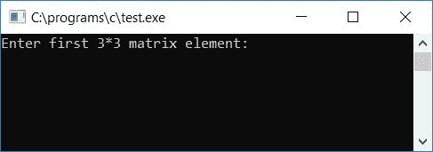

# C 程序：两个矩阵相乘

> 原文：<https://codescracker.com/c/program/c-program-multiply-two-matrices.htm>

在本文中，您将学习并获得关于 c 中两个矩阵相乘的代码。但是在浏览程序之前，如果您不知道两个矩阵相乘是如何执行的，那么我建议您看一下[矩阵相乘](/nonprog/matrix-multiplication.htm)的一步一步的过程。在那里，你 将会看到一步一步的使用图形表示的过程，即两个矩阵的乘积如何得到 的计算。现在让我们继续，用 C 程序实现它。

## C 语言中的矩阵乘法

C 编程中任意两个矩阵相乘，首先要求用户输入任意两个矩阵，然后开始给定的两个矩阵相乘，并将相乘结果逐个存储在任意变量 say **sum** 内。将 **sum** 的值存储在第三个 矩阵中(一个接一个作为它的元素)如这里给出的程序所示说 **mat3** 。

问题是，**用 C 写一个程序，把两个给定的矩阵**相乘。这个问题的答案是下面给出的 。这个 C 程序要求用户输入任意两个 3*3 矩阵元素，将它们相乘以形成一个新的 矩阵，它是两个给定的 3*3 矩阵相乘的结果。这里的 **3*3** 矩阵是指 3 行 3 列的矩阵:

```
#include<stdio.h>
#include<conio.h>
int main()
{
    int mat1[3][3], mat2[3][3], mat3[3][3], sum=0, i, j, k;
    printf("Enter first 3*3 matrix element: ");
    for(i=0; i<3; i++)
    {
        for(j=0; j<3; j++)
            scanf("%d", &mat1[i][j]);
    }
    printf("Enter second 3*3 matrix element: ");
    for(i=0; i<3; i++)
    {
        for(j=0; j<3; j++)
            scanf("%d", &mat2[i][j]);
    }
    printf("\nMultiplying two matrices...");
    for(i=0; i<3; i++)
    {
        for(j=0; j<3; j++)
        {
            sum=0;
            for(k=0; k<3; k++)
                sum = sum + mat1[i][k] * mat2[k][j];
            mat3[i][j] = sum;
        }
    }
    printf("\nMultiplication result of the two given Matrix is: \n");
    for(i=0; i<3; i++)
    {
        for(j=0; j<3; j++)
            printf("%d\t", mat3[i][j]);
        printf("\n");
    }
    getch();
    return 0;
}
```

由于上述程序是在 **Code::Blocks** IDE 下编写的，因此在成功构建和运行之后，这里是你 将在屏幕上看到的输出。这是第一张快照:



现在为第一个 3*3 矩阵提供任意 9 个元素，然后再为第二个 3*3 矩阵提供 9 个元素。为两个 3*3 矩阵提供所有 9-9 元素后，按`ENTER`查看两个矩阵的乘法结果，如下面给出的示例运行的第二个截图 所示:


#### 程序解释

1.  从用户处获取前 9 个元素或数字，并将其存储在第一个矩阵中，索引从 00 到 22
2.  即第一个元素存储在 mat1[0][0]内，第二个元素存储在 mat1[0][1]内，第三个元素存储在 mat1[0][2]内，.....，存储在 mat1[2][0]内的第七个元素，存储在 mat1[2][1]内的第八个元素，以及存储在 mat1[2][2]内的最后或第九个元素
3.  以类似的方式，从用户处获得第二个 9 元素，并将其存储在第二个矩阵中
4.  现在我们总共有两个 3*3 的矩阵，每个矩阵有 9-9 个元素。
5.  这里我们用三个 for 循环来乘矩阵。前两个 for 循环用于行和列，而第三个用于应用矩阵的乘法规则
6.  应用矩阵乘法法则将矩阵相乘，得到相乘结果后，将和变量内的值存储起来，将第一矩阵的各行元素与对应的第二矩阵的各列元素相乘后，将和变量的值逐一初始化到第三矩阵中。永远不要忘记在乘法过程开始之前为第三个矩阵的每个索引初始化 0 和
7.  这样，第三矩阵 mat3 包含总共 9 个元素，它们将是两个给定矩阵 mat1 和 mat2 的乘法结果
8.  最后打印第三个矩阵的值

### 允许用户定义矩阵的大小

现在让我们通过实现额外的特性来修改上面的程序。也就是说，该程序允许用户定义矩阵的大小:

```
#include<stdio.h>
#include<conio.h>
int main()
{
    int mat1[10][10], mat2[10][10], matmult[10][10];
    int row1, col1, row2, col2, i, j, k, sum;
    printf("Enter size of first matrix:\n");
    printf("Enter row size: ");
    scanf("%d", &row1);
    printf("Enter column size: ");
    scanf("%d", &col1);
    printf("\nEnter the element of first matrix:\n");
    for(i=0; i<row1; i++)
    {
        for(j=0; j<col1; j++)
            scanf("%d", &mat1[i][j]);
    }
    printf("\nEnter size of second matrix:\n");
    printf("Enter row size: ");
    scanf("%d", &row2);
    printf("Enter column size: ");
    scanf("%d", &col2);
    printf("\nEnter the element of second matrix:\n");
    for(i=0; i<row2; i++)
    {
        for(j=0; j<col2; j++)
            scanf("%d", &mat2[i][j]);
    }
    if(col1!=row2)
    {
        printf("\nMultiplication not possible!");
        printf("\nExiting...\n");
        printf("Press any key...");
        getch();
        return 0;
    }
    printf("\nMultiplying the two matrix...\n");
    for(i=0; i<row1; i++)
    {
        for(j=0; j<col2; j++)
        {
            sum = 0;
            for(k=0; k<col1; k++)
                sum = sum + mat1[i][k] * mat2[k][j];
            matmult[i][j] = sum;
        }
    }
    printf("The multiplication result (resultant matrix) is:\n");
    for(i=0; i<row1; i++)
    {
        for(j=0; j<col2; j++)
            printf("%d ", matmult[i][j]);
        printf("\n");
    }
    getch();
    return 0;
}
```

在运行时输入的两个给定矩阵相乘之前，我们将一个 if 语句应用到 中，检查第一个矩阵的列大小是否等于第二个矩阵的行大小。

如果相等，那么开始相乘，找出结果。如果不是，那么打印一些像**乘法不 可能的结果！**。以下是运行示例:


提供行和列大小以及矩阵元素后的快照(针对第一个矩阵):


提供行和列大小以及矩阵元素(用于第二个矩阵)后的快照。因为我们已经提供了 3 作为第二矩阵的行大小，它等于第一矩阵的列大小:


现在让我们进行另一次样品测试。在这种情况下，假设用户输入第一个矩阵的列大小为 3，第二个矩阵的行大小为 2，这是不相等的:


从上面的示例运行中可以清楚地看到，如果第一个矩阵的列大小不等于第二个矩阵的行大小，则矩阵乘法是不可能的。

#### 其他语言的相同程序

*   [C++ 中的矩阵乘法](/cpp/program/cpp-program-multiply-two-matrices.htm)
*   [Java 中的矩阵乘法](/java/program/java-program-multiply-two-matrices.htm)
*   [Python 中的矩阵乘法](/python/program/python-program-matrix-multiplication.htm)

[C 在线测试](/exam/showtest.php?subid=2)

* * *

* * *