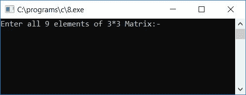
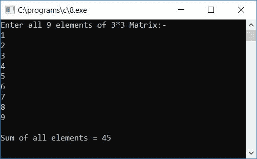

# C 程序：求矩阵所有元素之和

> 原文：<https://codescracker.com/c/program/c-program-find-sum-of-all-elements-matrix.htm>

在本教程中，您将学习并获得关于查找给定矩阵的所有元素之和的代码。

问题是**编写一个 C 程序，它将 3*3 矩阵的 9 个元素作为用户的输入(在运行时)，然后 计算所有矩阵元素的总和**。这个问题的答案是:

```
#include<stdio.h>
#include<conio.h>
int main()
{
    int mat[3][3], i, j, sum;
    sum = 0;
    printf("Enter all 9 elements of 3*3 Matrix:-\n");
    for(i=0; i<3; i++)
    {
        for(j=0; j<3; j++)
        {
            scanf("%d", &mat[i][j]);
            sum = sum + mat[i][j];
        }
    }
    printf("\nSum of all elements = %d", sum);
    getch();
    return 0;
}
```

该程序是用 **Code::Blocks** IDE 编写的，因此在成功构建和运行之后，您将获得如这里给出的示例所示的输出:



输入所有 9 个元素并按回车键，这是示例运行的第二个屏幕截图:



#### 程序解释

1.  将所有 9 个元素作为输入，并逐一初始化到矩阵中
2.  3*3 矩阵意味着它有 3 行 3 列
3.  我们必须为循环使用两个[，外部的一个用于行，内部的一个用于列](/c/c-for-loop.htm)
4.  这样
    *   第一个元素被初始化为 mat[0][0]
    *   第二个元素被初始化为 mat[0][1]
    *   第三个元素被初始化为 mat[0][2]
    *   以类似的方式，第四、第五、第六、第七、第八和第九元素被初始化为 mat[1][0]、mat[1][1]、mat[1][2]、mat[2][0]、mat[2][1]、mat[2][2]
5.  在扫描每个元素时，应用求和语句
6.  最后打印出 **sum** 变量的值。在开始计算所有矩阵元素的和之前，永远不要忘记初始化 0 到**和** [变量](/c/c-variables.htm)

[C 在线测试](/exam/showtest.php?subid=2)

* * *

* * *