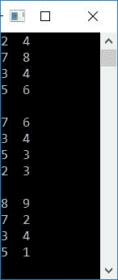
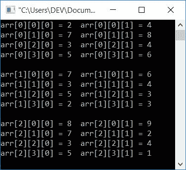

# C 程序：三维数组

> 原文：<https://codescracker.com/c/program/c-program-three-dimensional-array.htm>

在这篇文章中，你将学习并获得 C 编程中的三维数组代码。

### 如何求三维数组的大小

要找到三维数组的大小，说 **arr[i][j][k]** 。公式是:

```
size = i*j*k
```

例如，如果给定的数组是 **arr[3][4][2]** 。那么它的大小将是:

```
size = 3*4*2
     = 24
```

也就是说，它最多可以容纳 24 个元素。

## C 语言中的三维数组程序

一个三维数组表示 **arr[3][4][2]** ， **3** ，<u>大小为 <u>4*2</u> 的二维数组。也就是说，二维数组具有 4 行和 2 列。它的初始化是这样的:</u>

```
arr[3][4][2] = { 
              { {1, 2}, {3, 4}, {5, 6}, {7, 8} },
              { {8, 7}, {6, 5}, {4, 3}, {2, 1} },
              { {1, 3}, {5, 7}, {9, 7}, {5, 3} }
            };
```

如你所见，有三个 2 维数组，每个 4 行 2 列。现在让我们继续这个项目。

三维(3D)数组在编程中使用三个[用于循环](/c/c-for-loop.htm)。因此，如果你想动态初始化 或者在输出中打印它的元素，你必须使用三个**用于**循环。与 一样，下面给出的程序使用相同的方法在输出中打印三维数组的所有元素:

```
#include<stdio.h>
#include<conio.h>
int main()
{
   int i, j, k;
   int arr[3][4][2] = {
      { {2, 4}, {7, 8}, {3, 4}, {5, 6} },
      { {7, 6}, {3, 4}, {5, 3}, {2, 3} },
      { {8, 9}, {7, 2}, {3, 4}, {5, 1} }
      };
   for(i=0; i<3; i++)
   {
      for(j=0; j<4; j++)
      {
         for(k=0; k<2; k++)
            printf("%d  ", arr[i][j][k]);
         printf("\n");
      }
      printf("\n");
   }
   getch();
   return 0;
}
```

这个程序是在 *Code::Blocks* IDE 下构建和运行的。下面是它的示例输出:



从上面给出的输出可以看出，打印了三个 <u>二维数组</u>。

### 打印 3D 数组元素及其索引

打印所有元素及其索引号。程序如下:

```
#include<stdio.h>
#include<conio.h>
int main()
{
   int i, j, k;
   int arr[3][4][2] = {
      { {2, 4}, {7, 8}, {3, 4}, {5, 6} },
      { {7, 6}, {3, 4}, {5, 3}, {2, 3} },
      { {8, 9}, {7, 2}, {3, 4}, {5, 1} }
      };
   for(i=0; i<3; i++)
   {
      for(j=0; j<4; j++)
      {
         for(k=0; k<2; k++)
            printf("arr[%d][%d][%d] = %d ", i, j, k, arr[i][j][k]);
         printf("\n");
      }
      printf("\n");
   }
   getch();
   return 0;
}
```

下面是它的示例输出:



#### 其他语言的相同程序

*   [C++ 三维数组程序](/cpp/program/cpp-program-three-dimensional-array.htm)
*   [Java 三维数组程序](/java/program/java-program-three-dimensional-array.htm)

[C 在线测试](/exam/showtest.php?subid=2)

* * *

* * *