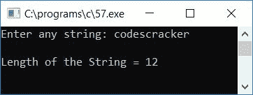
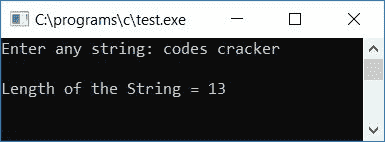

# C 程序：寻找字符串长度

> 原文：<https://codescracker.com/c/program/c-program-find-length-of-string.htm>

在本教程中，您将学习并获得关于如何使用以下方法查找并打印用户(在运行时)给定的任何[字符串](/c/c-strings.htm)的长度的代码:

*   使用 strlen() [函数](/c/c-functions.htm)
*   不使用 strlen()函数
*   使用用户定义的函数

## 使用 strlen()函数打印字符串长度

要在 C 编程中找到任何给定字符串的长度，您必须要求用户输入字符串，然后使用 **string.h** 库的 **strlen()** 函数找到其长度，如下面给出的程序所示:

```
#include<stdio.h>
#include<conio.h>
#include<string.h>
int main()
{
    char str[20];
    int len;
    printf("Enter the string: ");
    gets(str);
    len = strlen(str);
    printf("\nLength of the string = %d", len);
    getch();
    return 0;
}
```

由于上述程序是在 **Code::Blocks** IDE 下编写的，因此在成功构建和运行之后，这里是示例运行的第一个快照:


现在提供任意字符串，比如说 **codescracker** 并按`ENTER`键查看给定字符串的长度，如第二个快照所示:


名为 **strlen()** 的函数将一个参数作为字符串，并将返回长度。因此，这里字符串 say **str** 的 长度由函数 strlen()返回，并初始化为 [变量](/c/c-variables.htm) **len** 。打印 **len** 的值作为输出。

## 不使用 strlen()函数查找字符串长度

此程序不使用 **strlen()** 函数来查找长度，而是在此手动计算长度:

```
#include<stdio.h>
#include<conio.h>
int main()
{
    char ch[20];
    int count=0, i;
    printf("Enter any string: ");
    scanf("%s", ch);
    for(i=0; ch[i]!='\0'; i++)
        count++;
    printf("\nLength of the String = %d", count);
    getch();
    return 0;
}
```

下面是它的运行示例:


提供任何字符串输入，比如说 **codescracker** 并按回车键查看其长度作为输出:


与上面的程序一样，字符串是使用 **scanf()** 函数从用户处接收的。因此，每当用户 提供任何包含空格的字符串，那么只有第一个词将被接收，其余的被跳过。这里是 示例运行，用户输入任何包含空格的字符串，比如说**代码破解**:


如你所见，空格前的单词是**代码**，因此程序将只计算 **代码**的长度，即 5。为了解决这个问题，我们必须使用 **gets()** 函数代替 **scanf()** 来接收来自用户的字符串(以及空格)，如下面给出的程序所示:

```
#include<stdio.h>
#include<conio.h>
int main()
{
    char str[100];
    int count=0, i;
    printf("Enter any string: ");
    gets(str);
    for(i=0; str[i]!='\0'; i++)
        count++;
    printf("\nLength of the String = %d", count);
    getch();
    return 0;
}
```

这是第一次样本运行的最终快照:



现在让我们进行另一个示例运行，用户输入包含空格的字符串，比如说**代码破解**。这是第二次样本运行的最终快照:


#### 程序解释

*   使用 gets()函数接收任何字符串作为输入
*   使用[循环](/c/c-for-loop.htm)从字符串的第一个字符开始到最后一个字符
*   如果出现空终止字符(' \0 ')，则表示字符串中没有任何内容
*   因此，每次程序 流程进入循环的**内部时，增加**计数**变量的值，直到出现空终止字符**
*   **计数**变量在程序开始时被初始化为 0
*   因此，从字符串的第一个字符到最后一个字符，**计数**变量每次都会递增
*   它的意思是，**最后计数**变量，将保存字符串的长度，也就是说 **str** 中存在多少个字符
*   最后打印显示字符串长度的**计数**的值

## 使用用户定义的函数查找字符串长度

该程序使用用户定义的函数来完成与上一个程序相同的工作:

```
#include<stdio.h>
#include<conio.h>
int findStringLen(char str[50]);
int main()
{
    char str[50];
    int len;
    printf("Enter any string: ");
    gets(str);
    len = findStringLen(str);
    printf("\nLength of the String = %d", len);
    getch();
    return 0;
}
int findStringLen(char s[50])
{
    int i, count=0;
    for(i=0; s[i]!='\0'; i++)
        count++;
    return count;
}
```

以下是示例运行的最终快照:



#### 其他语言的相同程序

*   [C++查找字符串长度](/cpp/program/cpp-program-find-length-of-string.htm)
*   [Java 查找字符串长度](/java/program/java-program-find-length-of-string.htm)
*   [Python 查找字符串长度](/python/program/python-program-find-length-of-string.htm)

[C 在线测试](/exam/showtest.php?subid=2)

* * *

* * *