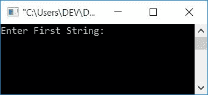
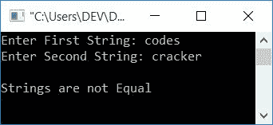
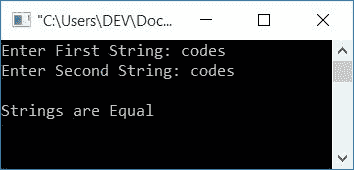

# C 程序：比较两个字符串

> 原文：<https://codescracker.com/c/program/c-program-compare-two-string.htm>

在这篇文章中，您将学习并获得关于使用和不使用标准库[函数](/c/c-functions.htm)检查两个输入[字符串](/c/c-strings.htm) 是否相等的代码。

## 不使用 strcmp()函数比较 C 中的字符串

这个程序不会使用任何标准库函数，比如说 **strcmp()** 来帮助比较 C. 中的两个字符串，而是这个程序会在自定义代码的帮助下比较用户给定的两个字符串。让我们来看看:

```
#include<stdio.h>
#include<conio.h>
int main()
{
    char str1[50], str2[50];
    int i=0, chk=0;
    printf("Enter First String: ");
    gets(str1);
    printf("Enter Second String: ");
    gets(str2);
    while(str1[i]!='\0' || str2[i]!='\0')
    {
        if(str1[i]!=str2[i])
        {
            chk = 1;
            break;
        }
        i++;
    }
    if(chk==0)
        printf("\nStrings are Equal");
    else
        printf("\nStrings are not Equal");
    getch();
    return 0;
}
```

该程序在 **Code::Blocks** IDE 中编译并执行。在执行上面的程序时，您将会看到输出 ,如下图所示:



现在提供任意两个字符串，比如说**代码**和**破解**并按下**回车键**查看输出，如下图 所示:



让我们进行另一个示例运行，其中假设用户提供了两个相等字符串，比如说**代码**和**代码**。



让我们看看上面程序中使用的一些主要逻辑。

#### 前一个程序中使用的逻辑

以下是以前程序中使用的一些主要逻辑的列表:

*   使用 **gets()** 函数在运行时扫描来自用户的字符串
*   将第一个和第二个字符串存储到 **str1** 和 **str2** [变量](/c/c-variables.htm)
*   创建一个 **while** 循环，一直运行到两个字符串的最后一个字符
*   在[循环](/c/c-loops.htm)内，使用 [if 语句](/c/c-if-statement.htm)，检查 第一个字符串的第一个字符是否不等于第二个字符串的第一个字符。如果评估为真， 则将 1 初始化为 **chk** 并使用 **break** 关键字，以终止循环
*   如果**的条件 if** 块评估为假，则 **i** 的值增加，程序流程 返回到[的条件，同时](/c/c-while-loop.htm)循环
*   这将继续，直到 **while** 循环的条件评估为假，或者 **if** 块(在 **while** 循环内)的条件评估为真
*   终止循环后，检查 **chk** 是否为 0。如果成立，那么**的语句如果**阻塞 就永远不会运行。所以两个字符串是相等的
*   否则，如果 **chk** 为 1，则执行 **if** 语句块，因此两个字符串不相等。好了

例如，假设用户输入**代码**和**破解**作为两个输入字符串。因此，下面给出了使用这两个给定字符串(作为输入)的上述 程序的模拟运行:

*   程序声明了两个变量，即 **char** 类型的 **str1** 和 **str2** ，最多可容纳 50 个 字符
*   程序声明另外两个变量，即 **i** 和 **chk** ，初始值为 0
*   程序将使用 **gets()** 函数扫描两个字符串作为输入
*   如果用户输入任何长度小于 50 的字符串，比如说**代码**，那么一个空终止字符 **(\ 0)**会自动分配到给定字符串(代码)的最后一个字符之后。也就是说，如果用户 提供**代码**作为第一个字符串，那么
    *   **str1[0]** 持有 **c**
    *   **str1[1]** 持有 **o**
    *   **str1[2]** 持有 **d**
    *   **str 1【3】**持有 **e**
    *   **str1[4]** 持有 **s**
    *   **str1[5]** 持有 **\0**
*   当循环时，程序检查**的状态**
*   第一次运行时，**的条件在**循环、
    `str1[i]!='\0' || str2[i]!='\0'`
    或
    `str1[0]!='\0' || str2[0]!='\0'`
    或
    `'c'!='\0' || 'c'!='\0'`
    评估为真。因为 在两种情况下，c 都不等于空终止字符 **\0**
*   所以程序流进入了 **while** 循环
*   如果块，程序检查**的条件，即
    `str1[i]!=str2[i]`
    或
    `c!=c`
    评估为假，则程序流程不会进入 **if** 块**
*   当再次循环时，程序增加 **i** 的值并返回到**的状态**
*   程序继续运行，直到 while 循环的条件评估为假
*   或者在循环内部，如果 **if** 块的条件评估为真，则如果块和 **1** 被初始化为 **chk** 变量，则程序流程进入 T2 内部。并且使用 **break** 关键字，当循环或循环终止时，程序流程从**中退出**
*   并检查 **chk** 是否保持其原始值(0)。如果它成立，那么 **if** 块的条件从不 评估为真，所以两个字符串的相同位置不会出现任何不匹配的 to 字符
*   所以程序打印的结果是**字符串等于**输出。否则，打印的**字符串不等于**

## 使用库函数比较 C 语言中的字符串

让我们创建另一个简单的程序，它也使用 C 的标准库函数检查给定的两个字符串是否相等:

```
#include<stdio.h>
#include<conio.h>
#include<string.h>
int main()
{
    char str1[50], str2[50];
    int len1, len2;
    printf("Enter First String: ");
    gets(str1);
    printf("Enter Second String: ");
    gets(str2);
    len1 = strlen(str1);
    len2 = strlen(str2);
    if(len1==len2)
    {
        if(strcmp(str1, str2)==0)
            printf("\nStrings are Equal");
        else
            printf("\nStrings are not Equal");
    }
    else
        printf("\nStrings are not Equal");
    getch();
    return 0;
}
```

这个程序将产生与前一个程序相同的输出。在上面的程序中，我们首先检查了两个字符串的长度是否相等，如果相等，则进一步处理。否则，如果给定的两个字符串的长度不相等，那么显然这两个字符串将不相等。

**注意**——如果两个字符串相等，那么 **strcmp()** 函数返回 **0** 。否则，如果两个字符串不相等，那么 **strcmp()** 函数返回 **1**

#### 其他语言的相同程序

*   [C++ 比较两个字符串](/cpp/program/cpp-program-compare-two-string.htm)
*   [Java 比较两个字符串](/java/program/java-program-compare-two-string.htm)
*   [Python 比较两个字符串](/python/program/python-program-compare-two-strings.htm)

[C 在线测试](/exam/showtest.php?subid=2)

* * *

* * *