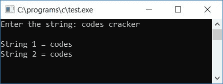

# C 程序：将一个字符串复制到另一个字符串

> 原文：<https://codescracker.com/c/program/c-program-copy-string.htm>

在本教程中，我们将学习如何在 C 语言中将一个[字符串](/c/c-strings.htm)复制到另一个，使用和不使用库[函数](/c/c-functions.htm) strcpy()。最后，我们还将学习如何使用指针复制字符串。让我们首先从使用库函数复制字符串开始。

## 使用 strcpy()函数复制 C 中的字符串

要在 C 编程中复制字符串，您必须要求用户输入字符串，将其存储在第一个字符串变量中，比如说**str 1**T10】，然后使用 **string.h** 库的 **strcpy()** 函数将其复制到第二个字符串变量中，比如说 **str2** 。 函数 **strcpy()** 接受两个参数。第二个参数的值被复制到第一个参数中。

```
#include<stdio.h>
#include<conio.h>
#include<string.h>
int main()
{
    char str1[20], str2[20];
    printf("Enter the string: ");
    gets(str1);
    printf("\nString 1 = %s", str1);
    strcpy(str2, str1);
    printf("\nString 2 = %s", str2);
    getch();
    return 0;
}
```

由于上面的程序是用 **Code::Blocks** IDE 编写的，因此在成功构建和运行之后，这里是 示例运行的第一个屏幕截图，在运行程序之后，您也会在输出屏幕上看到:


现在提供任意字符串，比如说 **codescracker** 并按`ENTER`键来查看这里给出的类似输出。这是样品运行的第 个快照:


下面是另一个运行示例，用户可以输入任何包含空格的字符串:


#### 程序解释

1.  使用 **gets()** 函数从用户处获取字符串输入
2.  在使用 **gets()** 函数之前，包含 **string.h** 库函数
3.  现在使用 **strcpy()** 函数将字符串复制到另一个变量中，比如说 **str2**
4.  strcpy()函数有两个参数，第一个参数是字符串将要复制到的目标变量
5.  第二个参数是源变量。这个变量的值被初始化为目标变量
6.  最后打印两个变量的值

正如您在前面的程序中看到的，我使用了 gets()函数来获取字符串输入。因为如果我们使用 scanf()函数并且用户输入包含空格的字符串，那么在空格之后所有的字符串值都会被跳过。例如，如果上面的程序替换为下面的程序:

```
#include<stdio.h>
#include<conio.h>
int main()
{
    char str1[20], str2[20];
    printf("Enter the string: ");
    scanf("%s", str1);
    printf("\nString 1 = %s", str1);
    strcpy(str2, str1);
    printf("\nString 2 = %s", str2);
    getch();
    return 0;
}
```

现在让我们对上面的程序进行一次样本运行。在这里，我将输入作为**代码破解**提供。字符串 包含空格，因此在空格之后，字符串值的其余部分被跳过，只有**代码**被初始化 到变量 **str1** ，如下面的快照所示:



从上面的快照中可以看出，只有**代码**被初始化为变量 **str1** ，并且 **str1** 的 值被复制到 **str2** 变量。因此，只有当 用户不提供任何带空格的字符串时，上述程序才是正确的。

## 不使用 strcpy()函数在 C 中复制字符串

这个程序执行与上一个程序相同的工作，但是没有使用任何库函数 **strcpy()** :

```
#include<stdio.h>
#include<conio.h>
int main()
{
    char strOrig[100], strCopy[100], i;
    printf("Enter any string: ");
    gets(strOrig);
    for(i=0; strOrig[i]!='\0'; i++)
        strCopy[i] = strOrig[i];
    strCopy[i] = '\0'; // never forgot to set null terminated character at the end of string
    printf("\nString 1 = %s", strOrig);
    printf("\nString 2 = %s", strCopy);
    getch();
    return 0;
}
```

这是第一次样本运行的最终快照:


这是第二次样本运行的最终快照:


#### 程序解释

*   使用 gets()函数获取字符串值
*   使用 [for 循环](/c/c-for-loop.htm)从给定字符串的第一个字符开始，比如说**strog**，一直持续到空终止的 字符(' \0 ')出现
*   在 **for** 循环中，将给定字符串中的每个字符比如**strog**逐个复制到任意字符串比如 **strCopy**中
*   从**退出**循环后，初始化字符串(strCopy) 末尾的空终止字符(' \0 ')，其中复制给定字符串(strOrig)的所有字符
*   现在打印两个字符串的值

## 使用指针复制 C 语言中的字符串

现在让我们用指针创建一个相同用途的程序:

```
#include<stdio.h>
#include<conio.h>
void copystr(char *, char *);
int main()
{
    char sourceStr[50], targetStr[50];
    printf("Enter the string: ");
    gets(sourceStr);
    printf("\nString 1 = %s", sourceStr);
    copystr(targetStr, sourceStr);
    printf("\nString 2 = %s", targetStr);
    getch();
    return 0;
}
void copystr(char *targetString, char *sourceString)
{
    while(*sourceString)
    {
        *targetString = *sourceString;
        sourceString++;
        targetString++;
    }
    *targetString = '\0';
}
```

以下是运行示例:


现在输入任意字符串，比如说 **codescracker** ，然后按`ENTER`键查看输出，如第二个截图所示:


#### 程序解释

1.  这里我们创建了一个名为 copystr()的函数，它有两个指针参数
2.  第一个参数负责目标字符串，第二个参数负责源字符串
3.  调用函数 copystr()后，目标字符串和源字符串作为参数传递
4.  我们知道源字符串包含用户在运行时输入的值。但是默认情况下，目标字符串有一些垃圾值
5.  现在我们已经在函数内部创建了一个 while 循环，它在源字符串到达其空终止字符(即' \0 ')之前运行(或者运行到字符串的最后一个字符)
6.  在循环中，我们将源字符串的每个字符(一个接一个)复制到目标字符串中
7.  在复制或初始化之后，我们增加了目标和源字符串的指针变量
8.  在完成 while 循环后，源字符串的所有字符都被复制到目标变量中
9.  因为我们在这里使用了指针，所以我们只需要输出两个字符串的值
10.  永远不要忘记在 targetString 指针变量的末尾放置空终止字符(' \0 ')

#### 其他语言的相同程序

*   [C++ 复制字符串](/cpp/program/cpp-program-copy-string.htm)
*   [Java 复制字符串](/java/program/java-program-copy-string.htm)
*   [Python 复制字符串](/python/program/python-program-copy-string.htm)

[C 在线测试](/exam/showtest.php?subid=2)

* * *

* * *