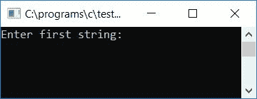
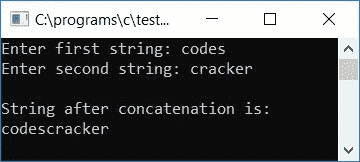
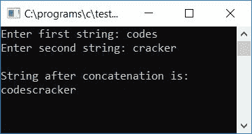
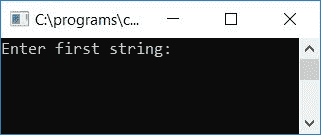
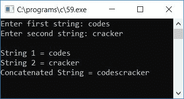

# C 程序：连接两个字符串

> 原文：<https://codescracker.com/c/program/c-program-concatenate-string.htm>

在本教程中，我们将学习如何使用和不使用库函数连接两个字符串。让我们首先从使用库[函数](/c/c-functions.htm)连接[字符串](/c/c-strings.htm)开始。

## 使用库函数连接 C 中的字符串

在 C 编程中，要连接一个字符串或将一个字符串追加到另一个字符串中，您必须要求用户输入任意两个字符串，并使用下面给出的程序中所示的 **strcat()** 函数连接这两个字符串。该函数有两个参数，即 是 **strcat(str1，str2)** 。这里 **str2** 的字符串值将被追加到字符串 **str1** 的末尾。

```
#include<stdio.h>
#include<conio.h>
#include<string.h>
int main()
{
    char str1[50], str2[50];
    printf("Enter first string: ");
    gets(str1);
    printf("Enter second string: ");
    gets(str2);
    strcat(str1, str2);
    printf("\nString after concatenation is:\n%s", str1);
    getch();
    return 0;
}
```

该程序是在 **Code::Blocks** IDE 下编写的，因此在成功构建并运行后，您将获得以下输出:



现在提供第一个字符串的值，比如说 **codes** 并按回车键，然后提供第二个字符串的值，比如说 **cracker** ，最后按回车键查看连接的字符串，如这里给出的快照所示:



第二个字符串 **cracker** (在本例中)的值被复制到第一个字符串 **codes** 中，连接的字符串 将成为输出中所示的 **codescracker** 。如果我们使用函数 strcat()作为 **strcat(str2，str1)** ，那么 **str1** 的字符串 值将被复制到 **str2** 。因此，如果我们为 **str1** 提供**代码**，为 **str2** 提供**破解程序**。然后 **strcat(str2，str1)** 将输出串接的字符串作为**破解代码**。

## 在 C 中不使用 strcat()函数连接字符串

现在让我们创建另一个程序，它也将连接字符串，但这次不使用任何库函数

```
#include<stdio.h>
#include<conio.h>
int main()
{
    char strOne[50], strTwo[50], i, count=0;
    printf("Enter first string: ");
    gets(strOne);
    printf("Enter second string: ");
    gets(strTwo);
    for(i=0; strOne[i]!='\0'; i++)
        count++;
    for(i=0; strTwo[i]!='\0'; i++)
    {
        strOne[count] = strTwo[i];
        count++;
    }
    strOne[count] = '\0';
    printf("\nString after concatenation is:\n%s", strOne);
    getch();
    return 0;
}
```

这个程序是这样创建的，第二个字符串(strTwo)的值将被连接到第一个字符串(strOne)中。该程序将输出串联字符串的值，如下面给出的运行示例所示:



#### 程序解释

*   使用 gets()函数从用户处获取两个字符串值
*   第一串说**码**被初始化为**strOne**T4】变量而第二串说**破解**被初始化为 **strTwo** 变量
*   创建一个 [for()循环](/c/c-for-loop.htm)来获得第一个字符串 strOne 的长度
*   如果字符串进入其空终止字符(' \0 ')，这意味着字符串中没有任何内容
*   从 **for()** 循环中退出后，我们将拥有一个 **count** 变量，它包含字符串 **strOne** 的长度
*   我们在这里计算了第一个字符串的长度，从第一个字符串结束的地方将第二个字符串的内容追加到第一个字符串中
*   创建另一个 for()循环，将第二个字符串 **strTwo** 的内容追加到第一个字符串 **strOne** 中
*   追加 strTwo 的所有字符后，初始化 strOne 最后一个空终止字符(' \0 ')
*   打印 strOne 的最终值，这将是连接的字符串

### 将两个字符串连接成第三个字符串

下面是另一个程序，它将从用户处读取任意两个字符串，并在不使用任何库函数的情况下连接成第三个字符串:

```
#include<stdio.h>
#include<conio.h>
int main()
{
    char strOne[50], strTwo[50], strCon[100], i, count=0;
    printf("Enter first string: ");
    gets(strOne);
    printf("Enter second string: ");
    gets(strTwo);
    for(i=0; strOne[i]!='\0'; i++)
    {
        strCon[i] = strOne[i];
        count++;
    }
    for(i=0; strTwo[i]!='\0'; i++)
    {
        strCon[count] = strTwo[i];
        count++;
    }
    strCon[count] = '\0';
    printf("\nString 1 = %s", strOne);
    printf("\nString 2 = %s", strTwo);
    printf("\nConcatenated String = %s", strCon);
    getch();
    return 0;
}
```

在成功构建和运行之后，下面是示例运行的第一个快照:



提供任意两个字符串，如**代码**和**破解**，然后按回车键查看三个字符串，第一个和第二个字符串是用户提供的 字符串，然后第三个字符串将是串接的字符串。下面是示例运行的第二个快照:



#### 其他语言的相同程序

*   [C++ 连接两个字符串](/cpp/program/cpp-program-concatenate-string.htm)
*   [Java 连接两个字符串](/java/program/java-program-concatenate-string.htm)
*   [Python 连接两个字符串](/python/program/python-program-concatenate-string.htm)

[C 在线测试](/exam/showtest.php?subid=2)

* * *

* * *