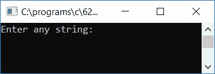
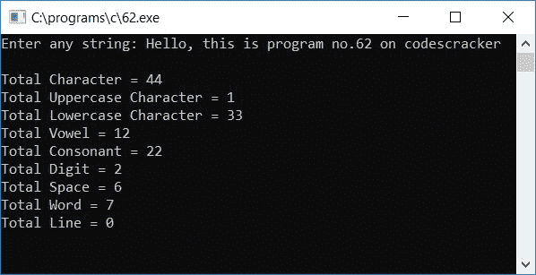

# C 程序：统计字符串中辅音，元音，数字，空格

> 原文：<https://codescracker.com/c/program/c-program-count-vowels-consonants-digits.htm>

在这里，我们将学习如何用 C 语言创建一个程序，要求用户在 运行时输入任何[字符串](/c/c-strings.htm)，以计算总数:

*   所有字符
*   大写字符
*   小写字符
*   数字
*   元音
*   空格字符
*   话
*   线
*   辅音

存在于给定的字符串中。程序如下:

```
#include<stdio.h>
#include<conio.h>
int main()
{
    char str[100];
    int i, count=0, countChar=0;
    int countUpper=0, countLower=0, countDigit=0, countVowel=0;
    int countSpace=0, countWord=0, countLine=0, countConsonant=0;
    printf("Enter any string: ");
    gets(str);
    for(i=0; str[i]!='\0'; i++)
    {
        if(str[i]>=65 && str[i]<=90)
        {
            countUpper++;

        }
        else if(str[i]>=97 && str[i]<=122)
        {
            countLower++;
        }
        else if(str[i]>=48 && str[i]<=57)
            countDigit++;
        else if(str[i]==' ')
            countSpace++;
        else if(str[i]=='\n')
            countLine++;
        if(str[i]=='a' || str[i]=='e' || str[i]=='i' || str[i]=='o' ||
           str[i]=='u' || str[i]=='A' || str[i]=='E' || str[i]=='I' ||
           str[i]=='O' || str[i]=='U')
            countVowel++;
        if(str[i]!=' ')
            count++;
        else
        {
            if(count!=0 && str[i+1]!='\0')
                countWord++;
            count = 0;
        }
        countChar++;
    }
    countConsonant = (countUpper+countLower) - countVowel;
    printf("\nTotal Character = %d", countChar);
    printf("\nTotal Uppercase Character = %d", countUpper);
    printf("\nTotal Lowercase Character = %d", countLower);
    printf("\nTotal Vowel = %d", countVowel);
    printf("\nTotal Consonant = %d", countConsonant);
    printf("\nTotal Digit = %d", countDigit);
    printf("\nTotal Space = %d", countSpace);
    printf("\nTotal Word = %d", countWord+1);
    printf("\nTotal Line = %d", countLine);
    getch();
    return 0;
}
```

该程序是在 **Code::Blocks** IDE 下编写的，因此下面是成功构建和运行后的运行示例:



现在输入任意字符串，说**你好，这是 codescracker** 上的 62 号程序，并按回车键查看以下输出:



#### 程序解释

*   对所有负责统计 总数的[变量](/c/c-variables.htm)声明并初始化 0
    *   所有字符
    *   大写字符
    *   小写字符
    *   元音
    *   辅音
    *   数字
    *   间隔
    *   话
    *   线
*   说
    *   countChar
    *   countUpper
    *   countLower
    *   反元音
    *   反辅音
    *   计数数字
    *   计数空间
    *   计数字
    *   计数线
*   现在在运行时从用户那里获得字符串输入
*   为循环创建一个[，从 0 运行到字符串的最后一个字符](/c/c-for-loop.htm)
*   因为任何字符串中的空终止字符(' \0 ')是最后一个字符
*   因此，我们必须检查字符串中从第 0 位<sup>到空终止字符之前的每一个字符</sup>
*   在循环的**内，创建 [if 块](/c/c-if-statement.htm)来检查当前的 字符是什么，即它是否是大写的，然后递增负责大写 字符计数的变量的值，比如说 **countUpper** 等等**
*   A-Z (A 到 Z)的 ASCII 码是 65-90 (65 到 90)。即 A 的 ASCII 码是 65，B 的 ASCII 码是 66，...Z 的 ASCII 码是 90
*   a-z 的 ASCII 码是 97-122
*   0-9 的 ASCII 码是 48-57
*   从**退出**循环后，逐个打印所有字符的值

[C 在线测试](/exam/showtest.php?subid=2)

* * *

* * *