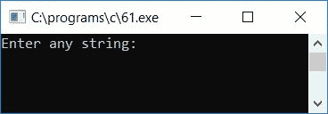
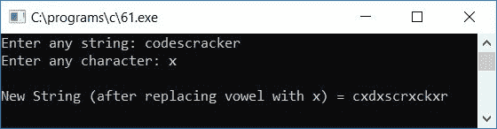
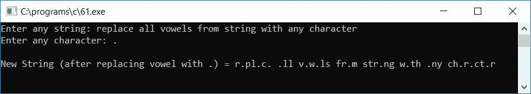

# 用给定字符替换字符串中所有元音字母的 c 程序

> 原文：<https://codescracker.com/c/program/c-program-replace-vowels-from-string.htm>

在本教程中，我们将学习如何用 C 语言创建一个程序，将任何给定的[字符串](/c/c-strings.htm)(由用户在运行时提供)中的所有元音替换为任何给定的字符(由用户在运行时提供)。程序如下:

```
#include<stdio.h>
#include<conio.h>
int main()
{
    char str[50], ch, i;
    printf("Enter any string: ");
    gets(str);
    printf("Enter any character: ");
    scanf("%c", &ch);
    for(i=0; str[i]!='\0'; i++)
    {
        if(str[i]=='a' || str[i]=='e' || str[i]=='i' || str[i]=='o'
           || str[i]=='u' || str[i]=='A' || str[i]=='E' || str[i]=='I'
           || str[i]=='O' || str[i]=='U')
        {
            str[i] = ch;
        }
    }
    printf("\nNew String (after replacing vowel with %c) = %s", ch, str);
    getch();
    return 0;
}
```

该程序是在 **Code::Blocks** IDE 下编写的，因此这里是成功构建和运行后，您将在输出屏幕 上看到的示例运行。这是示例运行的第一个快照:



提供任意字符串，比如说 **codescracker** ，然后输入任意字符，比如说 **x** ，用给定的字符 **x** 替换 字符串 **codescracker** 中的所有元音字母。下面是示例运行的第二个快照:



让我们来看另一个例子，用户已经提供了用任意字符和 **替换字符串中的所有元音。**(点)为字符。以下是示例运行的最终快照:



以下是上述程序中使用的一些主要步骤:

*   在运行时接收来自用户的任何字符串，比如 **codescracker**
*   然后在运行时接收来自用户的任何字符，比如 **x**
*   为从字符串的第一个字符运行到最后一个字符的循环创建一个
*   字符串的最后一个字符是一个名为**的空终止字符** ('\0 ')
*   因此，我们必须运行循环的**，直到出现 **'\0'** (空终止字符)**
*   在 **for** 循环中，检查当前字符是什么，是不是元音字母
*   如果是元音，那么用给定的字符替换元音。例如，如果字符串是 **codescracker** ，那么在循环的**的第二次运行 时， **o** 将是当前的元音字符，因此我们必须放置给定的 字符，比如说 **x** 来代替 **o** ，这样做之后，当前字符串将变成 **cxdescracker** 。继续 搜索下一个元音字母，将其替换为给定的字符，如 **x****
*   从**退出**循环后，打印字符串的值，这将是同一个字符串 ，但没有任何元音。用户用给定的字符替换所有的元音
*   即字符串 **codescracker** 将所有元音替换为 **x** 后会变成 **cxdxscrxckxr**

[C 在线测试](/exam/showtest.php?subid=2)

* * *

* * *