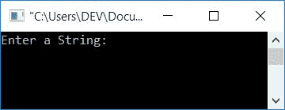
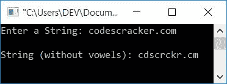
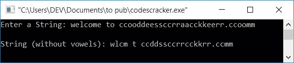

# C 程序：从字符串中删除元音

> 原文：<https://codescracker.com/c/program/c-program-delete-vowels-from-string.htm>

在本文中，您将学习并获得关于如何从给定的[字符串](/c/c-strings.htm)中删除所有元音的代码。例如，如果给定的字符串是:

```
codescracker.com
```

众所周知，26 个字母中有 5 个元音。分别是 **A，E，I，O，U** (来自大写字母 a-z)或 **a，E，I，O，u** (来自小写字母 A-Z)。然后从给定的字符串中删除所有的 元音后，该字符串将变成:

```
cdscrckr.cm
```

现在让我们继续这个项目。

## 删除 C 语言字符串中的元音字母

在 C 编程中，要从字符串中删除元音字母，你必须要求用户输入字符串。现在检查元音(A，A，E，E，I，I，O，O，U，U)。如果找到了(10 个中的)任何一个，那么将下一个字符移回它的一个索引，直到最后一个，以此类推。

问题是，**用 C 写一个程序，让用户在运行时从给定的字符串中删除元音字母。**这个问题的答案是:

```
#include<stdio.h>
#include<conio.h>
int main()
{
    char str[50];
    int i=0, j, chk;
    printf("Enter a String: ");
    gets(str);
    while(str[i]!='\0')
    {
        chk=0;
        if(str[i]=='a'||str[i]=='e'||str[i]=='i'||str[i]=='o'||str[i]=='u'||str[i]=='A'||str[i]=='E'||str[i]=='I'||str[i]=='O'||str[i]=='U')
        {
            j=i;
            while(str[j-1]!='\0')
            {
                str[j] = str[j+1];
                j++;
            }
            chk = 1;
        }
        if(chk==0)
            i++;
    }
    printf("\nString (without vowels): %s", str);
    getch();
    return 0;
}
```

如果块扩展成多行，也可以写[的条件，如下所示:](/c/c-if-statement.htm)

```
if(str[i]=='a' || str[i]=='e' || str[i]=='i' ||
   str[i]=='o' || str[i]=='u' || str[i]=='A' ||
   str[i]=='E' || str[i]=='I' || str[i]=='O' ||
   str[i]=='U')
{
    j=i;
    while(str[j-1]!='\0')
    {
        str[j] = str[j+1];
        j++;
    }
    chk = 1;
}
```

这个程序是在 **Code::Blocks** IDE 下构建和运行的。以下是运行示例:



现在提供任意字符串，比如说**codescracker.com**并按**回车**键，可以看到下面的输出:



让我们进行另一个示例运行，其中给定的字符串在相邻的索引处有多个元音。



从字符串中可以看出，

```
welcome to ccooddeessccrraacckkeerr.ccoomm
```

有很多次，元音预置在相邻的索引处。因此，使用该输入的模拟运行如下:

1.  [变量](/c/c-if-statement.htm) **str** 持有字符串 **欢迎来到 ccooddeessccrraacckkeerr . ccoomm**，以一种 的方式
    *   **str[0]** 持有 **w**
    *   **str[1]** 持有 **e**
    *   **str[2]** 持有 **l**
    *   等等
2.  最后一个字符 **m** 在**str【42】**中成立
3.  并且空终止字符 **\0** 自动初始化为**字符串【43】**
4.  最初， **i** 的值是 0
5.  第一次运行时， [while 循环](/c/c-while-loop.htm)的条件评估为真，因为出现在 **0<sup>第</sup>T5】索引处的字符(即 **w** )不等于空终止字符，所以程序流程进入循环内部**
6.  0 被初始化为 **chk**
7.  因为 **w** 不是元音，所以第一个 **if** 块的条件评估为假
8.  因此，如果阻塞，程序流程将检查第二个**的状态。在那里，它检查 的值 **chk** 是否为 0**
9.  因为它是 0，所以条件评估为真，并且 **i** 的值增加
10.  现在程序流返回到**的条件，同时**循环，并评估其条件 再次为真，因为出现在**1<sub>ST</sub>T5】索引处的字符(即 **e** )不等于空终止字符 ，所以程序流进入[循环](/c/c-loops.htm)**
11.  流程 **6 <sup>第</sup>步**步
12.  这一次，因为 **e** 是一个元音，所以第一个【T2 if】的条件在 **while** 循环中评估为真
13.  **i** 的值被初始化为 **j**
14.  现在把所有前进的字符(从这里)移回它的一个索引
15.  也就是说，如果 **j** 的值为 1，那么
    *   出现在索引号 2 的字符被移动到索引号 1
    *   类似地，出现在索引号 3 的字符被移动到索引号 2
    *   等等
    *   直到出现空终止字符
16.  移动字符后，现在字符串变量**中所有字符的当前位置以 的方式变为**str
    *   **str[1]** 持有 **l**
    *   **str[2]** 持有 **c**
    *   **str[3]** 持有 **o**
    *   等等

从执行移位的地方开始，只有要索引的字符的位置被替换。

18.  1 被初始化为 **chk** 变量
19.  这里执行初始化过程，以检查该循环是否求值。
20.  如果被评估，那么不增加 **i** 的值
21.  否则增加 **i** 的值
22.  当循环时，程序流程返回到**的状态**
23.  因为变量的值不会递增，所以它的值将与前一个值相同，即 1
24.  但是这一次，出现在第一个位置的角色不是 **e** ，而是 **l**
25.  从第 7 步继续，将 **l** 作为新字符
26.  该过程继续运行，直到所有元音从字符串中删除。就这样

## 使用函数从字符串中删除元音

这个程序使用一个用户自定义函数**check emotal()**来检查当前字符是否是元音。如果是 元音，那么 function 返回 1 作为返回值，否则返回 0 作为返回值。

这里我们刚刚把函数作为条件 **if** block 来检查元音。因为 1 评估为真条件 ，0 评估为假条件。然后，如果函数返回 1，则条件评估为真，否则评估为假。让我们来看看这个节目。要了解更多关于函数的知识，请参考 C 教程中的[函数。](/c/c-functions.htm)

```
#include<stdio.h>
#include<conio.h>
int checkVowel(char);
int main()
{
    char str[50];
    int i=0, j, chk;
    printf("Enter a String: ");
    gets(str);
    while(str[i]!='\0')
    {
        chk=0;
        if(checkVowel(str[i]))
        {
            j=i;
            while(str[j-1]!='\0')
            {
                str[j] = str[j+1];
                j++;
            }
            chk = 1;
        }
        if(chk==0)
            i++;
    }
    printf("\nString (without vowels): %s", str);
    getch();
    return 0;
}
int checkVowel(char ch)
{
    if(ch=='a' || ch=='e' || ch=='i' || ch=='o' || ch=='u' ||
       ch=='A' || ch=='E' || ch=='I' || ch=='O' || ch=='U')
       return 1;
    else
        return 0;

}
```

这个程序产生与前一个程序相同的输出。

#### 其他语言的相同程序

*   [C++从字符串中删除元音](/cpp/program/cpp-program-delete-vowels-from-string.htm)
*   [Java 从字符串中删除元音](/java/program/java-program-delete-vowels-from-string.htm)
*   [Python 从字符串中删除元音](/python/program/python-program-remove-vowels-from-string.htm)

[C 在线测试](/exam/showtest.php?subid=2)

* * *

* * *