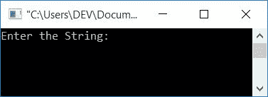
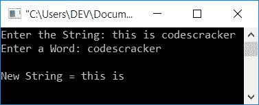
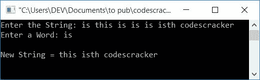

# 从字符串中删除单词的 c 程序

> 原文：<https://codescracker.com/c/program/c-program-delete-words-from-sentence.htm>

在本教程中，您将学习并获得从[字符串](/c/c-strings.htm)中删除单词的代码。 这里程序会要求用户输入任意一个字符串，然后从给定的字符串中删除给定的单词。 使用和不使用二维[数组](/c/c-arrays.htm)创建程序。

## 在 C #中从字符串中删除单词

在 C 编程中，要从给定的字符串中删除特定的单词，你必须要求用户输入字符串，然后要求输入需要删除的单词。然后检查字符串中是否存在给定的单词。如果找到，则按照下面给出的程序删除它:

```
#include<stdio.h>
#include<conio.h>
#include<string.h>
int main()
{
   char str[100], word[20];
   int i, j, ls, lw, temp, chk=0;
   printf("Enter the String: ");
   gets(str);
   printf("Enter a Word: ");
   gets(word);
   ls = strlen(str);
   lw = strlen(word);
   for(i=0; i<ls; i++)
   {
      temp = i;
      for(j=0; j<lw; j++)
      {
         if(str[i]==word[j])
            i++;
      }
      chk = i-temp;
      if(chk==lw)
      {
         i = temp;
         for(j=i; j<(ls-lw); j++)
            str[j] = str[j+lw];
         ls = ls-lw;
         str[j]='\0';
      }
   }
   printf("\nNew String = %s", str);
   getch();
   return 0;
}
```

这个程序是在 **Code::Blocks** IDE 下构建和运行的。下面是它的运行示例:



现在提供任何字符串，说**这是 codescracker** ，然后输入单词说 **codescracker** 。按`ENTER`键查看以下输出:



在上面的程序中，语句:

```
for(j=0; j<lw; j++)
{
   if(str[i]==word[j])
   i++;
}
```

用于通过逐字符匹配来检查是否存在(要删除的)单词。但是在声明之前， **i** 的值被初始化为 **temp** 。这样在语句之后，我们可以检查如果语句被求值的次数等于单词的长度 ，那么 [是否被求值。如果是，则找到该单词。因此，声明:](/c/c-if-statement.htm)

```
for(j=i; j<(ls-lw); j++)
   str[j] = str[j+lw];
```

用于将所有字符(在单词的最后一个字符的索引之后)移动到字符串中单词的第一个字符的索引处。也就是说，如果在索引号为 5 的给定字符串中找到该单词。并且字的长度是 3，因此我们必须将第 8 个<sup>索引</sup>处的字符移动到第 5 个<sup>索引</sup>，将第 9 个<sup>索引</sup>处的字符移动到第 6 个<sup>索引</sup>处，以此类推，直到字符串的最后一个字符。

永远不要忘记将字符串的新长度初始化为**ls**T2【变量。 每次单词被删除(如果不止一次，单词存在)，就用 单词的长度减去字符串的长度。现在，在新字符串的最后一个索引处放置一个空终止字符( **\0** )。

这个程序有一个限制。例如，如果字符串是**这是 codescracker** ，用户希望 删除**是**。然后**是从**来的**，这个**也随着孤独的**是**一起被删除。因此，在删除**为**后，该字符串成为第 个码字**。为了克服这个问题，我们有另一个程序，如下所示:**

### 从字符串程序中删除单词的完整版本

这是上一个程序的完整版本。这个程序还从最终字符串中删除重复的空格。

```
#include<stdio.h>
#include<conio.h>
#include<string.h>
int main()
{
   char str[100], word[20];
   int i, j, ls, lw, temp, chk=0, doIncrement, isSpace;
   printf("Enter the String: ");
   gets(str);
   printf("Enter a Word: ");
   gets(word);
   ls = strlen(str);
   lw = strlen(word);
   for(i=0; i<ls; i++)
   {
      temp = i;
      doIncrement = 0;
      for(j=0; j<lw; j++)
      {
         if(str[i]==word[j])
         {
            if(temp>0 && (temp+lw)<ls)
            {
               if(str[temp-1]== ' ' && str[temp+lw]==' ')
                  doIncrement=1;
            }
            else if(temp==0 && (temp+lw)<ls)
            {
               if(str[temp+lw]==' ')
                  doIncrement=1;
            }
            else if(temp>0 && (temp+lw)==ls)
            {
               if(str[temp-1]== ' ')
                  doIncrement=1;
            }
            if(doIncrement==1)
               i++;
            else
               break;
         }
      }
      chk = i-temp;
      if(chk==lw)
      {
         i = temp;
         for(j=i; j<(ls-lw); j++)
            str[j] = str[j+lw];
         ls = ls-lw;
         i = temp;
         str[j]='\0';
      }
   }
   ls = strlen(str);
   i=0;
   while(str[i]!='\0')
   {
      isSpace = 0;
      if(str[i]==' ' && str[i+1]==' ')
      {
         for(j=i; j<(ls-1); j++)
         {
            str[j] = str[j+1];
            isSpace = 1;
         }
      }
      if(i==0 && str[i]==' ')
      {
         for(j=i; j<(ls-1); j++)
         {
            str[j] = str[j+1];
            isSpace = 1;
         }
      }
      if(isSpace==0)
         i++;
      else
      {
         str[j]='\0';
         ls--;
      }
   }
   printf("\nNew String = %s", str);
   getch();
   return 0;
}
```

现在让我们提供输入字符串作为**is this is is is is is is is this codescracker**然后 **is** 作为要删除的单词。下面是它的运行示例:



这里包含单词**这个**和**是为了检查单词**是**(将被删除)是否从任何一侧得到匹配 。从两边可以看到， **is** 确实与单词 **this** 和 T10】is th**匹配，并且删除了所有多余的空格。

### 使用二维数组从字符串中删除单词

现在让我们用二维数组创建一个同样用途的程序。这里，给定字符串中的所有单词都被逐个放入一个名为 **stringIn2DArray[]** 的二维数组中。然后对这个词进行了检查(待 删除)。如果找到，只需执行删除任务，如下所示:

```
#include<stdio.h>
#include<conio.h>
#include<string.h>
int main()
{
   char str[400], word[20], stringIn2DArray[20][20];
   int i, j=0, k=0;
   printf("Enter the String: ");
   gets(str);
   printf("Enter the Word (to be Delete): ");
   gets(word);
   for(i=0; str[i]!='\0'; i++)
   {
      if(str[i]==' ')
      {
         stringIn2DArray[k][j]='\0';
         k++;
         j=0;
      }
      else
      {
         stringIn2DArray[k][j]=str[i];
         j++;
      }
   }
   stringIn2DArray[k][j] = '\0';
   j=0;
   for(i=0; i<(k+1); i++)
   {
      if(!strcmp(stringIn2DArray[i], word))
         stringIn2DArray[i][j]='\0';
   }
   printf("\nThe New String is: ");
   j=0;
   for(i=0; i<(k+1); i++)
   {
      if(stringIn2DArray[i][j] == '\0')
         continue;
      else
         printf("%s ", stringIn2DArray[i]);
   }
   getch();
   return 0;
}
```

这个程序产生与前一个程序相同的输出。

#### 其他语言的相同程序

*   [C++从字符串中删除单词](/cpp/program/cpp-program-delete-words-from-sentence.htm)
*   [Java 从字符串删除单词](/java/program/java-program-delete-words-from-sentence.htm)
*   [Python 从字符串中删除单词](/python/program/python-program-remove-word-from-sentence.htm)

[C 在线测试](/exam/showtest.php?subid=2)

* * *

* * *