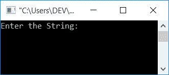
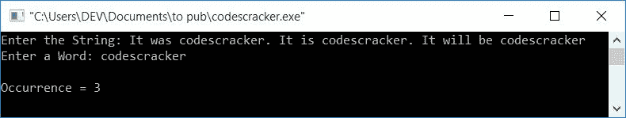
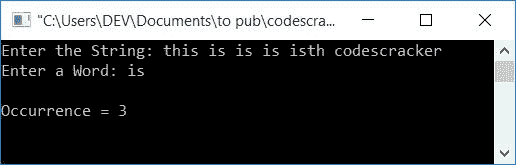

# C 程序：计算字符串中单词出现次数

> 原文：<https://codescracker.com/c/program/c-program-count-words-in-sentence.htm>

在本教程中，您将学习并获得关于如何使用 C 语言计算一个单词在[字符串](/c/c-strings.htm)中的出现次数的代码。这里的单词和字符串必须由用户获取(在运行时)。 例如，如果给定的字符串是:

```
It was codescracker. It is codescracker. It will be codescracker
```

然后出现一个词:

*   **codescracker** 是 3
*   **它**是 3
*   **是 1**是 1
*   **是**是 1
*   **将**设为 1
*   **是**是 1

现在让我们继续，用 C 程序实现它。

## 计算字符串中的单词数

在 C 编程中，要计算单词在字符串或句子中的出现次数，您必须要求用户输入字符串和单词，以计算给定单词在给定字符串中出现的次数，如下面给出的程序所示:

```
#include<stdio.h>
#include<conio.h>
#include<string.h>
int main()
{
   char str[100], word[20];
   int i, j, ls, lw, temp, countW=0, chk;
   printf("Enter the String: ");
   gets(str);
   printf("Enter a Word: ");
   gets(word);
   ls = strlen(str);
   lw = strlen(word);
   for(i=0; i<ls; i++)
   {
      temp = i;
      for(j=0; j<lw; j++)
      {
         if(str[i]==word[j])
            i++;
      }
      chk = i-temp;
      if(chk==lw)
         countW++;
      i = temp;
   }
   printf("\nOccurrence = %d", countW);
   getch();
   return 0;
}
```

该程序是在 **Code::Blocks** IDE 下编写的。下面是成功构建和运行后的运行示例:



现在提供任何字符串，比如

```
It was codescracker. It is codescracker. It will be codescracker
```

然后输入一个单词 say **codescracker** 来计算这个单词在给定的字符串中出现了多少次:



#### 程序解释

*   两个[变量](/c/c-variables.htm)、 **ls** 和 **lw** 分别用于保存字符串和字的长度
*   循环的第一个[从字符串的第一个字符运行到最后一个字符](/c/c-for-loop.htm)
*   第二个 **for** 循环从给定单词的第一个字符运行到最后一个字符
*   在第二个 **for** 循环中，我们使用逐字符匹配检查了给定的单词 是否出现在字符串中
*   也就是说，如果在字符串中的任何索引处找到单词的第一个字符，则检查第二个匹配项。也就是说，将单词的第二个字符与前一个索引后面的字符进行匹配，依此类推
*   例如，我们假设给定的单词是 **codescracker** 。所以它的长度是 **12** 。 因此，如果在给定的字符串中所有字符连续得到匹配，那么 **i** 的值将是 **(其先前值+ 12)** 。
*   从第二个**退出**循环后，使用 **i-temp** 或 **(i 之前的值+12)-temp** 初始化为 **chk**
*   如果 **i** 的前一个值是 7，那么它的值将是 7+12 或 **19**
*   而 **19-temp** 或 19-7 等于 12。所以 12 被初始化为 **chk**
*   现在检查 **chk** 的值是否等于字长
*   如果相等，那么这个单词就被找到了，所以我们必须增加变量 **countW** 的值，这样 就保存了这个单词的出现
*   现在最后初始化 temp 的值(前一个 I 的值在第二个循环的**之前) **i****
*   并继续该过程，直到字符串的最后一个字符

这个程序有一个限制，如果你输入一个字符串说**这是 codescracker** ，一个单词说**是**，那么它的 出现将显示为 **2** 。因为它也从**这个**得到**是**。为了解决这个问题，这里有另一个程序。

### 字符串程序中计算单词的完整版本

以下是之前程序的完整版本:

```
#include<stdio.h>
#include<conio.h>
#include<string.h>
int main()
{
   char str[100], word[20];
   int i, j, ls, lw, temp, countW=0, chk, doIncrement;
   printf("Enter the String: ");
   gets(str);
   printf("Enter a Word: ");
   gets(word);
   ls = strlen(str);
   lw = strlen(word);
   for(i=0; i<ls; i++)
   {
      temp = i;
      doIncrement = 0;
      for(j=0; j<lw; j++)
      {
         if(str[i]==word[j])
         {
            if(temp>0 && (temp+lw)<ls)
            {
               if(str[temp-1]== ' ' && str[temp+lw]==' ')
                  doIncrement=1;
            }
            else if(temp==0 && (temp+lw)<ls)
            {
               if(str[temp+lw]==' ')
                  doIncrement=1;
            }
            else if(temp>0 && (temp+lw)==ls)
            {
               if(str[temp-1]== ' ')
                  doIncrement=1;
            }
            if(doIncrement==1)
               i++;
            else
               break;
         }
      }
      chk = i-temp;
      if(chk==lw)
         countW++;
      i = temp;
   }
   printf("\nOccurrence = %d", countW);
   getch();
   return 0;
}
```

现在让我们用字符串输入作为**来检查一下，这是 is is is is isth codescracker** ，单词输入作为 **is** :



#### 其他语言的相同程序

*   [C++统计单词的出现次数](/cpp/program/cpp-program-count-words-in-sentence.htm)
*   [Java 统计单词的出现次数](/java/program/java-program-count-words-in-sentence.htm)
*   [Python 统计单词的出现次数](/python/program/python-program-count-word-in-sentence.htm)

[C 在线测试](/exam/showtest.php?subid=2)

* * *

* * *