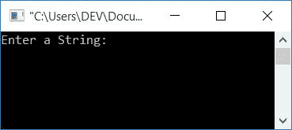
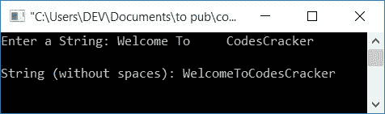
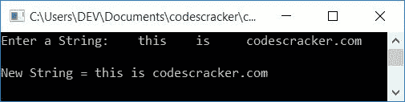

# C 程序：从字符串中删除空格

> 原文：<https://codescracker.com/c/program/c-program-remove-spaces-from-string.htm>

在本文中，您将学习并获得使用 C 程序从字符串中删除空格的代码。下面是本文中可用的程序列表:

1.  从用户输入的字符串中删除所有空格
2.  仅删除用户输入的字符串中多余的空格

第一个程序删除 c #中给定字符串的所有空格。例如，如果给定字符串是

```
Welcome To     CodesCracker
```

那么删除所有空格后的字符串将是:

```
WelcomeToCodesCracker
```

而第二个程序只从给定的字符串中删除多余的空格。例如，如果用户输入的字符串是:

```
    this    is       codescracker
```

然后，从该字符串中删除多余的空格后，新字符串将是:

```
this is codescracker
```

## 删除字符串中的所有空格

在 C 语言编程中，要删除字符串中的空格，你必须要求用户输入一个字符串。现在开始检查空格。如果在任何一个索引处发现了空格，那么只需将所有向前的字符向后移动一个索引，如下面给出的程序所示。问题是，**用 C 写一个程序，在运行时由用户删除给定字符串 中的所有空格。**这个问题的答案如下:

```
#include<stdio.h>
#include<conio.h>
int main()
{
    char str[50];
    int i=0, j, chk;
    printf("Enter a String: ");
    gets(str);
    while(str[i]!='\0')
    {
        chk=0;
        if(str[i]==' ')
        {
            j=i;
            while(str[j-1]!='\0')
            {
                str[j] = str[j+1];
                j++;
            }
            chk = 1;
        }
        if(chk==0)
            i++;
    }
    printf("\nString (without spaces): %s", str);
    getch();
    return 0;
}
```

这个程序是在 **Code::Blocks** IDE 下构建和运行的。下面是它的运行示例:



现在输入任意字符串，按下**回车键**可以看到没有空格的相同字符串。下面是示例运行的第二个快照:



#### 程序解释

现在，让我们以前面示例运行的快照中显示的字符串为例，讨论上述程序中使用的一些主要步骤:

*   字符串以一种 的方式存储在**str**T2 变量中
    *   **str[0]** 持有 **W**
    *   **str[1]** 持有 **e**
    *   **str[2]** 持有 **l**
    *   等等
*   因为，空格出现在索引号 **7，10，11，12，13，14** 处。所以
    *   **str[7]，str[10]，str[11]，str[12]，str[13]，str[14]** 持有空格
*   所以当 **i** 的值变为 **7** 时，那么第一个 **if** block 求值为 的条件为真。也就是说，在第 7 个<sup>索引处找到空间。</sup>
*   因此， **i** 的值被初始化为 **j** ，并且所有向前的字符 (从找到空格的地方)被移回一个索引。因为，现在这个空间是在索引号 7 处找到的。所以
    *   8 号索引处的字符移动到 7 号索引处
    *   9 号索引处的字符移动到 8 号索引处
    *   索引号 10 的字符移动到了索引号 9
    *   等等
    *   直到字符串的最后一个字符
*   因为 **i** 的值现在是 7，而位于索引号 8 的字符被移回到索引号 7
*   因此，这里 **i** 的值不会增加，因为现在出现在索引号 7 处的字符是未知的
*   也就是说，我们必须检查它，它是一个字符还是一个空格
*   如果在当前索引处没有找到空格，那么就增加 **i** 的值，并检查在下一个索引号处出现的字符
*   继续这个过程，直到最后一个字符

## 删除字符串中多余的空格

现在这个程序只删除字符串中多余的空格。也就是说，如果字符串中任意两个单词之间有两个或更多的空格，那么在执行这个程序之后，所有单词之间将只剩下一个空格。

```
#include<stdio.h>
#include<string.h>
#include<conio.h>
int main()
{
    char str[200];
    int i, j, len;
    printf("Enter a String: ");
    gets(str);
    len = strlen(str);
    for(i=0; i<len; i++)
    {
        if(str[0]==' ')
        {
            for(i=0; i<(len-1); i++)
                str[i] = str[i+1];
            str[i] = '\0';
            len--;
            i = -1;
            continue;
        }
        if(str[i]==' ' && str[i+1]==' ')
        {
            for(j=i; j<(len-1); j++)
            {
                str[j] = str[j+1];
            }
            str[j] = '\0';
            len--;
            i--;
        }
    }
    printf("\nNew String = %s", str);
    getch();
    return 0;
}
```

下面是它的运行示例:



#### 其他语言的相同程序

*   [C++从字符串中删除空格](/cpp/program/cpp-program-remove-spaces-from-string.htm)
*   [Java 从字符串中删除空格](/java/program/java-program-remove-spaces-from-string.htm)
*   [Python 删除字符串中的空格](/python/program/python-program-remove-spaces-from-string.htm)

[C 在线测试](/exam/showtest.php?subid=2)

* * *

* * *