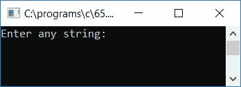
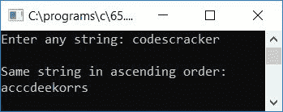
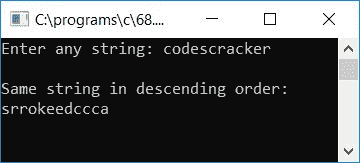

# 对字符串进行排序的 c 程序

> 原文：<https://codescracker.com/c/program/c-program-sort-string.htm>

在这里，我们将了解如何将任何给定的[字符串](/c/c-strings.htm)(由用户在运行时)按照 的升序和降序逐一排序。让我们首先从如何对字符串进行升序排序开始。

## c 按升序对字符串进行排序

在这里，我们创建了一个程序，它将使用 **gets()** [函数](/c/c-functions.htm)接收来自用户的任何字符串，然后将字符串按升序排序。例如， 如果给定的字符串是 **codescracker** ，那么按升序排序后的字符串将是 **acccdeekorrs**

```
#include<stdio.h>
#include<conio.h>
#include<string.h>
int main()
{
    char str[100], chTemp;
    int i, j, len;
    printf("Enter any string: ");
    gets(str);
    len = strlen(str);
    for(i=0; i<len; i++)
    {
        for(j=0; j<(len-1); j++)
        {
            if(str[j]>str[j+1])
            {
                chTemp = str[j];
                str[j] = str[j+1];
                str[j+1] = chTemp;
            }
        }
    }
    printf("\nSame string in ascending order:\n%s", str);
    getch();
    return 0;
}
```

由于该程序是在 **Code::Blocks** IDE 下编写的，因此在成功构建并运行之后，下面是上述程序的运行示例:



提供任意字符串，如 **codescracker** 并按回车键查看相同的字符串，其中每个 字符按升序排序，如下图所示:



以下是上述程序中使用的一些主要步骤:

*   使用 **gets()** 函数接收任意字符串
*   使用 **string.h** 库 的 **strlen()** 函数得到字符串的长度，并将其初始化为任意一个[变量](/c/c-variables.htm)比如 **len**
*   现在为循环创建一个[，从 0 到小于字符串长度的 1](/c/c-for-loop.htm)
*   在循环的**中，创建另一个**循环的**,用另一个循环变量比如 **j** 表示 从 0 到 2 小于字符串长度，以比较字符串中的每个字符**
*   在比较时，如果字符串中的任何一个字符大于下一个字符，那么就将这个字符相互颠倒，继续进行，直到每个字符都按升序排列。
*   因此，我们已经运行了两次循环。第一次是小于字符串长度的一倍，第二次是小于字符串长度的两倍
*   这样，字符串中的所有字符都得到了排列。我们只需要打印字符串值，比如 **str**

## c 按降序对字符串进行排序

让我们用 C 语言创建另一个程序，它也将接收来自用户的任何字符串，并将给定的字符串按降序排序，如下面给出的程序所示。例如，如果给定的字符串是 **codescracker** ，那么 降序排序后的字符串将是**srrokeedcca**:

```
#include<stdio.h>
#include<conio.h>
#include<string.h>
int main()
{
    char str[100], chTemp;
    int i, j, len;
    printf("Enter any string: ");
    gets(str);
    len = strlen(str);
    for(i=0; i<len; i++)
    {
        for(j=0; j<(len-1); j++)
        {
            if(str[j]<str[j+1])
            {
                chTemp = str[j];
                str[j] = str[j+1];
                str[j+1] = chTemp;
            }
        }
    }
    printf("\nSame string in descending order:\n%s", str);
    getch();
    return 0;
}
```

以下是其示例运行的最终快照:



#### 关于字符串排序的其他程序

*   [C 对每个单词进行升序排序](/c/program/c-program-sort-each-word-ascending.htm)
*   [C 按降序对每个单词进行排序](/c/program/c-program-sort-each-word-descending.htm)
*   [C 按字母顺序排列姓名](/c/program/c-program-sort-strings-alphabetical-order.htm)

[C 在线测试](/exam/showtest.php?subid=2)

* * *

* * *